---
jupytext:
  text_representation:
    extension: .md
    format_name: myst
    format_version: '0.13'
kernelspec:
  display_name: Python 3
  language: python
  name: python3
---

# Background: universal MLIPs

:::{objectives}
- Define a foundation MLIP and its training data.
- Explain why most materials models miss dispersion.
- Choose and check a model and a GPU engine.
:::

Core concepts for the hands-on parts. Numbered references are at the end;
reviews are in {doc}`../reference/reading`.

## Interatomic potentials and MLIPs

- A potential gives energy from atomic positions; its gradient gives the
  forces for molecular dynamics (MD) and relaxation.
- Classical force fields: fixed functional form, fast, limited
  transferability. First-principles (quantum-mechanical) methods such as
  density functional theory (DFT): accurate, cost grows steeply with system
  size.
- An MLIP is trained on first-principles (DFT) energies and forces: near-DFT
  accuracy at near force-field cost. The idea dates from 2007 [[1](https://doi.org/10.1103/PhysRevLett.98.146401)].
- An MLIP inherits the accuracy of the reference method it was trained on
  (usually PBE DFT), not more: it reuses that rung's accuracy at a fraction
  of its cost.

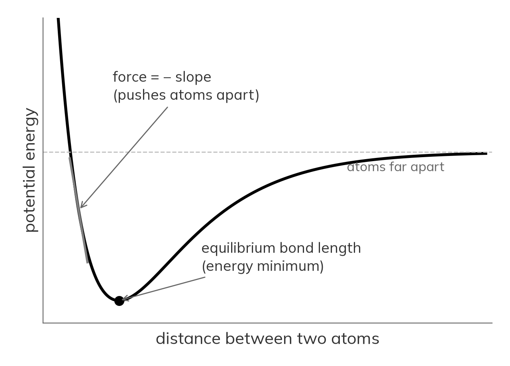

*Energy of two atoms versus their distance (illustrative Morse curve).*

## MLIPs among AI methods for materials

Six families, often confused. They differ in what the model learns or does.

::::{grid} 1 2 3 3
:gutter: 2

:::{grid-item-card} Electronic structure
*learns the quantum mechanics itself*

- Neural wavefunctions (FermiNet, PauliNet)
- Learned XC functionals (DM21, Skala)
- ML Hamiltonians and tight-binding (DeepH)
:::

:::{grid-item-card} Interatomic potentials
*learns energies and forces from DFT data*

- Universal models (MACE-MP, UMA, Orb, MatterSim, NequIP-OAM)
- Fine-tune a foundation model on your own data
:::

:::{grid-item-card} Generative models
*proposes new structures on demand*

- Diffusion for crystals (CDVAE, MatterGen)
- Language models write crystal files (CrystaLLM)
- Organic crystal prediction (Clari, 2026)
:::

:::{grid-item-card} Structure to property
*maps a structure straight to a property*

- Descriptors (SOAP, matminer)
- Crystal graph networks (CGCNN, ALIGNN)
- Multi-task models (MatterSim-MT, 2026)
:::

:::{grid-item-card} LLMs and agents
*reads, plans and runs the tools*

- Chemistry agents (ChemCrow, Coscientist)
- Simulation agents (MDCrow, El Agente, AtomisticSkills)
- LLM with an MLIP encoder (MatterChat)
:::

:::{grid-item-card} Autonomous labs, open data
*closes the loop: predict, make, measure*

- Self-driving labs (A-Lab, robotic chemist)
- Open data (OMat24, Alexandria, LeMaterial)
- Predicted stable is not always synthesisable [[34](https://doi.org/10.1021/acs.chemmater.4c00643), [35](https://doi.org/10.1103/PRXEnergy.3.011002)]
:::

::::

How they connect:

- MLIPs sit in the middle: first-principles data in, structures and dynamics out.
- Generators propose, MLIPs screen, labs make; new data feeds retraining.
- LLM agents can run any step, from one DFT or MLIP calculation to the whole loop.
- This lesson covers interatomic potentials only.

Next door, fast quantum chemistry (outside this lesson's hands-on scope):
the Grimme group's xTB methods need no training data, cover any element and
give electronic information. g-xTB approaches hybrid-DFT quality for
elements H to Lr [[25](https://doi.org/10.26434/chemrxiv-2025-bjxvt)]; CREST
samples with xTB and an MLIP can refine the result [[26](https://doi.org/10.1063/5.0197592)].
The two also meet: NN-xTB tunes the xTB Hamiltonian with a network
[[27](https://doi.org/10.1038/s41467-026-73184-z)], xTB features help ML
screen MOF band gaps [[28](https://doi.org/10.1021/acs.jctc.6c00979)], and
dxtb is differentiable xTB in PyTorch [[29](https://doi.org/10.1063/5.0216715)].
D3 and D4 dispersion add the van der Waals that PBE-trained MLIPs miss; they
now run on the GPU in TorchSim and with Orb, and a faster D3 for large cells
appeared in 2026.

| Use xTB when | Use an MLIP when | Combine them |
|---|---|---|
| Chemistry absent from MLIP training data | System within the training distribution | Conformer search with xTB (CREST), energies refined with the MLIP |
| Unusual elements, charge or spin states | Near-DFT accuracy in that domain | xTB as a cross-check outside the MLIP's domain |
| Electronic properties: charges, orbitals, gaps | Large systems, long MD: linear scaling, GPUs | D3/D4 dispersion added to either |

(background-foundation)=
## From bespoke to foundation models

*MLIP milestones, from one model per material to one model reused
everywhere. Logos identify the developing organisations.*

- System-specific MLIP: trained for one material, refitted for the next.
- Equivariant graph networks, NequIP [[2](https://doi.org/10.1038/s41467-022-29939-5)] and MACE [[3](https://arxiv.org/abs/2206.07697)], need far less data.
- Foundation MLIP: pre-trained across the periodic table, reused without
  retraining. MACE-MP-0 [[4](https://arxiv.org/abs/2401.00096)] made zero-shot use mainstream in 2024; UMA [[7](https://arxiv.org/abs/2506.23971)] and Orb-v3 [[8](https://arxiv.org/abs/2504.06231)] followed in 2025.
- UMA shows the scale: one model trained on about 500 million structures
  from five datasets. Its mixture of linear experts stores 1.4 billion
  parameters (UMA-M) and blends them per structure into one model of about
  50 million, so inference stays affordable. OMol25 adds hybrid-DFT
  molecules. Use the current checkpoint (UMA 1.2 small, patch 1.2.1); the
  original `uma-s-1` is archived [[7](https://arxiv.org/abs/2506.23971)].
  {doc}`a6-uma` sets it beside Orb-v3 and OrbMol, on crystals and on
  molecules with charge and spin.

  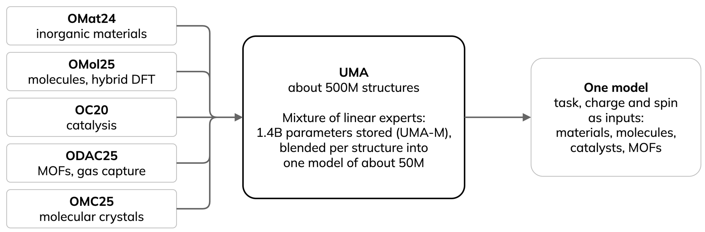

- The training level matters: for electrolyte densities, the OMol25-trained
  UMA reached R² 0.98 against 0.34 and 0.45 for materials-only models
  [[23](https://arxiv.org/abs/2603.20183)]; see the molecular row of
  {doc}`../reference/choosing-a-model`.

  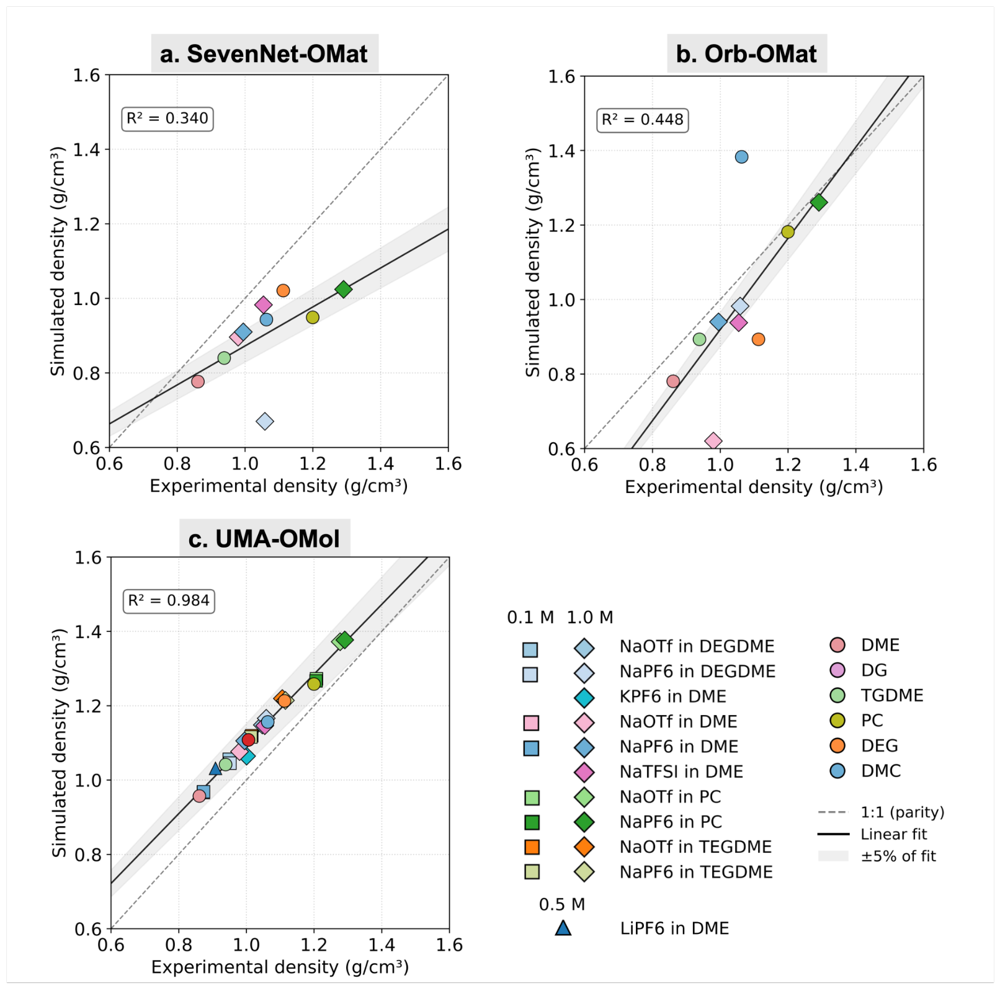

  *Kumar et al., arXiv:2603.20183, Fig. 1 (CC BY 4.0, cropped).*
- Coverage follows the data: common elements appear in hundreds of
  thousands of structures, rare ones (noble gases) in a handful (MPtrj
  counts in [[4](https://arxiv.org/abs/2401.00096)]). Check your elements and short-range repulsion before
  screening arbitrary crystals.

  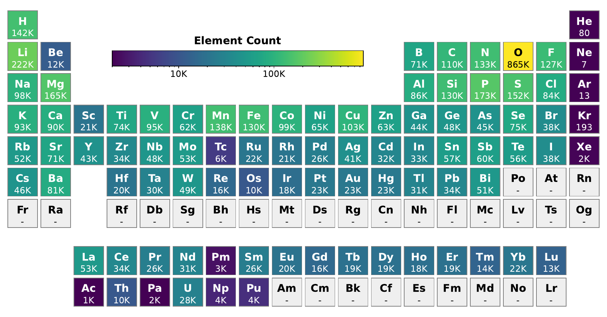

  *MPtrj element occurrence, Batatia et al., arXiv:2401.00096 (CC BY-NC-ND 4.0).*

Training data grew over a hundredfold in a few years:

| Dataset | Scale | Reference level |
|---|---|---|
| MPtrj [[5](https://doi.org/10.1038/s42256-023-00716-3)] | about 1.58 million configurations, about 146,000 Materials Project compounds, 89 elements | PBE(+U) |
| MatterSim | about 17 million configurations (active learning) | PBE(+U) |
| GNoME | about 89 million structures (not public) | PBE(+U) |
| OMat24 [[6](https://doi.org/10.1038/s43588-026-00996-w)] | about 118 million inorganic structures | PBE+U |
| OMol25 [[9](https://arxiv.org/abs/2505.08762)] | more than 100 million calculations, about 83 million molecular systems, 83 elements | ωB97M-V/def2-TZVPD |
| UMA training [[7](https://arxiv.org/abs/2506.23971)] | about 500 million unique 3D structures | mixed |

Model families (figures as published; the field moves fast):

| Model family | From | Architecture | Params | Training data |
|---|---|---|---|---|
| CHGNet, 2023 [[5](https://doi.org/10.1038/s42256-023-00716-3)] ([code](https://github.com/CederGroupHub/chgnet)) | UC Berkeley | GNN with magnetic moments | 0.4M | MPtrj |
| MACE-MP-0, 2024 [[4](https://arxiv.org/abs/2401.00096)] ([code](https://github.com/ACEsuit/mace-foundations)) | Cambridge and others | equivariant message passing (ACE) | 4.7M | MPtrj; newer multi-head models add more |
| SevenNet-0, now Omni [[Omni](https://arxiv.org/abs/2510.11241)] ([code](https://github.com/MDIL-SNU/SevenNet)) | SNU | NequIP-style equivariant GNN | 0.8M, now 55M | MPtrj, now 243M structures |
| Orb-v3 [[8](https://arxiv.org/abs/2504.06231)] ([code](https://github.com/orbital-materials/orb-models)) | Orbital Materials | non-equivariant graph network | 26M | OMat24, or MPtrj plus Alexandria |
| eqV2, eSEN, UMA [[6](https://doi.org/10.1038/s43588-026-00996-w)] [[eSEN](https://arxiv.org/abs/2502.12147)] [[7](https://arxiv.org/abs/2506.23971)] ([code](https://github.com/facebookresearch/fairchem)) | Meta FAIR | equivariant transformer, then eSEN with a mixture of linear experts | 31M to 153M; UMA up to 1.4B (50M active) | OMat24, then about 500M |
| DPA-3, now DPA-4 and DPA4C [[18](https://arxiv.org/abs/2608.19041)] ([code](https://github.com/deepmodeling/deepmd-kit)) | AISI Beijing, DP Technology | line-graph GNN, now SO(3)-equivariant | 0.03M to 25M | OpenLAM (163M) |
| NequIP and Allegro OAM, 2026 [[12](https://arxiv.org/abs/2607.28461)] ([NequIP](https://github.com/mir-group/nequip), [Allegro](https://github.com/mir-group/allegro)) | Harvard, Cambridge | E(3)-equivariant; Allegro strictly local | 0.6M to 32M | OAM |
| PET-OAM, 2026 [[PET](https://arxiv.org/abs/2601.16195)] ([code](https://github.com/lab-cosmo/upet)) | EPFL | transformer, symmetry not enforced | 26M to 730M | OAM |
| GRACE [[GRACE](https://doi.org/10.1103/PhysRevX.14.021036)] ([code](https://github.com/ICAMS/grace-tensorpotential)) | ICAMS, Bochum | graph atomic cluster expansion | 3.4M to 42M | MPtrj; OAM |

OAM = OMat24 + sAlex + MPtrj. MatterSim [[24](https://arxiv.org/abs/2405.04967)] and other fast models are compared in the fast-models table below.

Materials models learn PBE, which misses dispersion, so {doc}`a2-orb-models`
adds D3. OMol25 models use a different reference level.

## How the models are built

First papers and code: [Behler and Parrinello 2007](https://doi.org/10.1103/PhysRevLett.98.146401) ([code](https://github.com/CompPhysVienna/n2p2)), [GAP 2010](https://doi.org/10.1103/PhysRevLett.104.136403) ([code](https://github.com/libAtoms/QUIP)), [SNAP 2015](https://doi.org/10.1016/j.jcp.2014.12.018) ([code](https://github.com/FitSNAP/FitSNAP)), [MTP 2016](https://doi.org/10.1137/15M1054183) ([code](https://gitlab.com/ashapeev/mlip-2)), [ANI-1 2017](https://doi.org/10.1039/C6SC05720A) ([code](https://github.com/aiqm/torchani)), [ANI-1ccx, CCSD(T) data](https://doi.org/10.1038/s41467-019-10827-4), [SchNet](https://doi.org/10.1063/1.5019779) ([code](https://github.com/atomistic-machine-learning/schnetpack)), [DeePMD 2018](https://doi.org/10.1103/PhysRevLett.120.143001) ([code](https://github.com/deepmodeling/deepmd-kit)), [ACE 2019](https://doi.org/10.1103/PhysRevB.99.014104) ([code](https://github.com/ICAMS/python-ace)), [NequIP](https://doi.org/10.1038/s41467-022-29939-5) ([code](https://github.com/mir-group/nequip)), [MACE](https://arxiv.org/abs/2206.07697) ([code](https://github.com/ACEsuit/mace)), [M3GNet](https://doi.org/10.1038/s43588-022-00349-3) ([code](https://github.com/materialyzeai/matgl)), [CHGNet](https://doi.org/10.1038/s42256-023-00716-3) ([code](https://github.com/CederGroupHub/chgnet)), [MACE-MP-0](https://arxiv.org/abs/2401.00096) ([code](https://github.com/ACEsuit/mace-foundations)), [UMA](https://arxiv.org/abs/2506.23971) ([code](https://github.com/facebookresearch/fairchem)), [Orb-v3 2025](https://arxiv.org/abs/2504.06231) ([code](https://github.com/orbital-materials/orb-models)), [NequIP-OAM 2026](https://arxiv.org/abs/2607.28461) ([code](https://github.com/mir-group/nequip)), [DPA4C 2026](https://arxiv.org/abs/2608.19041) ([code](https://github.com/deepmodeling/deepmd-kit)), [Skala, learned DFT](https://arxiv.org/abs/2506.14665) ([code](https://github.com/microsoft/skala)).

- Message passing: in a graph neural network (GNN), atoms exchange
  information with neighbours over several rounds; features are learnt,
  not hand-designed.
- Equivariant: rotate the structure and the predicted forces rotate with it,
  while the energy is unchanged. NequIP needs up to about 1000 times less
  data [[2](https://doi.org/10.1038/s41467-022-29939-5)].

- Attention (EquiformerV2 [[paper](https://arxiv.org/abs/2306.12059)],
  EquiformerV3 [[paper](https://arxiv.org/abs/2604.09130)]) weighs each neighbour; models such as UMA
  (1.4B parameters) train on 100M+ structures. By 2026, simpler designs
  compete closely [[Orb-v3](https://arxiv.org/abs/2504.06231)]: data and
  scale matter more than architecture.

## Pre-train, then fine-tune

Recipe [[10](https://doi.org/10.1063/5.0299305)]:

::::{grid} 1 2 4 4
:gutter: 2

:::{grid-item-card} 1 · Start zero-shot
Use the foundation model directly; often good enough for screening.
:::

:::{grid-item-card} 2 · Fine-tune
Add a small, targeted dataset when you need numbers for one system.
:::

:::{grid-item-card} 3 · Select data
Uncertainty-aware sampling adds what the model is least sure about.
:::

:::{grid-item-card} 4 · Validate
Test the property that matters, not just the energy.
:::
::::

Catastrophic forgetting: a network trained further on new data can lose
accuracy on what it learnt before [[EWC](https://doi.org/10.1073/pnas.1611835114)].
Fine-tuned universal MLIPs show it too, and forgetting-aware fine-tuning
limits it [[16](https://doi.org/10.1038/s41524-025-01895-w)]. Keep the
original model for general use.

Where zero-shot models fall short: used as-is, foundation models get
structures right but can be far off on mechanical and disordered systems;
fine-tuning usually needs less data than training from scratch and closes
most of the gap.

- Fine-tuned models have lower energy errors at every data fraction, with
  the biggest gain at 10%; force errors converge with from-scratch training
  as data grows [[10](https://doi.org/10.1063/5.0299305)].

  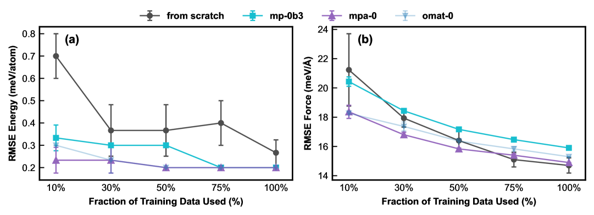

  *Learning curves, fine-tune against from scratch, Liu et al., J. Appl. Phys. 139, 041101 (2026) (CC0).*

| System, model | Property | Zero-shot | Fine-tuned |
|---|---|---|---|
| Mo, MACE-MP-0b3 [[10](https://doi.org/10.1063/5.0299305)] | $C_{11}$ elastic constant, error | 45.9% | 2.6% |
| Mo, MACE-MP-0b3 [[10](https://doi.org/10.1063/5.0299305)] | stacking-fault energy | far too low | close to DFT |
| Si, MACE-MP-0b [[Si](https://arxiv.org/abs/2506.07401)] | elastic constants, error | 19 to 53% | 0.6 to 5.2% |
| High-entropy alloy, MACE-MP-0 [[HEA](https://arxiv.org/abs/2506.07401)] | energy error, meV/atom | 59 to 64 | 13.8 (from scratch: 16.4 MACE, 24.1 ACE) |
| 41 models on a-C and a-SiO2 [[17](https://arxiv.org/abs/2607.11384)] | energy error | above 100% for some (a-C) | more than 5x lower from 4 structures (a-SiO2) |

- Elastic constant: how stiff a material is. Stacking-fault energy: the
  cost of sliding atomic layers, which sets how metals deform.

  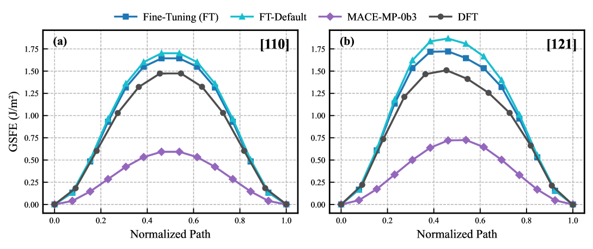

  *Mo stacking-fault energy: MACE-MP-0b3 (purple), DFT (black), fine-tuned (blue). Liu et al., J. Appl. Phys. 139, 041101 (2026) (CC0).*
- Our own run, {doc}`a4-training`: TensorNet (MatPES-PBE) fine-tuned to
  r2SCAN on 84 Li structures reaches 60 meV/atom energy and 128 meV/Å force
  error, against 513 and 427 from scratch (one run, one MI250X GCD).

(background-engines)=
## GPU engines

::::{grid} 1 2 2 2
:gutter: 2

:::{grid-item-card} CPU-era simulation tools
 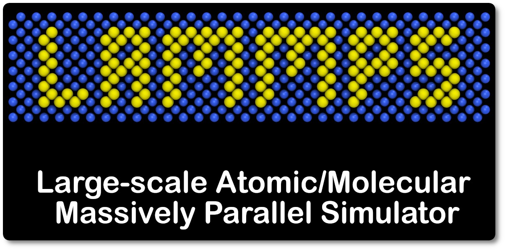 

- Built to run one system at a time
- GPU speed-ups first targeted classical force fields
- Excellent for cheap, simple functional forms
:::

:::{grid-item-card} GPU-era foundation MLIPs
 

- Neural networks with millions of parameters
- Want batched inference: many structures per GPU call
- One structure at a time leaves the GPU mostly idle
:::
::::

- TorchSim (PyTorch; [paper](https://arxiv.org/abs/2508.06628),
  [code](https://github.com/TorchSim/torch-sim),
  [docs](https://torchsim.github.io/torch-sim/user/introduction.html)),
  kUPS (JAX; [code](https://github.com/cusp-ai-oss/kups),
  [blog](https://medium.com/@CuspAI/kups-a-molecular-simulation-engine-for-the-ai-era-b213963a2359))
  and NVIDIA ALCHEMI Toolkit (PyTorch and Warp;
  [code](https://github.com/NVIDIA/nvalchemi-toolkit),
  [docs](https://nvidia.github.io/nvalchemi-toolkit/),
  [blog](https://developer.nvidia.com/blog/building-custom-atomistic-simulation-workflows-for-chemistry-and-materials-science-with-nvidia-alchemi-toolkit/))
  batch many systems into one GPU call. Part A uses TorchSim; Part B uses
  ALCHEMI Toolkit. All three are open source.

  | Engine | Stack | Idea | Licence |
  |---|---|---|---|
  | TorchSim | PyTorch | batched MD, relaxation and Monte Carlo; drives MACE, FairChem/UMA, SevenNet, ORB, MatterSim | MIT (Radical AI) |
  | kUPS | JAX | differentiable MD, Monte Carlo and optimisation primitives; runs MACE and UMA | Apache-2.0 (CuspAI) |
  | ALCHEMI Toolkit | PyTorch and Warp | vendor toolkit; batched and multi-GPU MD and relaxation with MACE, AIMNet2, UMA, MatGL TensorNet | Apache-2.0 (NVIDIA, [v0.2.0](https://github.com/NVIDIA/nvalchemi-toolkit/releases/tag/v0.2.0)) |
- What batching changes:

  ::::{grid} 1 2 2 2
  :gutter: 2

  :::{grid-item-card} One system per call
  Classical tools and ASE: one structure at a time, hardware mostly idle.
  :::

  :::{grid-item-card} Many systems per call
  GPU-native engines fill the card with a batch.
  :::

  :::{grid-item-card} Up to about 100x
  TorchSim against ASE on one H100: total throughput, not per system
  [[paper](https://arxiv.org/abs/2508.06628)].
  :::

  :::{grid-item-card} 5 to 7x
  Our A100 runs, 64 to 128 relaxations ({doc}`a1-batched-relaxation`).
  :::
  ::::

  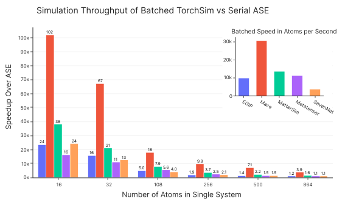

  *Throughput vs ASE (single H100, batched). [TorchSim](https://github.com/TorchSim/torch-sim) (MIT).*

  This makes relaxing and screening large candidate sets practical.
- ALCHEMI also supplies common GPU building blocks (neighbour lists, D3
  dispersion, Ewald sums;
  [Toolkit-Ops](https://github.com/NVIDIA/nvalchemi-toolkit-ops),
  [docs](https://nvidia.github.io/nvalchemi-toolkit-ops/),
  [blog](https://developer.nvidia.com/blog/accelerating-ai-powered-chemistry-and-materials-science-simulations-with-nvidia-alchemi-toolkit-ops/)) used by UMA, Orb, PET and TorchSim. These run on
  NVIDIA GPUs only; the D3 on {doc}`a2-orb-models` also runs on a CPU.

*Engines are built from swappable blocks: the same potential, integrator
and thermostat give NVE, NVT or NPT. After the kUPS design (CuspAI, 2026).*

- Leonardo (NVIDIA A100; Booster nodes with four GPUs each): CUDA-native,
  so TorchSim, cuEquivariance and ALCHEMI run directly. Our batched
  relaxation gave 5 to 7x over serial ({doc}`a1-batched-relaxation`).
- LUMI (AMD MI250X; LUMI-G nodes with four MI250X, each two GCDs): ROCm
  PyTorch runs MACE, NequIP and MatGL (float64); CUDA-only kernels do not.
  Our MACE, MatGL, fine-tuning and NEB runs used one GCD
  ({doc}`a1-batched-relaxation`, {doc}`a3-matgl-tutorials` to {doc}`a5-neb`).
  TorchSim added AMD/ROCm support in v0.4.2, verified on consumer cards.
  Docs: [docs.lumi-supercomputer.eu](https://docs.lumi-supercomputer.eu).
- Arrhenius (NVIDIA GH200, Linköping, inaugurated September 2026): 382
  nodes with four Grace Hopper superchips each; CUDA-native
  [[NAISS](https://www.naiss.se/resources/arrhenius-technical-description/)].
  Part B ran here: eight 64-atom MACE silicon trajectories on one GH200 took
  18.7 s as one ALCHEMI batch versus 88 to 100 s as eight LAMMPS processes
  ({doc}`07-reviewed-results`); one LAMMPS system on four GPUs ran 2.4 times
  faster than on one ({doc}`08-scaling`). Setup: {doc}`../setup/arrhenius`.
- ENCCS and Sweden AI Factory help with access and the software stack;
  Sweden AI Factory's own AI-optimised system in Linköping follows in
  2026/2027.
- NequIP and Allegro foundation models run LAMMPS ML-IAP/Kokkos MD on
  both: up to 102.5 million atoms on 256 GPUs, about 44 000 atoms per A100
  and 22 000 per MI250X GCD. NequIP-OAM-XL matches eSEN-30M-OAM on
  Matbench Discovery at about ten times the speed [[12](https://arxiv.org/abs/2607.28461)].
- DPA4C (DeePMD-kit v3.2.0) approaches MACE-OMat accuracy at about 100
  times the throughput; 2.048 billion atoms on 1024 V100 GPUs
  [[18](https://arxiv.org/abs/2608.19041)]. Checkpoints are CC-BY-NC.
- LUMI tip: with the CSC PyTorch module (`torch` 2.7.1+rocm6.2.4),
  `torch.det` and `prod` fail in float32 on the MI250X but work in float64,
  so MatGL runs in float64 there ({doc}`a3-matgl-tutorials`,
  {doc}`a4-training`).
- Measured multi-GPU MACE scaling: {doc}`08-scaling`.

:::{note}
Pin software versions and re-check results after upgrades. Bugs that
silently gave wrong results were fixed between July and September 2026 in
cuEquivariance v0.12.0 (fused tensor-product reduction), NequIP v0.19.0
(wrong forces and stress in TorchSim) and TorchSim v0.6.1 (D3, Ewald, PME
and DSF stress sign) [[19](https://github.com/TorchSim/torch-sim/releases/tag/v0.6.1)].
:::

(background-choosing)=
## Choosing and trusting a model

- Choose by task and hardware, not by the top leaderboard row.
- Validate the property you study; compare several models.
- Rules of thumb, a check protocol and the evidence behind them:
  {doc}`../reference/choosing-a-model`.

Fast universal models ([Matbench Discovery](https://matbench-discovery.materialsproject.org)
data, accessed 29 September 2026 [[13](https://doi.org/10.1038/s42256-025-01055-1)]):

| Model | Params | F1 ↑ | κSRME ↓ | Licence | Use case |
|---|---:|---:|---:|---|---|
| [Orb-v3](https://github.com/orbital-materials/orb-models) [[8](https://arxiv.org/abs/2504.06231)] | 26M | 0.905 | 0.21 | Apache-2.0 | fast; D3 variant for van der Waals |
| [SevenNet-Omni](https://github.com/MDIL-SNU/SevenNet) [[paper](https://arxiv.org/abs/2510.11241)] | 55M | 0.906 | 0.19 | MIT | D3 built in; LAMMPS and TorchSim |
| [NequIP-OAM-XL](https://github.com/mir-group/nequip) [[12](https://arxiv.org/abs/2607.28461)] | 32M | 0.906 | 0.13 | MIT / CC-BY | also runs on AMD GPUs (LUMI) |
| [MatRIS-10M-OAM](https://github.com/HPC-AI-Team/MatRIS) [[paper](https://arxiv.org/abs/2603.02002)] | 10M | 0.921 | 0.22 | BSD-3 | best accuracy for its size |
| [MatterSim v1 5M](https://github.com/microsoft/mattersim) [[24](https://arxiv.org/abs/2405.04967)] | 4.5M | 0.862 | 0.57 | MIT | small and fast |
| [Nequix](https://github.com/atomicarchitects/nequix) [[paper](https://arxiv.org/abs/2508.16067)] | 0.7M | 0.751 | 0.45 | MIT / CC-BY | cheapest to run and train |
| [eSEN-30M-OAM](https://github.com/facebookresearch/fairchem) [[paper](https://arxiv.org/abs/2502.12147)] | 30M | 0.925 | 0.17 | MIT / gated | very accurate; UMA family |
| [EquiformerV3-OAM](https://github.com/atomicarchitects/equiformer_v3) [[paper](https://arxiv.org/abs/2604.09130)] | 30M | 0.931 | 0.12 | MIT | accuracy leader, slower |

- Matbench Discovery is the main public leaderboard for crystal stability:
  does a predicted crystal hold together or decompose?
  F1 (0 to 1, higher is better): stable-crystal classification on
  [Matbench Discovery](https://matbench-discovery.materialsproject.org) [[13](https://doi.org/10.1038/s42256-025-01055-1)].
  κSRME (lower is better): thermal-conductivity error.
- F1 combines two questions. Precision: of the crystals the model calls
  stable, what share are stable? Recall: of the truly stable crystals, what
  share does it find? $F_1 = 2PR/(P+R)$, so a model must do well on both.
- Models are ranked by CPS, a combined score: 50% F1, 40% κSRME and 10%
  structure error (RMSD). The compliant tier trains on MPtrj only, for a
  fair comparison. Since July 2026 there is also an
  [MD task](https://matbench-discovery.materialsproject.org/benchmarks/md).

  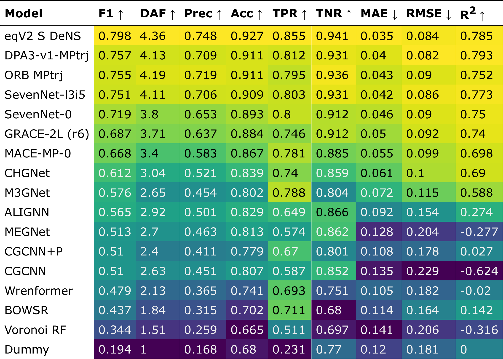

  *Compliant (MPtrj-only) models, 2025 paper snapshot; best today is F1 ≈ 0.86 (EquiformerV3). [Matbench Discovery](https://matbench-discovery.materialsproject.org) [[13](https://doi.org/10.1038/s42256-025-01055-1)]. PBE references; not a Materials Project endorsement.*
- [MatGL](https://github.com/materialyzeai/matgl) 4.0.3 (BSD-3) models
  (TensorNet, CHGNet, M3GNet and QET trained on MatPES; used in A2 to A4)
  are not on the leaderboard. MatGL has no TorchSim interface, so it runs
  through ASE.
- The compliant tier fixes the training data to MPtrj, so architectures are
  compared fairly; the best compliant F1 today is about 0.86
  (EquiformerV3).
- The leaderboard is a moving target:

  | Year | Model | Training data | F1 |
  |---|---|---|---:|
  | 2023 | CHGNet | MPtrj | 0.61 |
  | 2024 | MACE-MP-0 | MPtrj | 0.67 |
  | 2024 | eqV2 | OMat24 | 0.92 |
  | 2025 | Orb-v3 | OMat24 | 0.91 |
  | 2026 | EquiformerV3 | OMat24 and more | 0.93 |

  In three years F1 rose from about 0.6 to 0.93, mainly from more and
  broader training data. With training fixed to MPtrj (compliant tier), the
  best went from 0.82 (2024) to about 0.86 today. The top models are now
  within a few hundredths, so choose by your task, speed and licence.
- Most GPU speed-ups are NVIDIA-only (Leonardo, Arrhenius). On AMD (LUMI), choose a
  pure-PyTorch model such as [NequIP](https://github.com/mir-group/nequip)
  or [MACE](https://github.com/ACEsuit/mace).
- A low force error is not enough: check MD stability, speed, memory and
  your property [[Forces are not enough](https://arxiv.org/abs/2210.07237);
  [code](https://github.com/kyonofx/MDsim)].
- Finite-temperature MD of 15 foundation MLIPs, tier medians
  [[20](https://arxiv.org/abs/2607.03433)]:

  | Tier (training data) | Force RMSE, eV/Å | Pressure MAE, GPa |
  |---|---:|---:|
  | 1 (MPtrj) | 0.166 | 0.82 |
  | 2 (+ Alexandria) | 0.106 | 1.04 |
  | 3 (OMat24-based) | 0.063 | 0.82 |
  | 4 (multi-dataset) | 0.054 | 3.40 |

  The tier with the lowest force error has the worst pressure error, driven
  by the UMA models on one alloy (an unrelaxed experimental cell). It is now
  the [Matbench Discovery MD task](https://matbench-discovery.materialsproject.org/benchmarks/md).

  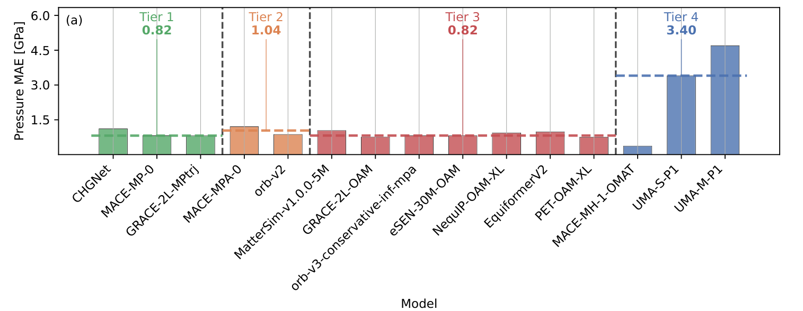

  *Gawkowski et al., arXiv:2607.03433, Fig. 4(a) (CC BY-SA 4.0, cropped).*

- Molecules, 15 pretrained models, MD of a 2,661-atom water box on one H100
  [[15](https://doi.org/10.1021/acs.jctc.6c00130)]: accuracy tracks model size
  and data, but slower is not always more accurate.

  | Model | Energy MAE, kcal/mol | MD steps/s |
  |---|---:|---:|
  | UMA-m-1.1 | 0.53 | 0.16 |
  | UMA-s-1.1 | 0.61 | 3.65 |
  | MACE-OFF23 (L) | 1.73 | 1.43 |
  | AIMNet2 | 2.55 | 33.7 |
- Beyond one score: [MLIP Arena](https://github.com/atomind-ai/mlip-arena)
  ([leaderboard](https://huggingface.co/spaces/atomind/mlip-arena))
  [[14](https://arxiv.org/abs/2509.20630)] tests physics in four groups:
  asymptotic behaviour (diatomic curves, energy conservation), stability and
  reactivity (heating, compression, combustion), distribution shifts (gas
  adsorption, vacancy migration) and thermodynamics (equation of state,
  phase transitions). In its heating test, 120 NVT runs from 300 to 3000 K in
  10 ps on one A100, the share of valid runs ranges from about 97% (ORBv2)
  to about 44% (M3GNet).

  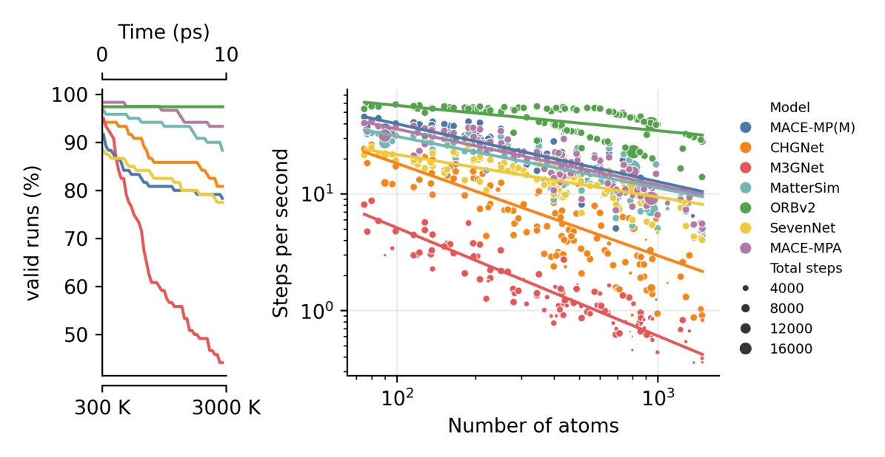

  *Chiang et al., arXiv:2509.20630, Fig. 3(a) (CC BY 4.0, cropped).*
- For molecules, [mlipbenchmarks](https://github.com/peastman/mlipbenchmarks)
  [[15](https://doi.org/10.1021/acs.jctc.6c00130)] compares accuracy, MD
  speed and GPU memory for 15 models; all ran stable MD, so accuracy
  against speed decides.
- Ensemble: run several models; disagreement flags low confidence.
- Check speed and GPU memory at your system size.
- PBE-trained models miss dispersion. Grimme's
  [D3 correction](https://github.com/dftd3/simple-dftd3) adds it on the GPU
  in [TorchSim](https://github.com/TorchSim/torch-sim) and `orb-models`
  (used on {doc}`a2-orb-models`).

## Barriers and NEB

- Diffusion and reactions are set by the barrier Ea at a saddle
  point, and the rate depends on it exponentially: at 298 K, 60 meV is about
  a factor of ten in diffusivity [[38](https://doi.org/10.1039/D5DD00534E)].
- The climbing-image nudged elastic band (CI-NEB) finds the saddle with a
  chain of images between two minima [[36](https://doi.org/10.1063/1.1329672)].
  Each image needs one force call per step, so an MLIP runs it in seconds
  on a GPU.

  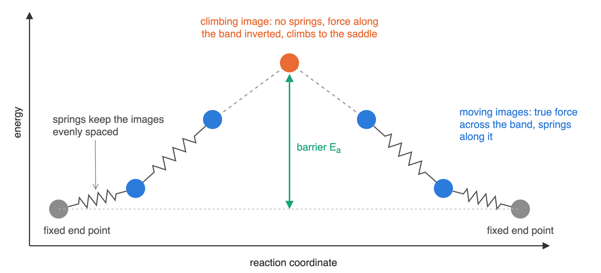

- NEB relaxes 5 to 9 images together. With DFT that is hundreds to
  thousands of DFT calls per path; with an MLIP each force call takes
  milliseconds, so thousands of paths become practical. CatTSunami ran a CO
  hydrogenation network on Rh(111), 19,000 NEBs, in 12 GPU days, against an
  estimated 52 GPU years with DFT [[39](https://doi.org/10.1021/acscatal.4c04272)].
- Universal MLIPs soften the energy surface far from equilibrium and tend
  to underestimate barriers: MAE 0.34 (MACE), 0.39 (CHGNet) and 0.49 eV
  (M3GNet) for 470 Mg2+ paths
  [[37](https://doi.org/10.1038/s41524-024-01500-6)]; CHGNet and M3GNet
  underestimate 73 % and 78 % of 574 paths [[38](https://doi.org/10.1039/D5DD00534E)].
- For those 574 battery paths: MAE 0.31 (MACE-MP-0) to 0.35 eV (M3GNet),
  and 0.20 to 0.26 eV without each model's outliers above 1 eV; good or bad
  conductor at 0.5 eV right 74 % (M3GNet) to 85 % (Orb-v3) of the time; MLIP
  paths were a better DFT starting guess in about two thirds of cases.
  DFT-NEB itself carries about 0.06 eV [[38](https://doi.org/10.1039/D5DD00534E)].

  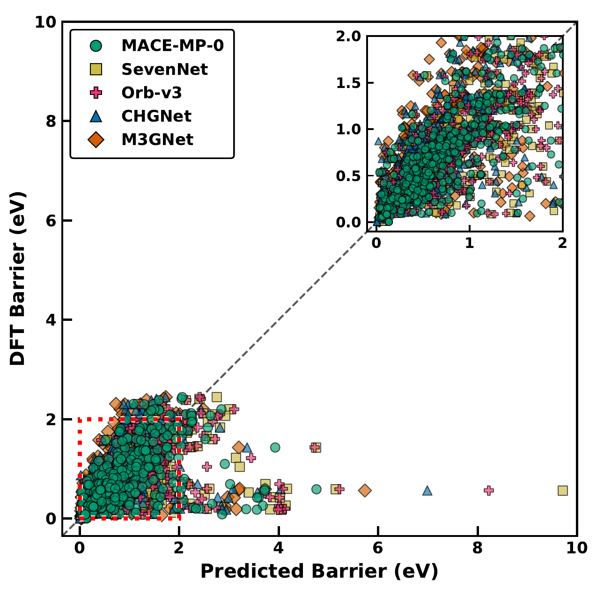

  *MLIP vs DFT-NEB barriers, 574 paths. Bheemaguli, Xiao & Sai Gautam, Fig. 2 (CC BY 4.0, cropped).*
- Newer models do better (about 0.05 to 0.17 eV on 154 paths)
  [[40](https://arxiv.org/abs/2609.05714)]. For 932 surface reactions,
  MLIP-NEB followed by a few DFT checks put 88 % of barriers within 0.1 eV
  of DFT at a 28× speed-up [[39](https://doi.org/10.1021/acscatal.4c04272)].
- Pattern: the MLIP finds the path, DFT confirms the saddle. CatTSunami:
  all-MLIP 2200× faster with 70 % success; adding 2 DFT relaxations and 1
  single point gives 88 % at 28× [[39](https://doi.org/10.1021/acscatal.4c04272)].
  Molecules: MACE-OMol25 path, then DFT, 96.6 % success with 3.8 DFT
  gradients per reaction, 94 to 96 % fewer than DFT alone
  [[paper](https://arxiv.org/abs/2604.00405)]. Fine-tuning on even one
  structure removes much of the softening bias
  [[37](https://doi.org/10.1038/s41524-024-01500-6)].
- Use MLIP-NEB to screen and to start DFT, then refine the saddle.
  Worked example with LiFePO4 on LUMI: {doc}`a5-neb`.

  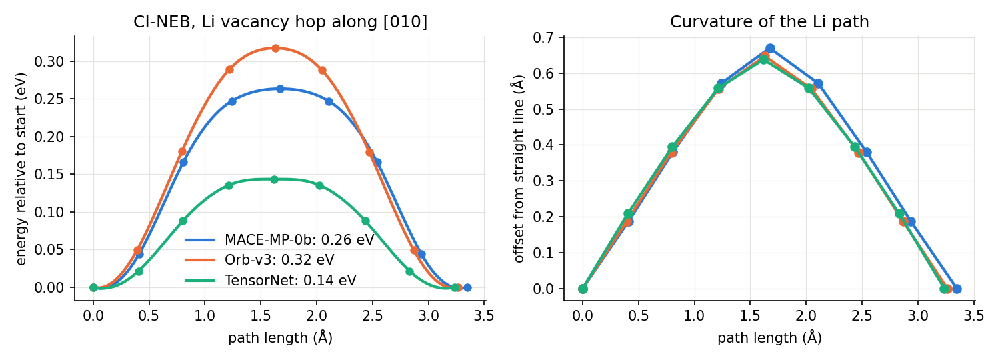

  *LUMI run, one MI250X GCD, float64 ({doc}`a5-neb`).*

  MACE-MP-0b 0.26 eV and Orb-v3 0.32 eV fall within 0.05 eV of DFT (GGA
  0.27, GGA+U 0.29 eV); TensorNet gives 0.14 eV, as softening predicts. All
  three find the curved [010] path, 0.64 to 0.67 Å off the straight line.
  The models cannot place the Fe3+ hole, which moves the DFT
  barrier by almost 0.2 eV.

## Outlook

- Long-range physics [[30](https://doi.org/10.1038/s41524-025-01911-z)]:

  ::::{grid} 1 3 3 3
  :gutter: 2

  :::{grid-item-card} The gap
  Standard MLIPs see only neighbours within a cutoff, so they miss
  long-range electrostatics: ions, interfaces, polar materials.
  :::

  :::{grid-item-card} The idea
  Learn hidden (latent) charges from energies and forces alone, then add the
  long-range part with an Ewald sum; no charge training data needed.
  :::

  :::{grid-item-card} What it unlocks
  Born effective charges and polarisation, infrared spectra under a field,
  ferroelectrics such as PbTiO3, ionic conduction in superionic water.
  :::
  ::::

  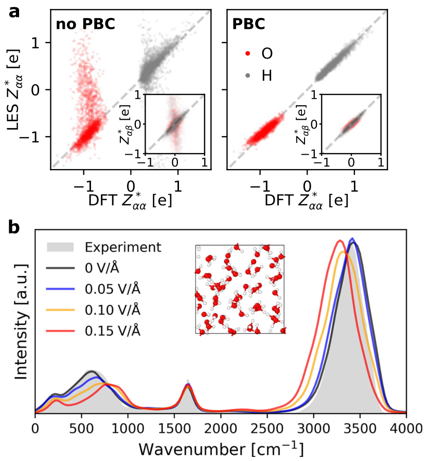

  *Zhong, Kim, King and Cheng, npj Comput. Mater. 11, 384 (2025), Fig. 1 (CC BY 4.0, cropped).*
- ML inside DFT: DFT is exact except for the exchange-correlation (XC)
  functional, which must be approximated (the rungs of Jacob's ladder).
  Machine learning can learn that term from accurate data:

  | Year | Milestone | What it did |
  |---|---|---|
  | 2012 | [First ML functional](https://doi.org/10.1103/PhysRevLett.108.253002) | kinetic energy learnt from examples; 1D model systems |
  | 2017 | [ML density maps](https://doi.org/10.1038/s41467-017-00839-3) | density learnt from the potential, skipping Kohn-Sham steps |
  | 2020 | [NeuralXC](https://doi.org/10.1038/s41467-020-17265-7) ([code](https://github.com/semodi/neuralxc)) | neural correction on top of a standard XC functional |
  | 2021 | DM21, DeepMind [[31](https://doi.org/10.1126/science.abj6511)] ([code](https://github.com/google-deepmind/deepmind-research/tree/master/density_functional_approximation_dm21)) | trained with fractional charge and spin; fixes delocalisation error |
  | 2025 | Skala, Microsoft [[32](https://arxiv.org/abs/2506.14665)] ([code](https://github.com/microsoft/skala)) | deep-learned XC at meta-GGA cost; beats hybrids on GMTKN55 (2.8 kcal/mol) |
  | 2026 | Skala in CP2K ([molecular](https://arxiv.org/abs/2608.19033), [condensed phase](https://arxiv.org/abs/2609.34055)) | molecules (Aug), then condensed phase (Sept): usable for materials |

  Skala today: open code ([microsoft/skala](https://github.com/microsoft/skala))
  with PySCF, GPU4PySCF and ASE interfaces, and now in CP2K for molecular and
  condensed-phase calculations. Why it matters here: better, cheaper
  reference data for the next generation of MLIPs; the two directions
  reinforce each other.
- Generative models propose, MLIPs screen. A diffusion model turns a
  crystal into noise step by step and learns to run it backwards:

  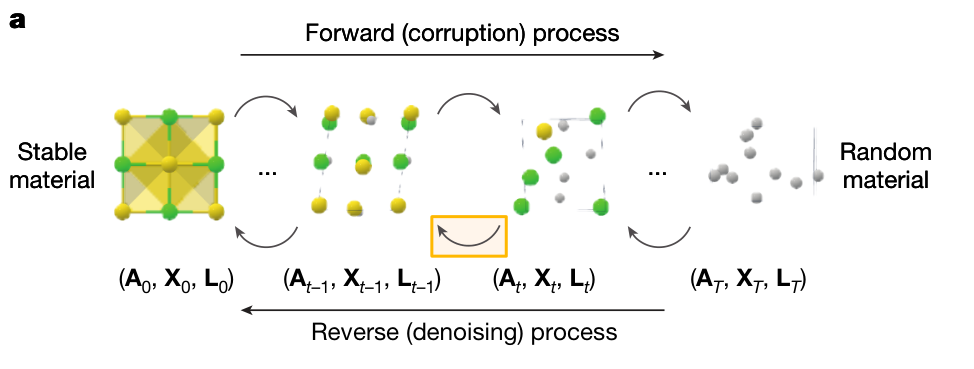

  *Zeni et al., Nature 2025, Fig. 1a (CC BY 4.0, cropped).*

  ::::{grid} 1 2 2 2
  :gutter: 2

  :::{grid-item-card} MatterGen
  [paper](https://doi.org/10.1038/s41586-025-08628-5),
  [code](https://github.com/microsoft/mattergen). Can be steered towards a
  target chemistry, symmetry or property; more than twice as likely as
  earlier generators to give stable, unique and new crystals. One candidate
  was made in the lab; a 2026 study argues it was already known
  ([Mater. Horiz.](https://doi.org/10.1039/D6MH00268D)).
  :::

  :::{grid-item-card} LeMat-GenBench
  [paper](https://arxiv.org/abs/2512.04562),
  [code](https://github.com/LeMaterial/lemat-genbench),
  [leaderboard](https://huggingface.co/spaces/LeMaterial/LeMat-GenBench).
  Scores 12 generators with an MLIP ensemble (MACE-MP, UMA, Orb); more stable
  output tends to mean less novel output, and no model wins everywhere.
  Synthesis and experimental checks remain the real bottleneck.
  :::
  ::::

- Early agentic workflows: agents turn a plain-language goal into
  simulation steps (plan, call a tool, read the result, repeat).

  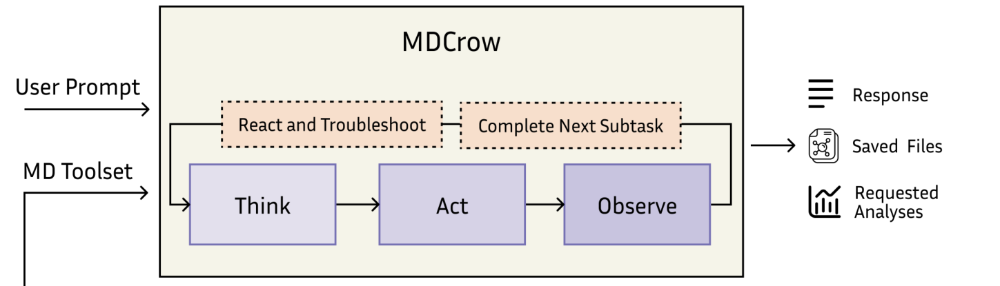

  *Campbell et al., arXiv:2502.09565, Fig. 1A (CC BY 4.0, cropped).*

  | Example | What it does | Result |
  |---|---|---|
  | [MDCrow](https://arxiv.org/abs/2502.09565) ([code](https://github.com/ur-whitelab/MDCrow)) | MD through OpenMM, 40+ tools | 25 tasks: 72% correct (gpt-4o) vs 28% for a bare LLM |
  | [El Agente Q](https://doi.org/10.1016/j.matt.2025.102263) | xTB and ORCA, jobs via SLURM | 6 exercises, about 88% average success |
  | [NVIDIA test](https://developer.nvidia.com/blog/how-ai-coding-agents-can-unlock-materials-simulation-with-nvidia-alchemi-toolkit/), Aug 2026 | a coding agent wrote 45 batched GPU MACE pipelines | none questioned an ill-posed task; an unstated thermostat damped Li diffusion 3 to 5 times |

  Agents can already run the codes, but they do not yet question the
  physics: expert judgement stays in the loop.
- In every case, validate the property you care about.

> "A poorly posed initial question results in AI scientific slop, an
> unfortunate side effect that is now becoming far too common."
> Shyue Ping Ong, September 2026 [[22](https://www.materialyze.ai/post/the-non-ai-pocalypse-in-materials-science)]

## Getting started

- Models and code: [MACE](https://github.com/ACEsuit/mace),
  [SevenNet](https://github.com/MDIL-SNU/SevenNet),
  [Orb](https://github.com/orbital-materials/orb-models),
  [MatterSim](https://github.com/microsoft/mattersim),
  [FairChem/UMA](https://github.com/facebookresearch/fairchem),
  [MatGL](https://github.com/materialyzeai/matgl),
  [DeePMD-kit](https://github.com/deepmodeling/deepmd-kit). Engines:
  [TorchSim](https://github.com/TorchSim/torch-sim),
  [kUPS](https://github.com/cusp-ai-oss/kups),
  [ALCHEMI Toolkit](https://github.com/NVIDIA/nvalchemi-toolkit).
- Datasets: MPtrj (1.6M configurations, the classic start), OMat24 and
  OMol25 (100M+ each, materials and molecules),
  [Alexandria](https://alexandria.icams.rub.de) (large open DFT database of
  crystals).
- Benchmarks: [Matbench Discovery](https://matbench-discovery.materialsproject.org)
  (stability, κSRME, MD task), [MLIP Arena](https://github.com/atomind-ai/mlip-arena)
  (physical tasks, stability), [mlipbenchmarks](https://github.com/peastman/mlipbenchmarks)
  (molecules, speed, memory).
- Help from ENCCS and Sweden AI Factory: lessons at
  [enccs.github.io/lessons](https://enccs.github.io/lessons/), workshops and
  events at [enccs.se/events](https://enccs.se/events); access to LUMI,
  Leonardo and Arrhenius; compute and AI expertise at
  [swedenaifactory.se](https://swedenaifactory.se); contact
  [training@enccs.se](mailto:training@enccs.se).

:::{keypoints}
- MLIPs learn DFT energies and forces at near force-field cost.
- Use foundation models zero-shot; fine-tune for quantitative accuracy.
- PBE-trained models miss dispersion without D3.
- Batched GPU engines run many systems in one call; choose a model by task
  and validate the property you study.
- One error number is not enough; pin package versions.
:::

## References

1. J. Behler, M. Parrinello, Phys. Rev. Lett. 98, 146401 (2007).
   [doi:10.1103/PhysRevLett.98.146401](https://doi.org/10.1103/PhysRevLett.98.146401)
2. S. Batzner et al., Nat. Commun. 13, 2453 (2022).
   [doi:10.1038/s41467-022-29939-5](https://doi.org/10.1038/s41467-022-29939-5)
3. I. Batatia et al., MACE. [arXiv:2206.07697](https://arxiv.org/abs/2206.07697)
4. I. Batatia et al., A foundation model for atomistic materials chemistry.
   [arXiv:2401.00096](https://arxiv.org/abs/2401.00096)
5. B. Deng et al., CHGNet and MPtrj, Nat. Mach. Intell. 5, 1031 (2023).
   [doi:10.1038/s42256-023-00716-3](https://doi.org/10.1038/s42256-023-00716-3)
6. L. Barroso-Luque et al., OMat24, Nat. Comput. Sci. 6, 642 (2026). [doi:10.1038/s43588-026-00996-w](https://doi.org/10.1038/s43588-026-00996-w); [arXiv:2410.12771](https://arxiv.org/abs/2410.12771)
7. B. M. Wood et al., UMA. [arXiv:2506.23971](https://arxiv.org/abs/2506.23971)
8. B. Rhodes et al., Orb-v3. [arXiv:2504.06231](https://arxiv.org/abs/2504.06231)
9. D. S. Levine et al., OMol25. [arXiv:2505.08762](https://arxiv.org/abs/2505.08762)
10. X. Liu et al., J. Appl. Phys. 139, 041101 (2026).
    [doi:10.1063/5.0299305](https://doi.org/10.1063/5.0299305); companion
    study [arXiv:2506.07401](https://arxiv.org/abs/2506.07401)
11. [TorchSim](https://github.com/TorchSim/torch-sim),
    [kUPS](https://github.com/cusp-ai-oss/kups),
    [ALCHEMI Toolkit](https://github.com/NVIDIA/nvalchemi-toolkit)
12. S. R. Kavanagh et al., NequIP and Allegro foundation models.
    [arXiv:2607.28461](https://arxiv.org/abs/2607.28461)
13. J. Riebesell et al., Matbench Discovery, Nat. Mach. Intell. 7, 836 (2025).
    [doi:10.1038/s42256-025-01055-1](https://doi.org/10.1038/s42256-025-01055-1);
    [leaderboard](https://matbench-discovery.materialsproject.org)
14. Chiang et al., MLIP Arena, NeurIPS 2025 Datasets and Benchmarks.
    [arXiv:2509.20630](https://arxiv.org/abs/2509.20630)
15. Eastman, Pretti and Markland, mlipbenchmarks, J. Chem. Theory Comput. 22, 6108 (2026).
    [doi:10.1021/acs.jctc.6c00130](https://doi.org/10.1021/acs.jctc.6c00130)
16. Kim et al., forgetting-aware fine-tuning of universal MLIPs,
    npj Comput. Mater. 12, 26 (2026).
    [doi:10.1038/s41524-025-01895-w](https://doi.org/10.1038/s41524-025-01895-w)
17. Fragapane and Deringer, AM26 amorphous-materials benchmark.
    [arXiv:2607.11384](https://arxiv.org/abs/2607.11384)
18. DPA4 and DPA4C, [DeePMD-kit v3.2.0](https://github.com/deepmodeling/deepmd-kit/releases/tag/v3.2.0).
    [arXiv:2608.19041](https://arxiv.org/abs/2608.19041)
19. Release notes:
    [cuEquivariance v0.12.0](https://github.com/NVIDIA/cuEquivariance/releases/tag/v0.12.0),
    [NequIP v0.19.0](https://github.com/mir-group/nequip/releases/tag/v0.19.0),
    [TorchSim v0.6.1](https://github.com/TorchSim/torch-sim/releases/tag/v0.6.1)
20. Dyna-Mat, foundation MLIPs in finite-temperature MD.
    [arXiv:2607.03433](https://arxiv.org/abs/2607.03433)
21. NVIDIA, How AI coding agents can unlock materials simulation with NVIDIA
    ALCHEMI Toolkit (2026).
    [blog](https://developer.nvidia.com/blog/how-ai-coding-agents-can-unlock-materials-simulation-with-nvidia-alchemi-toolkit/)
22. S. P. Ong, The Non-AI-pocalypse in Materials Science (2026).
    [post](https://www.materialyze.ai/post/the-non-ai-pocalypse-in-materials-science)
23. Kumar et al., electrolyte solvation structure from an OMol25-trained
    potential. [arXiv:2603.20183](https://arxiv.org/abs/2603.20183)
24. H. Yang et al., MatterSim. [arXiv:2405.04967](https://arxiv.org/abs/2405.04967)
25. Froitzheim, Müller, Hansen and Grimme, g-xTB, ChemRxiv (2025).
    [doi:10.26434/chemrxiv-2025-bjxvt](https://doi.org/10.26434/chemrxiv-2025-bjxvt)
26. Pracht et al., CREST, J. Chem. Phys. 160, 114110 (2024).
    [doi:10.1063/5.0197592](https://doi.org/10.1063/5.0197592)
27. Xia, Thie, Soon and Barca, NN-xTB, Nat. Commun. 17, 7302 (2026).
    [doi:10.1038/s41467-026-73184-z](https://doi.org/10.1038/s41467-026-73184-z)
28. Jose and Walsh, J. Chem. Theory Comput. 22, 8531 (2026).
    [doi:10.1021/acs.jctc.6c00979](https://doi.org/10.1021/acs.jctc.6c00979)
29. Friede, Hölzer, Ehlert and Grimme, dxtb, J. Chem. Phys. 161, 062501 (2024).
    [doi:10.1063/5.0216715](https://doi.org/10.1063/5.0216715)
30. Zhong, Kim, King and Cheng, latent Ewald summation, npj Comput. Mater.
    11, 384 (2025). [doi:10.1038/s41524-025-01911-z](https://doi.org/10.1038/s41524-025-01911-z)
31. Kirkpatrick et al., DM21, Science 374, 1385 (2021).
    [doi:10.1126/science.abj6511](https://doi.org/10.1126/science.abj6511)
32. Luise et al., Skala. [arXiv:2506.14665](https://arxiv.org/abs/2506.14665)
33. Zeni et al., MatterGen, Nature 639, 624 (2025).
    [doi:10.1038/s41586-025-08628-5](https://doi.org/10.1038/s41586-025-08628-5);
    Betala et al., LeMat-GenBench. [arXiv:2512.04562](https://arxiv.org/abs/2512.04562)
34. Cheetham and Seshadri, Chem. Mater. 36, 3490 (2024).
    [doi:10.1021/acs.chemmater.4c00643](https://doi.org/10.1021/acs.chemmater.4c00643)
35. Leeman et al., PRX Energy 3, 011002 (2024).
    [doi:10.1103/PRXEnergy.3.011002](https://doi.org/10.1103/PRXEnergy.3.011002)
36. G. Henkelman, B. P. Uberuaga and H. Jónsson, CI-NEB, J. Chem. Phys.
    113, 9901 (2000). [doi:10.1063/1.1329672](https://doi.org/10.1063/1.1329672)
37. B. Deng et al., systematic softening in universal MLIPs,
    npj Comput. Mater. 11, 9 (2025).
    [doi:10.1038/s41524-024-01500-6](https://doi.org/10.1038/s41524-024-01500-6)
38. A. K. Bheemaguli, P. Xiao and G. Sai Gautam, Digital Discovery 5, 1809 (2026).
    [doi:10.1039/D5DD00534E](https://doi.org/10.1039/D5DD00534E);
    [arXiv:2512.03642](https://arxiv.org/abs/2512.03642);
    [code and data](https://github.com/sai-mat-group/mlips-migration-barriers),
    [Zenodo](https://doi.org/10.5281/zenodo.17483476)
39. B. Wander et al., CatTSunami, ACS Catal. 15, 5283 (2025).
    [doi:10.1021/acscatal.4c04272](https://doi.org/10.1021/acscatal.4c04272);
    [arXiv:2405.02078](https://arxiv.org/abs/2405.02078)
40. K. Amirian et al., FPBench. [arXiv:2609.05714](https://arxiv.org/abs/2609.05714);
    [code](https://github.com/mogroupumd/FPBench)
