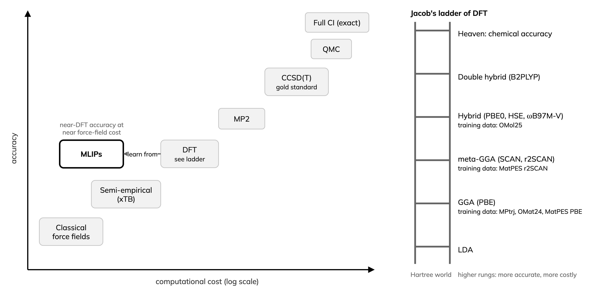
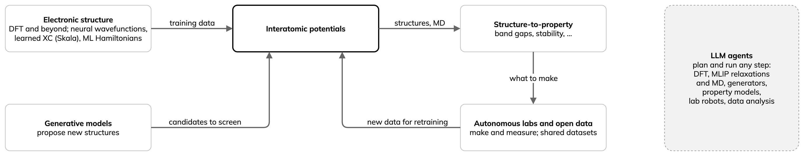
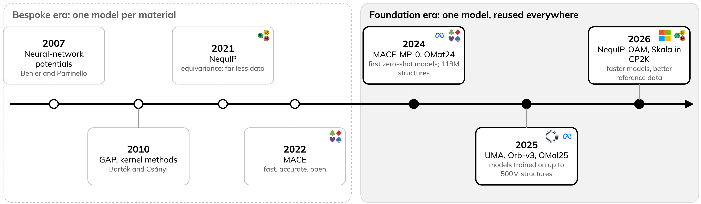
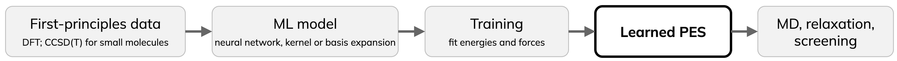
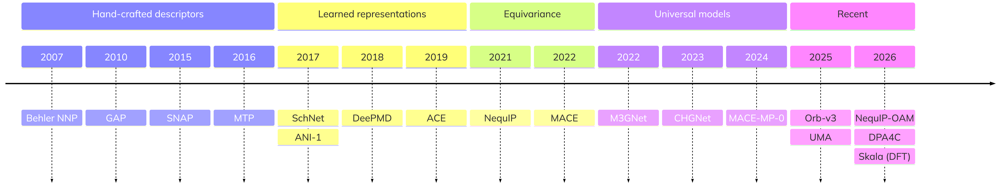
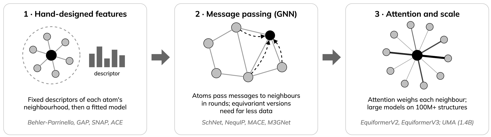
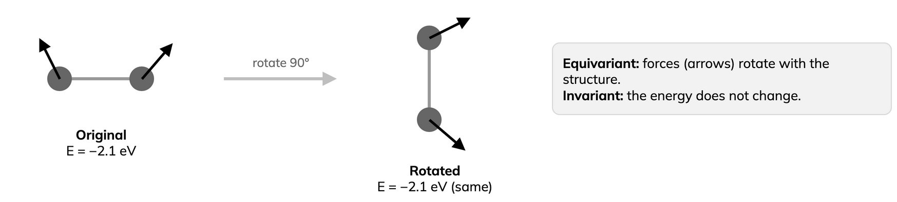
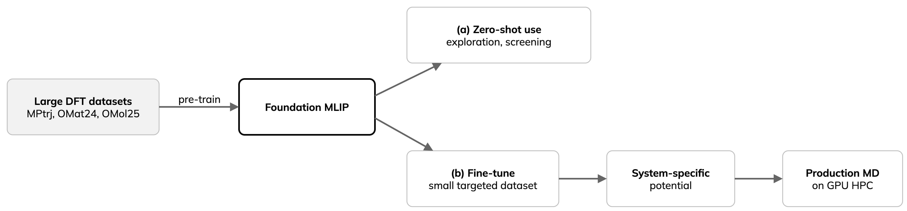
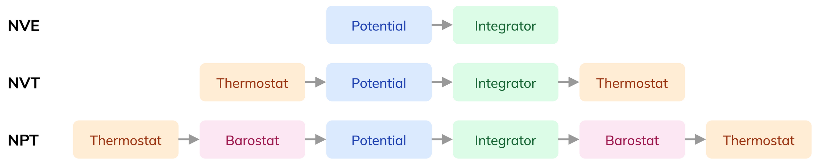
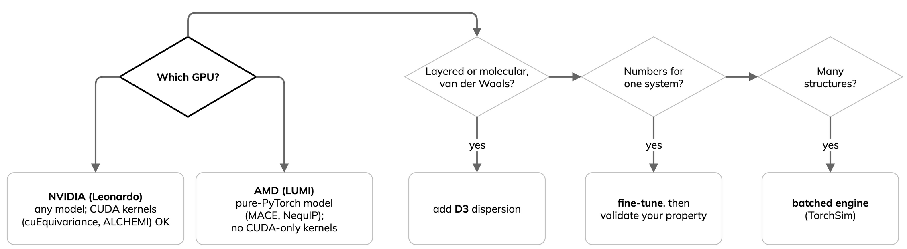

---
jupytext:
  text_representation:
    extension: .md
    format_name: myst
    format_version: '0.13'
kernelspec:
  display_name: Python 3
  language: python
  name: python3
---

# Background: universal MLIPs

:::{objectives}
- Define a foundation MLIP and its training data.
- Explain why most materials models miss dispersion.
- Choose and check a model and a GPU engine.
:::

Core concepts for the hands-on parts. Numbered references are at the end;
reviews are in {doc}`../reference/reading`.

## Interatomic potentials and MLIPs

- A potential gives energy from atomic positions; its gradient gives the
  forces for molecular dynamics (MD) and relaxation.
- Classical force fields: fixed functional form, fast, limited
  transferability. First-principles (quantum-mechanical) methods such as
  density functional theory (DFT): accurate, cost grows steeply with system
  size.
- An MLIP is trained on first-principles (DFT) energies and forces: near-DFT
  accuracy at near force-field cost. The idea dates from 2007 [[1](https://doi.org/10.1103/PhysRevLett.98.146401)].

## MLIPs among AI methods for materials

Six families, often confused. They differ in what the model learns or does.

::::{grid} 1 2 3 3
:gutter: 2

:::{grid-item-card} Electronic structure
*learns the quantum mechanics itself*

- Neural wavefunctions (FermiNet, PauliNet)
- Learned XC functionals (DM21, Skala)
- ML Hamiltonians and tight-binding (DeepH)
:::

:::{grid-item-card} Interatomic potentials
*learns energies and forces from DFT data*

- Universal models (MACE-MP, UMA, Orb, MatterSim, NequIP-OAM)
- Fine-tune a foundation model on your own data
:::

:::{grid-item-card} Generative models
*proposes new structures on demand*

- Diffusion for crystals (CDVAE, MatterGen)
- Language models write crystal files (CrystaLLM)
- Organic crystal prediction (Clari, 2026)
:::

:::{grid-item-card} Structure to property
*maps a structure straight to a property*

- Descriptors (SOAP, matminer)
- Crystal graph networks (CGCNN, ALIGNN)
- Multi-task models (MatterSim-MT, 2026)
:::

:::{grid-item-card} LLMs and agents
*reads, plans and runs the tools*

- Chemistry agents (ChemCrow, Coscientist)
- Simulation agents (MDCrow, El Agente, AtomisticSkills)
- LLM with an MLIP encoder (MatterChat)
:::

:::{grid-item-card} Autonomous labs, open data
*closes the loop: predict, make, measure*

- Self-driving labs (A-Lab, robotic chemist)
- Open data (OMat24, Alexandria, LeMaterial)
- Predicted stable is not always synthesisable [[34](https://doi.org/10.1021/acs.chemmater.4c00643), [35](https://doi.org/10.1103/PRXEnergy.3.011002)]
:::

::::

How they connect:

- MLIPs sit in the middle: first-principles data in, structures and dynamics out.
- Generators propose, MLIPs screen, labs make; new data feeds retraining.
- LLM agents can run any step, from one DFT or MLIP calculation to the whole loop.
- This lesson covers interatomic potentials only.

Next door, fast quantum chemistry (outside this lesson's hands-on scope):
the Grimme group's xTB methods need no training data, cover any element and
give electronic information. g-xTB approaches hybrid-DFT quality for
elements H to Lr [[25](https://doi.org/10.26434/chemrxiv-2025-bjxvt)]; CREST
samples with xTB and an MLIP can refine the result [[26](https://doi.org/10.1063/5.0197592)].
The two also meet: NN-xTB tunes the xTB Hamiltonian with a network
[[27](https://doi.org/10.1038/s41467-026-73184-z)], xTB features help ML
screen MOF band gaps [[28](https://doi.org/10.1021/acs.jctc.6c00979)], and
dxtb is differentiable xTB in PyTorch [[29](https://doi.org/10.1063/5.0216715)].
D3 and D4 dispersion now run on the GPU in TorchSim and with Orb.

| Use xTB when | Use an MLIP when | Combine them |
|---|---|---|
| Chemistry absent from MLIP training data | System within the training distribution | Conformer search with xTB (CREST), energies refined with the MLIP |
| Unusual elements, charge or spin states | Near-DFT accuracy in that domain | xTB as a cross-check outside the MLIP's domain |
| Electronic properties: charges, orbitals, gaps | Large systems, long MD: linear scaling, GPUs | D3/D4 dispersion added to either |

(background-foundation)=
## From bespoke to foundation models

*MLIP milestones, from one model per material to one model reused
everywhere. Own diagram; logos identify the developing organisations.*

- System-specific MLIP: trained for one material, refitted for the next.
- Equivariant graph networks, NequIP [[2](https://doi.org/10.1038/s41467-022-29939-5)] and MACE [[3](https://arxiv.org/abs/2206.07697)], need far less data.
- Foundation MLIP: pre-trained across the periodic table, reused without
  retraining. MACE-MP-0 [[4](https://arxiv.org/abs/2401.00096)] made zero-shot use mainstream in 2024; UMA [[7](https://arxiv.org/abs/2506.23971)] and Orb-v3 [[8](https://arxiv.org/abs/2504.06231)] followed in 2025.
- UMA shows the scale: UMA-M has 1.4 billion parameters, but only about 50
  million are active per structure (a mixture of linear experts), so
  inference stays affordable. It is trained on OMat24 plus OMol25
  (hybrid-DFT molecules). Use the current checkpoint (UMA 1.2 small, March
  2026); the original `uma-s-1` is deprecated. For electrolytes, see the
  molecular row of {doc}`../reference/choosing-a-model` [[23](https://arxiv.org/abs/2603.20183)].
- Coverage follows the data: common elements appear in hundreds of
  thousands of structures, rare ones (noble gases) in a handful (MPtrj
  counts in [[4](https://arxiv.org/abs/2401.00096)]). Check your elements and short-range repulsion before
  screening arbitrary crystals.

Training data grew over a hundredfold in a few years:

| Dataset | Scale | Reference level |
|---|---|---|
| MPtrj [[5](https://doi.org/10.1038/s42256-023-00716-3)] | about 1.58 million configurations, 89 elements | PBE(+U) |
| MatterSim | about 17 million configurations (active learning) | PBE(+U) |
| GNoME | about 89 million structures (not public) | PBE(+U) |
| OMat24 [[6](https://doi.org/10.1038/s43588-026-00996-w)] | about 118 million inorganic structures | PBE+U |
| OMol25 [[9](https://arxiv.org/abs/2505.08762)] | more than 100 million molecular calculations | ωB97M-V/def2-TZVPD |
| UMA training [[7](https://arxiv.org/abs/2506.23971)] | about 500 million structures | mixed |

Model families (figures as published; the field moves fast):

| Model | From | Architecture | Params | Training data |
|---|---|---|---|---|
| CHGNet [[5](https://doi.org/10.1038/s42256-023-00716-3)] | LBNL | GNN with charge | about 0.4M | MPtrj |
| MACE-MP-0 [[4](https://arxiv.org/abs/2401.00096)] | Cambridge and others | equivariant message passing (ACE) | a few M | MPtrj |
| SevenNet-0 | SNU | NequIP-style GNN | about 0.8M | MPtrj |
| MatterSim [[24](https://arxiv.org/abs/2405.04967)] | Microsoft | M3GNet-style GNN | 0.9M to 4.5M | 3M to 6M (17M in paper) |
| Orb-v3 [[8](https://arxiv.org/abs/2504.06231)] | Orbital Materials | graph network | 26M | OMat24 or MPtrj plus Alexandria |
| eqV2 (OMat24) [[6](https://doi.org/10.1038/s43588-026-00996-w)] | Meta FAIR | equivariant transformer | 31M to 153M | OMat24 |
| DPA-3 | DeepModeling | line-graph GNN | scalable | OpenLAM, OMat24 |
| UMA [[7](https://arxiv.org/abs/2506.23971)] | Meta FAIR | equivariant GNN, mixture of linear experts | 290M to 1.4B (6.6M to 50M active) | about 500M |

Materials models learn PBE, which misses dispersion, so {doc}`a2-orb-models`
adds D3. OMol25 models use a different reference level.

## How the models are built

First papers and code: [Behler and Parrinello 2007](https://doi.org/10.1103/PhysRevLett.98.146401) ([code](https://github.com/CompPhysVienna/n2p2)), [GAP 2010](https://doi.org/10.1103/PhysRevLett.104.136403) ([code](https://github.com/libAtoms/QUIP)), [SNAP 2015](https://doi.org/10.1016/j.jcp.2014.12.018) ([code](https://github.com/FitSNAP/FitSNAP)), [MTP 2016](https://doi.org/10.1137/15M1054183) ([code](https://gitlab.com/ashapeev/mlip-2)), [ANI-1 2017](https://doi.org/10.1039/C6SC05720A) ([code](https://github.com/aiqm/torchani)), [ANI-1ccx, CCSD(T) data](https://doi.org/10.1038/s41467-019-10827-4), [SchNet](https://doi.org/10.1063/1.5019779) ([code](https://github.com/atomistic-machine-learning/schnetpack)), [DeePMD 2018](https://doi.org/10.1103/PhysRevLett.120.143001) ([code](https://github.com/deepmodeling/deepmd-kit)), [ACE 2019](https://doi.org/10.1103/PhysRevB.99.014104) ([code](https://github.com/ICAMS/python-ace)), [NequIP](https://doi.org/10.1038/s41467-022-29939-5) ([code](https://github.com/mir-group/nequip)), [MACE](https://arxiv.org/abs/2206.07697) ([code](https://github.com/ACEsuit/mace)), [M3GNet](https://doi.org/10.1038/s43588-022-00349-3) ([code](https://github.com/materialyzeai/matgl)), [CHGNet](https://doi.org/10.1038/s42256-023-00716-3) ([code](https://github.com/CederGroupHub/chgnet)), [MACE-MP-0](https://arxiv.org/abs/2401.00096) ([code](https://github.com/ACEsuit/mace-foundations)), [UMA](https://arxiv.org/abs/2506.23971) ([code](https://github.com/facebookresearch/fairchem)), [Orb-v3 2025](https://arxiv.org/abs/2504.06231) ([code](https://github.com/orbital-materials/orb-models)), [NequIP-OAM 2026](https://arxiv.org/abs/2607.28461) ([code](https://github.com/mir-group/nequip)), [DPA4C 2026](https://arxiv.org/abs/2608.19041) ([code](https://github.com/deepmodeling/deepmd-kit)), [Skala, learned DFT](https://arxiv.org/abs/2506.14665) ([code](https://github.com/microsoft/skala)).

- Message passing: in a graph neural network (GNN), atoms exchange
  information with neighbours over several rounds; features are learnt,
  not hand-designed.
- Equivariant: rotate the structure and the predicted forces rotate with it,
  while the energy is unchanged. NequIP needs up to about 1000 times less
  data [[2](https://doi.org/10.1038/s41467-022-29939-5)].

- Attention (EquiformerV2/V3) weighs each neighbour; models such as UMA
  (1.4B parameters) train on 100M+ structures. By 2026, simpler designs
  compete closely [[Orb-v3](https://arxiv.org/abs/2504.06231)]: data and
  scale matter more than architecture.

## Pre-train, then fine-tune

- Recipe [[10](https://doi.org/10.1063/5.0299305)]: zero-shot for screening; fine-tune on a small targeted set
  when you need numbers; add data by uncertainty (active learning);
  validate the property, not only the energy.
- Fine-tuning can cause catastrophic forgetting on other systems [16];
  keep the original model for general use.

Fine-tuning is data-efficient [[10](https://doi.org/10.1063/5.0299305)] (errors in meV/atom against DFT; lower
is better):

- High-entropy alloy: fine-tuned 13.8 meV/atom; from scratch 16.4 (MACE)
  and 24.1 (ACE).
- Molybdenum (MACE-MP-0b3): $C_{11}$ error 45.9% zero-shot, 2.6%
  fine-tuned.
- Silicon (MACE-MP-0b): 19-53% zero-shot, 0.6-5.2% fine-tuned.
- Mechanical properties are a known zero-shot weak spot.
- Amorphous materials are another: across 41 universal models, some exceed
  100% relative energy error on amorphous carbon and get ring statistics
  wrong; fine-tuning on only four amorphous SiO2 structures cuts the energy
  error more than 5 times [[17](https://arxiv.org/abs/2607.11384)].
- Our own run, {doc}`a4-training`: TensorNet (MatPES-PBE) fine-tuned to
  r2SCAN on 84 Li structures reaches 60 meV/atom energy and 128 meV/Å force
  error, against 513 and 427 from scratch (one run, one MI250X GCD).

(background-engines)=
## GPU engines

- ASE and LAMMPS run one system at a time; their GPU support targets
  classical force fields.
- TorchSim (PyTorch), kUPS (JAX) and NVIDIA ALCHEMI Toolkit (PyTorch and
  Warp) batch many systems into one GPU call [[11](https://github.com/TorchSim/torch-sim)]. Part A uses TorchSim;
  Part B uses ALCHEMI Toolkit.
- TorchSim reports up to about 100 times the throughput of ASE for the same
  model, as time per atom with thousands of atoms batched on one H100
  [[11](https://github.com/TorchSim/torch-sim)]. That is aggregate throughput,
  not a per-system speed-up; our A100 runs gave 5 to 7 times
  ({doc}`a1-batched-relaxation`).
- ALCHEMI also supplies GPU kernels (neighbour lists, D3, Ewald) used
  under UMA, Orb, PET and TorchSim. The GPU path is CUDA-only: it runs on
  Leonardo, not on LUMI. The D3 on {doc}`a2-orb-models` also runs on a CPU.

*Engines are built from swappable blocks. Own diagram, after the kUPS
design.*

- Leonardo (NVIDIA): CUDA-only kernels such as cuEquivariance and ALCHEMI
  run.
- LUMI (AMD MI250X): ROCm PyTorch runs MACE; CUDA-only kernels do not.
- Arrhenius (NVIDIA GH200, Linköping, inaugurated September 2026): 382
  nodes with four Grace Hopper superchips each; CUDA-native
  [[NAISS](https://www.naiss.se/resources/arrhenius-technical-description/)].
  Part B ran here: eight 64-atom MACE silicon trajectories on one GH200 took
  18.7 s as one ALCHEMI batch versus 88 to 100 s as eight LAMMPS processes
  ({doc}`07-reviewed-results`); one LAMMPS system on four GPUs ran 2.4 times
  faster than on one ({doc}`08-scaling`). Setup: {doc}`../setup/arrhenius`.
- NequIP and Allegro foundation models run LAMMPS ML-IAP/Kokkos MD on
  both: up to 102.5 million atoms on 256 GPUs, about 44 000 atoms per A100
  and 22 000 per MI250X GCD. NequIP-OAM-XL matches eSEN-30M-OAM on
  Matbench Discovery at about ten times the speed [[12](https://arxiv.org/abs/2607.28461)].
- DPA4C (DeePMD-kit v3.2.0) approaches MACE-OMat accuracy at about 100
  times the throughput; 2.048 billion atoms on 1024 V100 GPUs
  [[18](https://arxiv.org/abs/2608.19041)]. Checkpoints are CC-BY-NC.
- LUMI tip: with the CSC PyTorch module (`torch` 2.7.1+rocm6.2.4),
  `torch.det` and `prod` fail in float32 on the MI250X but work in float64,
  so MatGL runs in float64 there ({doc}`a3-matgl-tutorials`,
  {doc}`a4-training`).
- Pin versions and re-check after upgrades. Bugs that silently gave wrong
  results were fixed between July and September 2026 in cuEquivariance
  v0.12.0 (fused tensor-product reduction), NequIP v0.19.0 (wrong forces
  and stress in TorchSim) and TorchSim v0.6.1 (D3, Ewald, PME and DSF
  stress sign) [[19](https://github.com/TorchSim/torch-sim/releases/tag/v0.6.1)].
- Measured multi-GPU MACE scaling: {doc}`08-scaling`.

(background-choosing)=
## Choosing and trusting a model

- Choose by task and hardware, not by the top leaderboard row.
- Validate the property you study; compare several models.
- Rules of thumb, a check protocol and the evidence behind them:
  {doc}`../reference/choosing-a-model`.

Fast universal models ([Matbench Discovery](https://matbench-discovery.materialsproject.org)
data, accessed 29 September 2026 [[13](https://doi.org/10.1038/s42256-025-01055-1)]):

| Model | Params | F1 ↑ | κSRME ↓ | Licence | Use case |
|---|---:|---:|---:|---|---|
| [Orb-v3](https://github.com/orbital-materials/orb-models) [[8](https://arxiv.org/abs/2504.06231)] | 26M | 0.905 | 0.21 | Apache-2.0 | fast; D3 variant for van der Waals |
| [SevenNet-Omni](https://github.com/MDIL-SNU/SevenNet) | 55M | 0.906 | 0.19 | MIT | D3 built in; LAMMPS and TorchSim |
| [NequIP-OAM-XL](https://github.com/mir-group/nequip) [[12](https://arxiv.org/abs/2607.28461)] | 32M | 0.906 | 0.13 | MIT / CC-BY | also runs on AMD GPUs (LUMI) |
| [MatRIS-10M-OAM](https://github.com/HPC-AI-Team/MatRIS) | 10M | 0.921 | 0.22 | BSD-3 | best accuracy for its size |
| [MatterSim v1 5M](https://github.com/microsoft/mattersim) | 4.5M | 0.862 | 0.57 | MIT | small and fast |
| [Nequix](https://github.com/atomicarchitects/nequix) | 0.7M | 0.751 | 0.45 | MIT / CC-BY | cheapest to run and train |
| [eSEN-30M-OAM](https://github.com/facebookresearch/fairchem) | 30M | 0.925 | 0.17 | MIT / gated | very accurate; UMA family |
| [EquiformerV3-OAM](https://github.com/atomicarchitects/equiformer_v3) | 30M | 0.931 | 0.12 | MIT | accuracy leader, slower |

- F1 (0 to 1, higher is better): stable-crystal classification on
  [Matbench Discovery](https://matbench-discovery.materialsproject.org) [[13](https://doi.org/10.1038/s42256-025-01055-1)].
  κSRME (lower is better): thermal-conductivity error.
- MatGL 4.0.3 models (TensorNet, CHGNet, M3GNet and QET trained on MatPES;
  used in A2 to A4) are not on the leaderboard.
- The compliant tier fixes the training data to MPtrj, so architectures are
  compared fairly; the best compliant F1 today is about 0.86
  (EquiformerV3).
- The leaderboard moves within months. In 2024, OMat24 training reached F1
  of about 0.92 and about 20 meV/atom, against about 0.82 for the best
  compliant model; Orb-v3 published about 0.91 in 2025; OMat24-class models
  now reach about 0.92 to 0.93.
- Most GPU speed-ups are NVIDIA-only (Leonardo). On AMD (LUMI), choose a
  pure-PyTorch model such as [NequIP](https://github.com/mir-group/nequip)
  or [MACE](https://github.com/ACEsuit/mace).
- A low energy error does not guarantee stable MD. Benchmark your property
  class and check stability.
- One error number is not enough: in finite-temperature MD of 15 foundation
  MLIPs, the tier with the lowest force error had the worst median pressure
  error (3.40 GPa) [[20](https://arxiv.org/abs/2607.03433)]. It is now the
  Matbench Discovery MD task.
- Beyond one score: [MLIP Arena](https://github.com/atomind-ai/mlip-arena)
  [[14](https://arxiv.org/abs/2509.20630)] tests equations of state, phonons, diffusion barriers and diatomic
  curves; [mlipbenchmarks](https://github.com/peastman/mlipbenchmarks) [[15](https://doi.org/10.1021/acs.jctc.6c00130)]
  measures accuracy, MD speed, GPU memory and stability.
- Ensemble: run several models; disagreement flags low confidence.
- Check speed and GPU memory at your system size.
- PBE-trained models miss dispersion. Grimme's
  [D3 correction](https://github.com/dftd3/simple-dftd3) adds it on the GPU
  in [TorchSim](https://github.com/TorchSim/torch-sim) and `orb-models`
  (used on {doc}`a2-orb-models`).

## Barriers and NEB

- Diffusion and reactions are set by the barrier Ea at a saddle
  point, and the rate depends on it exponentially: at 298 K, 60 meV is about
  a factor of ten in diffusivity [[38](https://doi.org/10.1039/D5DD00534E)].
- The climbing-image nudged elastic band (CI-NEB) finds the saddle with a
  chain of images between two minima [[36](https://doi.org/10.1063/1.1329672)].
  Each image needs one force call per step, so an MLIP runs it in seconds
  on a GPU.
- Universal MLIPs soften the energy surface far from equilibrium and tend
  to underestimate barriers: MAE 0.34 to 0.49 eV for 470 Mg2+
  paths [[37](https://doi.org/10.1038/s41524-024-01500-6)], and 0.31 eV at
  best for 574 battery paths, where the models still sorted good from bad
  conductors (0.5 eV cut-off) about 80 % of the time
  [[38](https://doi.org/10.1039/D5DD00534E)].
- Newer models do better (about 0.05 to 0.17 eV on 154 paths)
  [[40](https://arxiv.org/abs/2609.05714)]. For 932 surface reactions,
  MLIP-NEB followed by a few DFT checks put 88 % of barriers within 0.1 eV
  of DFT at a 28× speed-up [[39](https://doi.org/10.1021/acscatal.4c04272)].
- Use MLIP-NEB to screen and to start DFT, then refine the saddle.
  Worked example with LiFePO4 on LUMI: {doc}`a5-neb`.

## Outlook

- Long-range physics: standard MLIPs are short-ranged. Latent Ewald
  summation learns latent charges from energies and forces alone, giving
  polarisation, Born effective charges, infrared spectra under a field and
  ferroelectric behaviour (PbTiO3) [[30](https://doi.org/10.1038/s41524-025-01911-z)].
- ML inside DFT: learned exchange-correlation functionals, from DM21
  [[31](https://doi.org/10.1126/science.abj6511)] to Skala, which reports
  hybrid accuracy at semi-local cost [[32](https://arxiv.org/abs/2506.14665)].
  Better, cheaper DFT means better MLIP training data.
- Generative models propose, MLIPs screen: MatterGen is more than twice as
  likely as earlier generators to give new, stable crystals, and one has
  been synthesised; LeMat-GenBench scores generators with MLIP ensembles and
  finds a stability-versus-novelty trade-off [[33](https://doi.org/10.1038/s41586-025-08628-5)].
- Language-model agents driving simulation codes.
- Early agentic workflows: in an NVIDIA test, coding agents wrote 45
  batched GPU MLIP pipelines, but none pushed back on an ill-posed task, and
  an unspecified thermostat changed Li diffusion by 3 to 5 times
  [[21](https://developer.nvidia.com/blog/how-ai-coding-agents-can-unlock-materials-simulation-with-nvidia-alchemi-toolkit/)].
  Physics choices still need an expert.
- In every case, validate the property you care about.

> "A poorly posed initial question results in AI scientific slop, an
> unfortunate side effect that is now becoming far too common."
> Shyue Ping Ong, 2026 [[22](https://www.materialyze.ai/post/the-non-ai-pocalypse-in-materials-science)]

:::{keypoints}
- MLIPs learn DFT energies and forces at near force-field cost.
- Use foundation models zero-shot; fine-tune for quantitative accuracy.
- PBE-trained models miss dispersion without D3.
- Batched GPU engines run many systems in one call; choose a model by task
  and validate the property you study.
- One error number is not enough; pin package versions.
:::

## References

1. J. Behler, M. Parrinello, Phys. Rev. Lett. 98, 146401 (2007).
   [doi:10.1103/PhysRevLett.98.146401](https://doi.org/10.1103/PhysRevLett.98.146401)
2. S. Batzner et al., Nat. Commun. 13, 2453 (2022).
   [doi:10.1038/s41467-022-29939-5](https://doi.org/10.1038/s41467-022-29939-5)
3. I. Batatia et al., MACE. [arXiv:2206.07697](https://arxiv.org/abs/2206.07697)
4. I. Batatia et al., A foundation model for atomistic materials chemistry.
   [arXiv:2401.00096](https://arxiv.org/abs/2401.00096)
5. B. Deng et al., CHGNet and MPtrj, Nat. Mach. Intell. 5, 1031 (2023).
   [doi:10.1038/s42256-023-00716-3](https://doi.org/10.1038/s42256-023-00716-3)
6. L. Barroso-Luque et al., OMat24, Nat. Comput. Sci. 6, 642 (2026). [doi:10.1038/s43588-026-00996-w](https://doi.org/10.1038/s43588-026-00996-w); [arXiv:2410.12771](https://arxiv.org/abs/2410.12771)
7. B. M. Wood et al., UMA. [arXiv:2506.23971](https://arxiv.org/abs/2506.23971)
8. B. Rhodes et al., Orb-v3. [arXiv:2504.06231](https://arxiv.org/abs/2504.06231)
9. D. S. Levine et al., OMol25. [arXiv:2505.08762](https://arxiv.org/abs/2505.08762)
10. X. Liu et al., J. Appl. Phys. 139, 041101 (2026).
    [doi:10.1063/5.0299305](https://doi.org/10.1063/5.0299305); companion
    study [arXiv:2506.07401](https://arxiv.org/abs/2506.07401)
11. [TorchSim](https://github.com/TorchSim/torch-sim),
    [kUPS](https://github.com/cusp-ai-oss/kups),
    [ALCHEMI Toolkit](https://github.com/NVIDIA/nvalchemi-toolkit)
12. S. R. Kavanagh et al., NequIP and Allegro foundation models.
    [arXiv:2607.28461](https://arxiv.org/abs/2607.28461)
13. J. Riebesell et al., Matbench Discovery, Nat. Mach. Intell. 7, 836 (2025).
    [doi:10.1038/s42256-025-01055-1](https://doi.org/10.1038/s42256-025-01055-1);
    [leaderboard](https://matbench-discovery.materialsproject.org)
14. Chiang et al., MLIP Arena, NeurIPS 2025 Datasets and Benchmarks.
    [arXiv:2509.20630](https://arxiv.org/abs/2509.20630)
15. Eastman, Pretti and Markland, mlipbenchmarks, J. Chem. Theory Comput. 22, 6108 (2026).
    [doi:10.1021/acs.jctc.6c00130](https://doi.org/10.1021/acs.jctc.6c00130)
16. Kim et al., catastrophic forgetting,
    npj Comput. Mater. 12, 26 (2026).
17. Fragapane and Deringer, AM26 amorphous-materials benchmark.
    [arXiv:2607.11384](https://arxiv.org/abs/2607.11384)
18. DPA4 and DPA4C, [DeePMD-kit v3.2.0](https://github.com/deepmodeling/deepmd-kit/releases/tag/v3.2.0).
    [arXiv:2608.19041](https://arxiv.org/abs/2608.19041)
19. Release notes:
    [cuEquivariance v0.12.0](https://github.com/NVIDIA/cuEquivariance/releases/tag/v0.12.0),
    [NequIP v0.19.0](https://github.com/mir-group/nequip/releases/tag/v0.19.0),
    [TorchSim v0.6.1](https://github.com/TorchSim/torch-sim/releases/tag/v0.6.1)
20. Dyna-Mat, foundation MLIPs in finite-temperature MD.
    [arXiv:2607.03433](https://arxiv.org/abs/2607.03433)
21. NVIDIA, How AI coding agents can unlock materials simulation with NVIDIA
    ALCHEMI Toolkit (2026).
    [blog](https://developer.nvidia.com/blog/how-ai-coding-agents-can-unlock-materials-simulation-with-nvidia-alchemi-toolkit/)
22. S. P. Ong, The Non-AI-pocalypse in Materials Science (2026).
    [post](https://www.materialyze.ai/post/the-non-ai-pocalypse-in-materials-science)
23. Kumar et al., electrolyte solvation structure from an OMol25-trained
    potential. [arXiv:2603.20183](https://arxiv.org/abs/2603.20183)
24. H. Yang et al., MatterSim. [arXiv:2405.04967](https://arxiv.org/abs/2405.04967)
25. Froitzheim, Müller, Hansen and Grimme, g-xTB, ChemRxiv (2025).
    [doi:10.26434/chemrxiv-2025-bjxvt](https://doi.org/10.26434/chemrxiv-2025-bjxvt)
26. Pracht et al., CREST, J. Chem. Phys. 160, 114110 (2024).
    [doi:10.1063/5.0197592](https://doi.org/10.1063/5.0197592)
27. Xia, Thie, Soon and Barca, NN-xTB, Nat. Commun. 17, 7302 (2026).
    [doi:10.1038/s41467-026-73184-z](https://doi.org/10.1038/s41467-026-73184-z)
28. Jose and Walsh, J. Chem. Theory Comput. 22, 8531 (2026).
    [doi:10.1021/acs.jctc.6c00979](https://doi.org/10.1021/acs.jctc.6c00979)
29. Friede, Hölzer, Ehlert and Grimme, dxtb, J. Chem. Phys. 161, 062501 (2024).
    [doi:10.1063/5.0216715](https://doi.org/10.1063/5.0216715)
30. Zhong, Kim, King and Cheng, latent Ewald summation, npj Comput. Mater.
    11, 384 (2025). [doi:10.1038/s41524-025-01911-z](https://doi.org/10.1038/s41524-025-01911-z)
31. Kirkpatrick et al., DM21, Science 374, 1385 (2021).
    [doi:10.1126/science.abj6511](https://doi.org/10.1126/science.abj6511)
32. Luise et al., Skala. [arXiv:2506.14665](https://arxiv.org/abs/2506.14665)
33. Zeni et al., MatterGen, Nature 639, 624 (2025).
    [doi:10.1038/s41586-025-08628-5](https://doi.org/10.1038/s41586-025-08628-5);
    Betala et al., LeMat-GenBench. [arXiv:2512.04562](https://arxiv.org/abs/2512.04562)
34. Cheetham and Seshadri, Chem. Mater. 36, 3490 (2024).
    [doi:10.1021/acs.chemmater.4c00643](https://doi.org/10.1021/acs.chemmater.4c00643)
35. Leeman et al., PRX Energy 3, 011002 (2024).
    [doi:10.1103/PRXEnergy.3.011002](https://doi.org/10.1103/PRXEnergy.3.011002)
36. G. Henkelman, B. P. Uberuaga and H. Jónsson, CI-NEB, J. Chem. Phys.
    113, 9901 (2000). [doi:10.1063/1.1329672](https://doi.org/10.1063/1.1329672)
37. B. Deng et al., systematic softening in universal MLIPs,
    npj Comput. Mater. 11, 9 (2025).
    [doi:10.1038/s41524-024-01500-6](https://doi.org/10.1038/s41524-024-01500-6)
38. A. K. Bheemaguli, P. Xiao and G. Sai Gautam, Digital Discovery 5, 1809 (2026).
    [doi:10.1039/D5DD00534E](https://doi.org/10.1039/D5DD00534E);
    [arXiv:2512.03642](https://arxiv.org/abs/2512.03642)
39. B. Wander et al., CatTSunami, ACS Catal. 15, 5283 (2025).
    [doi:10.1021/acscatal.4c04272](https://doi.org/10.1021/acscatal.4c04272);
    [arXiv:2405.02078](https://arxiv.org/abs/2405.02078)
40. K. Amirian et al., FPBench. [arXiv:2609.05714](https://arxiv.org/abs/2609.05714)
