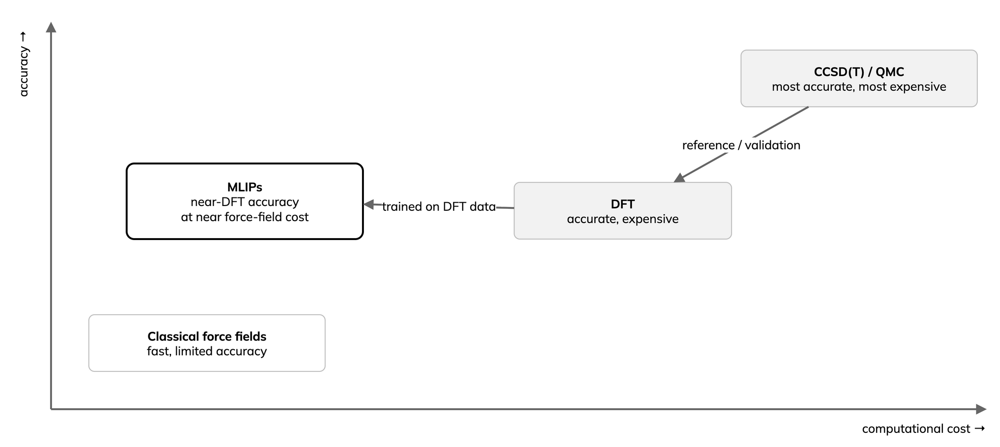

---
jupytext:
  text_representation:
    extension: .md
    format_name: myst
    format_version: '0.13'
kernelspec:
  display_name: Python 3
  language: python
  name: python3
---

# Background: universal MLIPs

:::{objectives}
- Define a foundation MLIP and its training data.
- Explain why most materials models miss dispersion.
- Choose and check a model and a GPU engine.
:::

Core concepts for the hands-on parts. Numbered references are at the end;
reviews are in {doc}`../reference/reading`.

## Interatomic potentials and MLIPs

- A potential gives energy from atomic positions; its gradient gives the
  forces for molecular dynamics (MD) and relaxation.
- Classical force fields: fixed functional form, fast, limited
  transferability. Density functional theory (DFT): accurate, cost grows
  steeply with system size.
- An MLIP is trained on quantum (DFT) energies and forces: near-DFT
  accuracy at near force-field cost. The idea dates from 2007 [1].

## MLIPs among AI methods for materials

- Six families: electronic structure, interatomic potentials, generative
  models, structure to property, LLM agents, autonomous labs and open data.
- This lesson covers interatomic potentials only.

(background-foundation)=
## From bespoke to foundation models

*MLIP milestones, from one model per material to one model reused
everywhere. Own diagram; logos identify the developing organisations.*

- System-specific MLIP: trained for one material, refitted for the next.
- Equivariant graph networks, NequIP [2] and MACE [3], need far less data.
- Foundation MLIP: pre-trained across the periodic table, reused without
  retraining. MACE-MP-0 [4] came first; UMA [7] and Orb-v3 [8] in 2025.
- Coverage follows the data: common elements appear in hundreds of
  thousands of structures, rare ones (noble gases) in a handful (MPtrj
  counts in [4]). Check your elements and short-range repulsion before
  screening arbitrary crystals.

Training data grew over a hundredfold in a few years:

| Dataset | Scale | Reference level |
|---|---|---|
| MPtrj [5] | about 1.58 million configurations, 89 elements | PBE(+U) |
| MatterSim | about 17 million configurations (active learning) | PBE(+U) |
| GNoME | about 89 million structures (not public) | PBE(+U) |
| OMat24 [6] | about 118 million inorganic structures | PBE+U |
| OMol25 [9] | more than 100 million molecular calculations | ωB97M-V/def2-TZVPD |
| UMA training [7] | about 500 million structures | mixed |

Materials models learn PBE, which misses dispersion, so {doc}`a2-orb-models`
adds D3. OMol25 models use a different reference level.

## How the models are built

- Message passing: in a graph neural network (GNN), atoms exchange
  information with neighbours over several rounds; features are learnt,
  not hand-designed.
- Equivariant: rotate the structure and the predicted forces rotate with it,
  while the energy is unchanged. NequIP needs up to about 1000 times less
  data [2].

- Transformers scale the idea to the largest datasets. By 2026, simpler
  designs compete closely: data and scale matter more than architecture.

## Pre-train, then fine-tune

- Recipe [10]: zero-shot for screening; fine-tune on a small targeted set
  when you need numbers; add data by uncertainty (active learning);
  validate the property, not only the energy.
- Fine-tuning can cause catastrophic forgetting on other systems [16];
  keep the original model for general use.

Fine-tuning is data-efficient [10] (errors in meV/atom against DFT; lower
is better):

- High-entropy alloy: fine-tuned 13.8 meV/atom; from scratch 16.4 (MACE)
  and 24.1 (ACE).
- Molybdenum (MACE-MP-0b3): $C_{11}$ error 45.9% zero-shot, 2.6%
  fine-tuned.
- Silicon (MACE-MP-0b): 19-53% zero-shot, 0.6-5.2% fine-tuned.
- Mechanical properties are a known zero-shot weak spot.

(background-engines)=
## GPU engines

- ASE and LAMMPS run one system at a time; their GPU support targets
  classical force fields.
- TorchSim (PyTorch), kUPS (JAX) and NVIDIA ALCHEMI Toolkit (PyTorch and
  Warp) batch many systems into one GPU call [11]. Part A uses TorchSim;
  Part B uses ALCHEMI Toolkit.
- ALCHEMI also supplies CUDA-only kernels (neighbour lists, D3, Ewald) used
  under UMA, Orb, PET and TorchSim, including the D3 on
  {doc}`a2-orb-models`. They run on Leonardo, not on LUMI.

*Engines are built from swappable blocks. Own diagram, after the kUPS
design.*

- Leonardo (NVIDIA): CUDA-only kernels such as cuEquivariance and ALCHEMI
  run.
- LUMI (AMD MI250X): ROCm PyTorch runs MACE; CUDA-only kernels do not.
- NequIP and Allegro foundation models run LAMMPS ML-IAP/Kokkos MD on
  both: up to 102.5 million atoms on 256 GPUs, about 44 000 atoms per A100
  and 22 000 per MI250X GCD. NequIP-OAM-XL matches eSEN-30M-OAM on
  Matbench Discovery at about ten times the speed [12].
- Measured multi-GPU MACE scaling: {doc}`08-scaling`.

(background-choosing)=
## Choosing and trusting a model

- Choose by task and hardware, not by the top leaderboard row.
- Validate the property you study; compare several models.

Fast universal models ([Matbench Discovery](https://matbench-discovery.materialsproject.org)
data, accessed 29 September 2026 [13]):

| Model | Params | F1 ↑ | κSRME ↓ | Licence | Use case |
|---|---:|---:|---:|---|---|
| [Orb-v3](https://github.com/orbital-materials/orb-models) [8] | 26M | 0.905 | 0.21 | Apache-2.0 | fast; D3 variant for van der Waals |
| [SevenNet-Omni](https://github.com/MDIL-SNU/SevenNet) | 55M | 0.906 | 0.19 | MIT | D3 built in; LAMMPS and TorchSim |
| [NequIP-OAM-XL](https://github.com/mir-group/nequip) [12] | 32M | 0.906 | 0.13 | MIT / CC-BY | also runs on AMD GPUs (LUMI) |
| [MatRIS-10M-OAM](https://github.com/HPC-AI-Team/MatRIS) | 10M | 0.921 | 0.22 | BSD-3 | best accuracy for its size |
| [MatterSim v1 5M](https://github.com/microsoft/mattersim) | 4.5M | 0.862 | 0.57 | MIT | small and fast |
| [EquiformerV3-OAM](https://github.com/atomicarchitects/equiformer_v3) | 30M | 0.931 | 0.12 | MIT | accuracy leader, slower |

- F1 (0 to 1, higher is better): stable-crystal classification on
  [Matbench Discovery](https://matbench-discovery.materialsproject.org) [13].
  κSRME (lower is better): thermal-conductivity error.
- The leaderboard moves within months; OMat24-trained models reach F1 of
  about 0.92 to 0.93.
- Most GPU speed-ups are NVIDIA-only (Leonardo). On AMD (LUMI), choose a
  pure-PyTorch model such as [NequIP](https://github.com/mir-group/nequip)
  or [MACE](https://github.com/ACEsuit/mace).
- A low energy error does not guarantee stable MD. Benchmark your property
  class and check stability.
- Beyond one score: [MLIP Arena](https://github.com/atomind-ai/mlip-arena)
  [14] tests equations of state, phonons, diffusion barriers and diatomic
  curves; [mlipbenchmarks](https://github.com/peastman/mlipbenchmarks) [15]
  measures accuracy, MD speed, GPU memory and stability.
- Ensemble: run several models; disagreement flags low confidence.
- Check speed and GPU memory at your system size.
- PBE-trained models miss dispersion. Grimme's
  [D3 correction](https://github.com/dftd3/simple-dftd3) adds it on the GPU
  in [TorchSim](https://github.com/TorchSim/torch-sim) and `orb-models`
  (used on {doc}`a2-orb-models`).

## Outlook

- Directions: long-range electrostatics without charge labels, learned DFT
  functionals for better reference data, generative models screened with
  MLIPs, language-model agents driving simulation codes.
- In every case, validate the property you care about.

:::{keypoints}
- MLIPs learn DFT energies and forces at near force-field cost.
- Use foundation models zero-shot; fine-tune for quantitative accuracy.
- PBE-trained models miss dispersion without D3.
- Batched GPU engines run many systems in one call; choose a model by task
  and validate the property you study.
:::

## References

1. J. Behler, M. Parrinello, Phys. Rev. Lett. 98, 146401 (2007).
   [doi:10.1103/PhysRevLett.98.146401](https://doi.org/10.1103/PhysRevLett.98.146401)
2. S. Batzner et al., Nat. Commun. 13, 2453 (2022).
   [doi:10.1038/s41467-022-29939-5](https://doi.org/10.1038/s41467-022-29939-5)
3. I. Batatia et al., MACE. [arXiv:2206.07697](https://arxiv.org/abs/2206.07697)
4. I. Batatia et al., A foundation model for atomistic materials chemistry.
   [arXiv:2401.00096](https://arxiv.org/abs/2401.00096)
5. B. Deng et al., CHGNet and MPtrj, Nat. Mach. Intell. 5, 1031 (2023).
   [doi:10.1038/s42256-023-00716-3](https://doi.org/10.1038/s42256-023-00716-3)
6. L. Barroso-Luque et al., OMat24. [arXiv:2410.12771](https://arxiv.org/abs/2410.12771)
7. B. M. Wood et al., UMA. [arXiv:2506.23971](https://arxiv.org/abs/2506.23971)
8. B. Rhodes et al., Orb-v3. [arXiv:2504.06231](https://arxiv.org/abs/2504.06231)
9. D. S. Levine et al., OMol25. [arXiv:2505.08762](https://arxiv.org/abs/2505.08762)
10. X. Liu et al., J. Appl. Phys. 139, 041101 (2026).
    [doi:10.1063/5.0299305](https://doi.org/10.1063/5.0299305); companion
    study [arXiv:2506.07401](https://arxiv.org/abs/2506.07401)
11. [TorchSim](https://github.com/TorchSim/torch-sim),
    [kUPS](https://github.com/cusp-ai-oss/kups),
    [ALCHEMI Toolkit](https://github.com/NVIDIA/nvalchemi-toolkit)
12. S. R. Kavanagh et al., NequIP and Allegro foundation models.
    [arXiv:2607.28461](https://arxiv.org/abs/2607.28461)
13. J. Riebesell et al., Matbench Discovery, Nat. Mach. Intell. 7, 836 (2025).
    [doi:10.1038/s42256-025-01055-1](https://doi.org/10.1038/s42256-025-01055-1);
    [leaderboard](https://matbench-discovery.materialsproject.org)
14. Chiang et al., MLIP Arena, NeurIPS 2025 Datasets and Benchmarks.
    [arXiv:2509.20630](https://arxiv.org/abs/2509.20630)
15. Eastman, Pretti and Markland, mlipbenchmarks, J. Chem. Theory Comput. 22, 6108 (2026).
    [doi:10.1021/acs.jctc.6c00130](https://doi.org/10.1021/acs.jctc.6c00130)
16. Kim et al., catastrophic forgetting,
    npj Comput. Mater. 12, 26 (2026).
