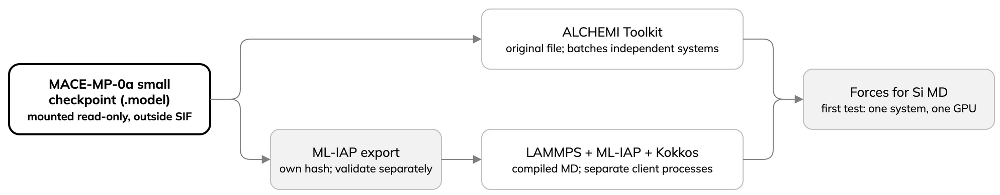

---
jupytext:
  text_representation:
    extension: .md
    format_name: myst
    format_version: '0.13'
kernelspec:
  display_name: Python 3
  language: python
  name: python3
---

# The MACE potential and the two MD engines

A molecular-dynamics (MD) engine steps positions and velocities forward
one step at a time, giving a trajectory; a MACE machine-learned interatomic potential supplies
the forces, here for diamond-structure silicon. MACE is a model family,
not one universal checkpoint; a model suited to one chemical domain may not
suit another.

The lesson pins the MACE-MP-0a small checkpoint. ALCHEMI Toolkit loads the original file,
LAMMPS a separate ML-IAP export. Hashes differ because formats differ; the
export needs its own validation.

:::{dropdown} model.toml
```{literalinclude} ../reference/model.toml
:language: toml
:lines: 1-13
:lineno-match:
```
:::

Check both hashes in the full
[model identity file](../reference/model.toml) before preparing either engine.

Other families (MACE-MPA, MACE-OMAT, MACE-OFF) differ in training data and
use; listing them does not mean the pinned ALCHEMI image or ML-IAP export
can run them without new preparation and tests. See the
[MACE foundation-model documentation](https://mace-docs.readthedocs.io/en/latest/guide/foundation_models.html)
when choosing a model for a new system.

- ALCHEMI Toolkit builds atomic data structures, calls the model and can advance a batch of independent
  systems: one program and GPU allocation, no forces exchanged.
- LAMMPS is a compiled MD engine; ML-IAP calls MACE, Kokkos runs supported
  work on the GPU.
- First comparison: one silicon system, one GPU, both engines. Later, ALCHEMI
  batches systems and LAMMPS runs separate client processes.



:::{note}
The checkpoint stays outside the SIF, so the image can be built, inspected and
reused without a large embedded model or assumed redistribution rights. The
model is selected explicitly and mounted read-only at run time. Changing it
needs a new identity and ML-IAP export, not just a filename edit.
:::
