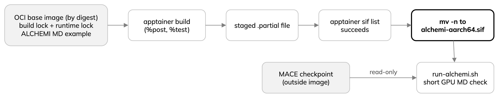

---
jupytext:
  text_representation:
    extension: .md
    format_name: myst
    format_version: '0.13'
kernelspec:
  display_name: Python 3
  language: python
  name: python3
---

# Build the ALCHEMI image

- Base: OCI image pinned by digest.
- Copied into the SIF: two lock files and the ALCHEMI MD example.
- Locks pin build and runtime packages with hashes; they ship with the repository, not generated in class.



:::{dropdown} alchemi-aarch64.def
```{literalinclude} ../alchemi-aarch64.def
:language: text
:lines: 1-11
:lineno-match:
```
:::

:::{dropdown} alchemi-aarch64.def
```{literalinclude} ../alchemi-aarch64.def
:language: text
:start-at: %post
:end-before: %labels
:lineno-match:
```
:::

Full [Apptainer definition](../alchemi-aarch64.def),
[build lock](../locks/build-requirements.lock) and
[runtime lock](../locks/requirements.lock) are in the checkout. The definition installs the locked
packages; locks are not model weights.

Before the GPU exercises, on an aarch64 Apptainer builder (not a notebook
cell), set a **new** output path outside Git and run:

```bash
export MLIP_SIF_OUTPUT=/path/outside/git/alchemi-aarch64.sif
bash scripts/build-alchemi-sif.sh
```

The script builds into a temporary `.partial` file (`staged`) and moves it
into place only after `apptainer sif list` succeeds, so no incomplete SIF
appears at the final path.

:::{dropdown} build-alchemi-sif.sh
```{literalinclude} ../scripts/build-alchemi-sif.sh
:language: bash
:start-at: staged=
:end-at: mv -n
:lineno-match:
:emphasize-lines: 5
```
:::

Highlighted: `apptainer build`. The excerpt omits preflight checks; run the
complete [build script](../scripts/build-alchemi-sif.sh).

:::{note}
The MACE checkpoint stays outside the image. `scripts/run-alchemi.sh` selects
it explicitly and mounts it read-only, so image and model stay independent and a new model needs no
rebuild.
:::

- Record base image digest, both locks and SIF identity.
- `%test` only checks imports; run a short GPU MD job in a real allocation
  before using a new image.
