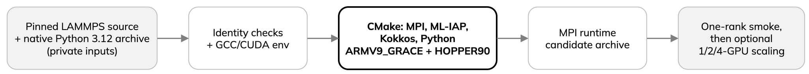

---
jupytext:
  text_representation:
    extension: .md
    format_name: myst
    format_version: '0.13'
kernelspec:
  display_name: Python 3
  language: python
  name: python3
---

# Build native LAMMPS with ML-IAP, Kokkos, and MPI

- ML-IAP embeds Python: needs a prepared CPython 3.12 archive (Torch, MACE,
  CuPy) with matching `Python.h` and `libpython3.12.so`. The notebook venv
  will not do.
- Pinned source and Python archives are private inputs, not in the lesson
  checkout; obtain and verify them first.



The Arrhenius job checks both archive identities, then loads the reviewed GCC/CUDA
environment:

:::{dropdown} build-lammps-mpi.sbatch
```{literalinclude} ../scripts/build-lammps-mpi.sbatch
:language: bash
:start-at: source /software/sse2/init/hpc_init_sse.sh
:end-at: test -x "$(command -v make)"
:lineno-match:
```
:::

- Target: Arrhenius GH200 (Grace CPU, Hopper GPU); CMake enables MPI,
  ML-IAP, Kokkos, Python, `Kokkos_ARCH_ARMV9_GRACE`, `Kokkos_ARCH_HOPPER90`.
- `mpicc`/`mpicxx` must match the MPI stack used at run time.
- Not portable: JUPITER needs its own GH200 build against its compiler/MPI
  stack.

:::{dropdown} build-lammps-mpi.sbatch
```{literalinclude} ../scripts/build-lammps-mpi.sbatch
:language: bash
:start-at: cmake -S
:end-at: -D Python_LIBRARY=
:lineno-match:
```
:::

- Runs in a reviewed Slurm build allocation; writes an MPI runtime
  candidate archive.
- Does not overwrite an existing LAMMPS, submit itself, or prove multi-GPU
  MD correct.
- Excerpts omit identity checks, private paths and validation; see the full
  [build job](../scripts/build-lammps-mpi.sbatch).
- One-rank smoke first, then the optional 1/2/4-GPU scaling episode.

## Use the tested GPU path

The [MACE ML-IAP guide](https://mace-docs.readthedocs.io/en/latest/guide/lammps_mliap.html)
recommends unified ML-IAP, CUDA Kokkos, Newton on, half neighbour lists.
Our example sets these via the LAMMPS library, not `lmp`:

:::{dropdown} lammps_si.py
```{literalinclude} ../examples/lammps_si.py
:language: python
:lines: 23-34
:lineno-match:
:emphasize-lines: 2,11-12
```
:::

- `mliap/kk unified` then applies the exported model; the
  [complete example](../examples/lammps_si.py) adds atoms, integrator,
  timing and cleanup.
- These settings are the baseline for all comparisons here.
- Kokkos does not imply active cuEquivariance kernels; check runtime and
  export before crediting them with a speedup.

## Export the same checkpoint for ML-IAP

ALCHEMI reads the MACE file; LAMMPS reads an ML-IAP export. In the native
Python environment, export to a fresh path outside Git. The exporter checks
the model hash, needs one visible GPU and will not overwrite:

```bash
export MLIP_MLIAP_MODEL=/path/outside/git/mace-mp-0a-small-mliap.pt
python examples/export_mace_mliap.py \
  --model "$MLIP_MODEL" --output "$MLIP_MLIAP_MODEL"
```

- Record the printed export hash with the runtime identity; on Arrhenius it should
  match `reference/model.toml` (a fresh export did, and passed a short
  one-rank run).
- Elsewhere, recheck export and one-rank run; a matching hash is not a
  force or trajectory validation.
- [Exporter source](../examples/export_mace_mliap.py): model check and
  overwrite refusal.

Arrhenius multi-rank profile (site specific, not portable):

- Site MPICH, PMI2/CXI, `gpu/aware on`, peer-visible GPUs; hiding other
  GPUs from a rank caused an ML-IAP ghost-exchange failure.
- Elsewhere, recheck compiler/MPI ABI, device assignment, transport and Slurm
  options. [JUPITER's native setup](../setup/jupiter.md) is separate; a
  future Leonardo profile should be too.
- NCCL is for ALCHEMI's `DomainParallel` path, not a replacement for this
  build's MPI.
