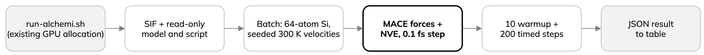

---
jupytext:
  text_representation:
    extension: .md
    format_name: myst
    format_version: '0.13'
kernelspec:
  display_name: Python 3
  language: python
  name: python3
---

# Simulate silicon with MACE

- System: cubic diamond Si, 2 x 2 x 2 cells, 64 atoms.
- Potential: pinned MACE model for energy and forces.
- Run: NVE velocity Verlet, 0.1 fs step, 10 warmup and 200 timed steps.
- Initial velocities: 300 K. NVE has no thermostat, so temperature is not held at 300 K.



The ALCHEMI example builds `AtomicData` per system, assigns seeded velocities
and collects the systems into a `Batch` (one replica: still one physical simulation):

:::{dropdown} alchemi_si.py
```{literalinclude} ../examples/alchemi_si.py
:language: python
:start-at: def make_batch
:end-before: def run_steps
:lineno-match:
```
:::

Explicit integrator and neighbour-list hook:

- `--integrator nve`: `NVE`.
- `--integrator langevin`: NVT Langevin, temperature and friction set in code.
- Different physics: never share one performance or trajectory claim.

:::{dropdown} alchemi_si.py
```{literalinclude} ../examples/alchemi_si.py
:language: python
:start-at: def run_steps
:end-before: def main
:lineno-match:
```
:::

Seeded velocities and timing code: full [ALCHEMI example](../examples/alchemi_si.py).

The cell below runs the single trajectory (Arrhenius environment, one GPU
allocated). The helper mounts the model and this script read-only into the
SIF, so it runs the code above. Terminal equivalent, from the repository root:

```bash
bash scripts/run-alchemi.sh --replicas 1 --cells 2 \
  --integrator nve --warmup 10 --steps 200
```

Output is structured; the notebook tabulates a few fields. Neither submits
a job: both need an existing GPU allocation and the setup-page environment
variables.

```{code-cell} ipython3
:tags: [hide-input]
import json
import subprocess
from time import perf_counter
from pathlib import Path
from IPython.display import Markdown, display

lesson = Path.cwd().parent if Path.cwd().name == "episodes" else Path.cwd()
started = perf_counter()
completed = subprocess.run(
    ["bash", str(lesson / "scripts/run-alchemi.sh"), "--replicas", "1", "--cells", "2",
     "--integrator", "nve", "--warmup", "10", "--steps", "200"],
    check=True, capture_output=True, text=True,
)
command_wall = perf_counter() - started
one = json.loads(completed.stdout.strip().splitlines()[-1])
display(Markdown(
    "| Atoms | Timed steps | Whole command (s) | MD steps only (s) | Peak Torch memory (GiB) |\n"
    "| ---: | ---: | ---: | ---: | ---: |\n"
    f"| {one['atoms_per_replica']} | {one['measured_steps']} | "
    f"{command_wall:.3f} | {one['measured_seconds']:.3f} | "
    f"{one['peak_torch_allocated_bytes']/2**30:.2f} |"
))
```

:::{note}
- Whole command: SIF startup, model loading, warmup and MD.
- MD steps only: excludes those setup costs.
- Neither includes queue wait.
- One short timing does not predict sustained production speed or validate
  the model against reference science.
- PyTorch peak allocation is not total GPU memory use.
:::
