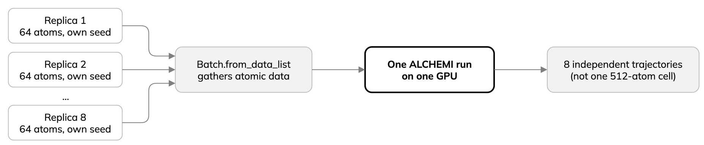

---
jupytext:
  text_representation:
    extension: .md
    format_name: myst
    format_version: '0.13'
kernelspec:
  display_name: Python 3
  language: python
  name: python3
---

# Batch independent trajectories on one GPU

Eight copies of a 64-atom cell with different seeded velocities stay eight
independent simulations, not one coupled 512-atom cell. `Batch.from_data_list`
lets one ALCHEMI run advance them together.



The cells below time one trajectory, then eight, on the same GPU. Do not run
another GPU notebook meanwhile. Terminal equivalent, from the lesson checkout:

```bash
bash scripts/run-alchemi.sh --replicas 1 --cells 2 --integrator nve --warmup 10 --steps 200
bash scripts/run-alchemi.sh --replicas 8 --cells 2 --integrator nve --warmup 10 --steps 200
```

The notebook times each whole command, including setup and model loading.
The runner's MD-only time is a different timing window.

```{code-cell} ipython3
:tags: [hide-input]
import json
import subprocess
from time import perf_counter
from pathlib import Path
from IPython.display import Markdown, display

lesson = Path.cwd().parent if Path.cwd().name == "episodes" else Path.cwd()
single_start = perf_counter()
single_call = subprocess.run(
    ["bash", str(lesson / "scripts/run-alchemi.sh"), "--replicas", "1", "--cells", "2",
     "--integrator", "nve", "--warmup", "10", "--steps", "200"],
    check=True, capture_output=True, text=True,
)
single_wall = perf_counter() - single_start
single = json.loads(single_call.stdout.strip().splitlines()[-1])
display(Markdown(
    f"Time to finish one simulation: **{single_wall:.3f} s** "
    f"({single['measured_steps']} measured MD steps; "
    f"MD-only time {single['measured_seconds']:.3f} s)."
))
```

```{code-cell} ipython3
:tags: [hide-input]
batch_start = perf_counter()
batch_call = subprocess.run(
    ["bash", str(lesson / "scripts/run-alchemi.sh"), "--replicas", "8", "--cells", "2",
     "--integrator", "nve", "--warmup", "10", "--steps", "200"],
    check=True, capture_output=True, text=True,
)
batch_wall = perf_counter() - batch_start
batch = json.loads(batch_call.stdout.strip().splitlines()[-1])
display(Markdown(
    "| Simulations | Atoms each | Time to finish all (s) | MD-only time (s) |\n"
    "| ---: | ---: | ---: | ---: |\n"
    f"| 1 | {single['atoms_per_replica']} | {single_wall:.3f} | "
    f"{single['measured_seconds']:.3f} |\n"
    f"| 8 | {batch['atoms_per_replica']} | {batch_wall:.3f} | "
    f"{batch['measured_seconds']:.3f} |"
))
```

- The rows do different work, so their times are not a speedup ratio.
- For methods on the *same eight simulations*, see the
  [reviewed benchmark](07-reviewed-results.md); these short live runs only
  illustrate.
- Aggregate rate: `simulations × measured steps / time to finish all`
  (MD steps per second across all simulations, not per trajectory).
- Larger systems may already fill the GPU, so batching gains less.

:::{note}
For NVT, change `--integrator nve` to `langevin` in both cells. ALCHEMI uses
`NVTLangevin`; native LAMMPS can use `langevin` with `nve/kk` or a Nose–Hoover
`nvt/kk` fix. Same target temperature does not make these interchangeable;
keep NVE and NVT results in separate tables.
:::
