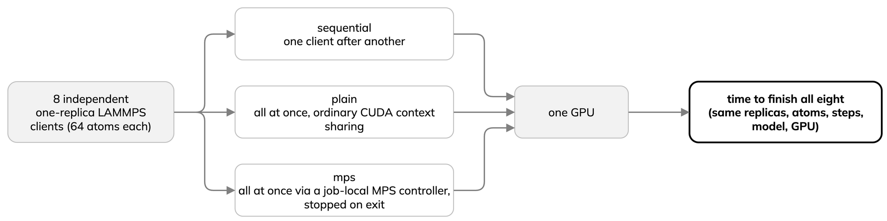

---
jupytext:
  text_representation:
    extension: .md
    format_name: myst
    format_version: '0.13'
kernelspec:
  display_name: Python 3
  language: python
  name: python3
---

# B6 Run the same silicon case with LAMMPS

- LAMMPS loads the validated ML-IAP export of the MACE checkpoint; ML-IAP
  connects the potential and `/kk` styles run supported GPU work with Kokkos.
- Activation uses the LAMMPS Python library, not yet a standalone `.in` recipe.
- Input below; [complete source](../examples/lammps_si.py) supplied.

:::{dropdown} lammps_si.py
```{literalinclude} ../examples/lammps_si.py
:language: python
:start-at: for command in (
:end-at: lmp.command("run 0")
:lineno-match:
```
:::

With the MPI-enabled native runtime extracted and set as `MLIP_NATIVE_PREFIX`,
the first cell runs one 64-atom NVE trajectory on one GPU (one rank, not an
MPI scaling test). Terminal equivalent, from the lesson checkout:

```bash
bash scripts/run-lammps.sh --replicas 1 --cells 2 --integrator nve --warmup 10 --steps 200
```

As with ALCHEMI, the notebook times the complete command; the runner's
MD-only time is shown separately.

```{code-cell} ipython3
:tags: [hide-input]
import json
import subprocess
from time import perf_counter
from pathlib import Path
from IPython.display import Markdown, display

lesson = Path.cwd().parent if Path.cwd().name == "episodes" else Path.cwd()
one_start = perf_counter()
completed = subprocess.run(
    ["bash", str(lesson / "scripts/run-lammps.sh"), "--replicas", "1", "--cells", "2",
     "--integrator", "nve", "--warmup", "10", "--steps", "200"],
    check=True, capture_output=True, text=True,
)
one_wall = perf_counter() - one_start
lammps_one = json.loads(completed.stdout.strip().splitlines()[-1])
display(Markdown(
    f"Time to finish one LAMMPS simulation: **{one_wall:.3f} s** "
    f"({lammps_one['measured_steps']} measured MD steps; "
    f"MD-only time {lammps_one['measured_seconds']:.3f} s)."
))
```

Eight independent simulations on one GPU, three workloads:



1. `sequential`: one client after another. Baseline; no concurrent sharing.
2. `plain`: all eight at once; ordinary CUDA context sharing.
3. `mps`: job-local CUDA Multi-Process Service (MPS) controller with private
   pipe and log directories, confined to the allocation and stopped on exit.
   May cut context-scheduling overhead; no guaranteed speedup.

- ALCHEMI's single-process `Batch` is none of these modes.
- Metric: time to finish all eight, with the same replicas, atoms, steps, model and GPU.
- The [reviewed-results episode](07-reviewed-results.md) keeps plain and MPS
  in separate rows.
- Optional, longer cells: run each once in a suitably long allocation, not
  alongside another GPU exercise.

Terminal equivalents, run individually from the lesson checkout:

```bash
bash scripts/run-lammps-group.sh sequential --cells 2 --integrator nve --warmup 10 --steps 200
bash scripts/run-lammps-group.sh plain --cells 2 --integrator nve --warmup 10 --steps 200
bash scripts/run-lammps-group.sh mps --cells 2 --integrator nve --warmup 10 --steps 200
```

Each cell times its complete command, including wrapper startup. The
runner's `group_wall_seconds` starts later and is not used for this
comparison.

```{code-cell} ipython3
:tags: [hide-input]
sequential_start = perf_counter()
sequential_call = subprocess.run(
    ["bash", str(lesson / "scripts/run-lammps-group.sh"), "sequential", "--cells", "2",
     "--integrator", "nve", "--warmup", "10", "--steps", "200"],
    check=True, capture_output=True, text=True,
)
sequential_wall = perf_counter() - sequential_start
sequential = json.loads(sequential_call.stdout.strip().splitlines()[-1])
display(Markdown(
    f"Time to finish eight sequential LAMMPS simulations: "
    f"**{sequential_wall:.2f} s** (runner group wall "
    f"{sequential['group_wall_seconds']:.2f} s)."
))
```

```{code-cell} ipython3
:tags: [hide-input]
plain_start = perf_counter()
plain_call = subprocess.run(
    ["bash", str(lesson / "scripts/run-lammps-group.sh"), "plain", "--cells", "2",
     "--integrator", "nve", "--warmup", "10", "--steps", "200"],
    check=True, capture_output=True, text=True,
)
plain_wall = perf_counter() - plain_start
plain = json.loads(plain_call.stdout.strip().splitlines()[-1])
display(Markdown(
    f"Time to finish eight ordinary-sharing LAMMPS simulations: "
    f"**{plain_wall:.2f} s** (runner group wall "
    f"{plain['group_wall_seconds']:.2f} s)."
))
```

```{code-cell} ipython3
:tags: [hide-input]
mps_start = perf_counter()
mps_call = subprocess.run(
    ["bash", str(lesson / "scripts/run-lammps-group.sh"), "mps", "--cells", "2",
     "--integrator", "nve", "--warmup", "10", "--steps", "200"],
    check=True, capture_output=True, text=True,
)
mps_wall = perf_counter() - mps_start
mps = json.loads(mps_call.stdout.strip().splitlines()[-1])
display(Markdown(
    f"Time to finish eight MPS LAMMPS simulations: **{mps_wall:.2f} s** "
    f"(runner group wall {mps['group_wall_seconds']:.2f} s)."
))
```
