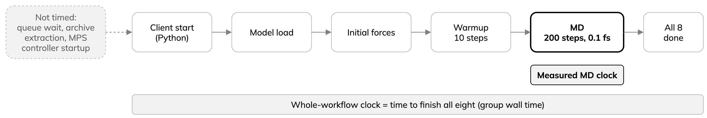

---
mystnb:
  execution_mode: force
  render_markdown_format: gfm
jupytext:
  text_representation:
    extension: .md
    format_name: myst
    format_version: '0.13'
kernelspec:
  display_name: Python 3
  language: python
  name: python3
---

# B7 Read a completed shared-GPU benchmark

ALCHEMI batching versus eight native LAMMPS processes sharing one GH200
on Arrhenius or JUPITER.

- Each row: eight independent silicon/MACE trajectories, NVE, 64 or 512
  atoms each. The incomplete Arrhenius 4,096-atom matrix is excluded.
- Recorded site runs, not your session. Cells only read checked-in CSVs:
  no MD, allocation or Slurm.
- Sites differ in runtime and startup conditions; do not compare them as
  if identical.

## Reference measurements

Tabs select displayed reference data only, not a backend or kernel.

::::{tab-set}
:sync-group: site

:::{tab-item} Arrhenius
:sync: arrhenius
One Arrhenius GH200; time to finish all eight trajectories, in seconds:

| Atoms/trajectory | ALCHEMI batch | LAMMPS ordinary, 8 clients | LAMMPS MPS, 8 clients |
| ---: | ---: | ---: | ---: |
| 64 | 18.745 | 100.010 | 88.336 |
| 512 | 26.599 | 114.335 | 90.782 |

[All 16 Arrhenius rows](reviewed-shared-gpu-nve.csv).
:::

:::{tab-item} JUPITER
:sync: jupiter
One JUPITER GH200 (a full node was allocated); time to finish all eight
trajectories, in seconds:

| Atoms/trajectory | ALCHEMI batch | LAMMPS ordinary, 8 clients | LAMMPS MPS, 8 clients |
| ---: | ---: | ---: | ---: |
| 64 | 76.380 | 95.733 | 73.033 |
| 512 | 35.166 | 115.179 | 75.696 |

[All 16 JUPITER comparison rows](reviewed-shared-gpu-nve-jupiter.csv).
The private JUPITER matrix also keeps a redundant ordinary-sharing
one-client row per size. The site MPS server was observed during the
concurrent clients.
:::

::::

## Whole workflow or measured MD?



- Whole workflow: ALCHEMI client start until all eight finish.
- Measured MD: the 200 steps after ten warmup steps, all eight together;
  excludes Python startup, model loading, initial forces and warmup.

| Site | Atoms/simulation | Whole workflow, all eight (s) | Measured MD, all eight (s) |
| --- | ---: | ---: | ---: |
| Arrhenius | 64 | 18.745 | 5.595 |
| Arrhenius | 512 | 26.599 | 13.373 |
| JUPITER | 64 | 76.380 | 4.571 |
| JUPITER | 512 | 35.166 | 13.232 |

- One run per case, not medians; sites used different runtime packaging.
- JUPITER ran 64 atoms first in its job. Its long whole-workflow time is
  startup and setup, not slower MD (measured MD is similar); the cause
  (imports, filesystem caching, GPU power policy) is not isolated.
- For a site-performance claim, repeat cases in varied order and report
  medians and ranges for *both* clocks.

The read-only cell below renders one full CSV. Change `site` to see the
other site (tabs do not change notebook variables); re-running changes no
data and runs no MD.

- `processes`: LAMMPS client processes; ALCHEMI is one process, eight replicas.
- Each row: eight simulations, each 10 warmup and 200 measured steps.
- Both engines: NVE velocity-Verlet, 0.1 fs; initial velocities independent,
  not atom-by-atom matched.
- Time to finish all eight = group wall time: client startup, model loading,
  warmup and MD; excludes queue wait, native archive extraction and MPS
  controller startup.
- Aggregate rate = `8 × 200 / group wall seconds`: MD steps across all
  eight per second, not one trajectory's speed nor a standard MD unit.

```{code-cell} ipython3
:tags: [hide-input]
import csv
from pathlib import Path
from IPython.display import Markdown, display

episode_dir = Path.cwd() / "episodes" if (Path.cwd() / "episodes").is_dir() else Path.cwd()
site = "Arrhenius"  # change to "JUPITER" to inspect its full table and figure
sources = {
    "Arrhenius": "reviewed-shared-gpu-nve.csv",
    "JUPITER": "reviewed-shared-gpu-nve-jupiter.csv",
}
with (episode_dir / sources[site]).open(newline="") as stream:
    rows = list(csv.DictReader(stream))

assert len(rows) == 16 and {int(row["atoms_per_replica"]) for row in rows} == {64, 512}
display(Markdown(
    "| Atoms/simulation | Method | Clients | Time to finish all 8 (s) | MD steps across all 8/s |\n"
    "| ---: | --- | ---: | ---: | ---: |\n" +
    "\n".join(
        f"| {r['atoms_per_replica']} | {r['method']} | {r['processes']} | "
        f"{r['group_wall_seconds']} | {r['replica_steps_per_second']} |"
        for r in rows
    )
))
```

## Generate a comparison figure

Time to finish all eight; shorter is better for this fixed work. Shows ALCHEMI and the two
eight-process LAMMPS modes (ordinary, CUDA MPS); the table keeps every
client count. Whole-workflow timings, not force-kernel speedups.

```{code-cell} ipython3
:tags: [hide-input]
%matplotlib inline
import matplotlib.pyplot as plt

selected = {("ALCHEMI batch", "1"), ("LAMMPS ordinary sharing", "8"),
            ("LAMMPS CUDA MPS", "8")}
labels = ["ALCHEMI batch", "LAMMPS ordinary sharing", "LAMMPS CUDA MPS"]
fig, axes = plt.subplots(1, 2, figsize=(13, 5), sharey=True)
for ax, atoms in zip(axes, (64, 512)):
    subset = [r for r in rows if int(r["atoms_per_replica"]) == atoms
              and (r["method"], r["processes"]) in selected]
    by_method = {r["method"]: float(r["group_wall_seconds"]) for r in subset}
    ax.barh(labels, [by_method[label] for label in labels])
    ax.set_title(f"Eight simulations × {atoms} atoms")
    ax.set_xlabel("Time to finish all eight (s; shorter is better)")
    ax.invert_yaxis()
fig.suptitle(f"{site} GH200: completed NVE workflows (one run per case)")
fig.tight_layout()
plt.show()
```

## Interpret the measurement

Arrhenius:

- ALCHEMI versus fastest LAMMPS: 18.745 s vs 88.336 s at 64 atoms (about
  4.71x); 26.599 s vs 90.782 s at 512 atoms (about 3.41x).
- Not a repeated-run estimate, kernel speedup, trajectory-equivalence result
  or GPU memory limit.
- The 4,096-atom matrix timed out before its eighth row; do not extrapolate.

JUPITER:

- ALCHEMI 76.380 s (64) vs 35.166 s (512): the larger case is not
  intrinsically faster; startup and setup dominate the first whole-workflow
  result (measured MD above); the precise cause is not isolated.
- LAMMPS MPS 73.033 s and 75.696 s vs ordinary 95.733 s and 115.179 s.
- Supports showing both modes, not a general MPS or cross-site speedup claim.

For a new comparison:

- Record model and software hashes, GPU occupancy, initial positions and
  velocities, warmup and timed-step counts.
- Repeat each case on an otherwise idle GPU; report median and range for
  time to finish all eight.
- Compare energies and forces at matched states separately from timing.
- At 64 atoms, setup and model loading weigh more than at large atom counts.
