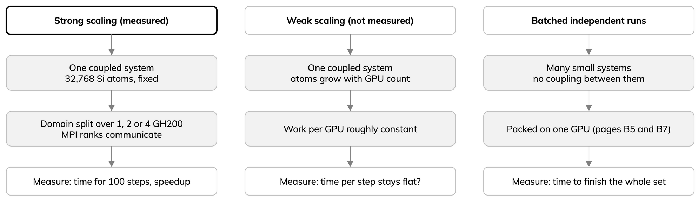

---
jupytext:
  text_representation:
    extension: .md
    format_name: myst
    format_version: '0.13'
kernelspec:
  display_name: Python 3
  language: python
  name: python3
---

# B8 One silicon simulation on more than one GPU

How many GPUs for one large molecular-dynamics (MD) run? Ask: does it fit, how
long does it take, do extra GPUs save enough time. Measured LAMMPS/MACE runs on
one GH200 node on Arrhenius or JUPITER. Not the same as [running eight independent simulations on one GPU](05-batched-md.md).



## Start with one GPU

Preliminary one-GH200 size sweeps, after ten warmup steps. Each row is **one** run of 100 measured steps, not a median.
The tabs select displayed site evidence; they do not change a notebook kernel.

::::{tab-set}
:sync-group: site

:::{tab-item} Arrhenius
:sync: arrhenius
| Silicon atoms | Time for 100 measured MD steps |
| ---: | ---: |
| 512 | 35.4 s |
| 8,000 | 43.7 s |
| 32,768 | 117.1 s |
:::

:::{tab-item} JUPITER
:sync: jupiter
| Silicon atoms | Time for 100 measured MD steps |
| ---: | ---: |
| 512 | 30.6 s |
| 8,000 | 43.4 s |
| 32,768 | 120.2 s |

Full four-GH200 Booster node allocated, one GPU used. Not a controlled
cross-site comparison.
:::

::::

Capacity probes, pinned model, ten measured MD steps:

- One GH200 completed 39,304 silicon atoms on **each site**.
- 46,656 atoms (next cubic size): CUDA out-of-memory on each site (JUPITER
  during the two-step warmup, not a completed MD run).
- Brackets **the tested workload on each site**, not a maximum for every model
  or trajectory.
- Separate native runner from the MPI jobs below; do not combine into one speedup.
- Says nothing about the largest system four GPUs can run together.

## Does adding GPUs finish the same system sooner?

**Strong scaling**: fixed atom count, *same coupled system*, more GPUs. One
32,768-atom silicon system split over one, two or four GH200s in one node;
100 cold MD steps, 0.1-fs timestep, same MACE model. Median of three completed
repetitions per GPU count.

::::{tab-set}
:sync-group: site

:::{tab-item} Arrhenius
:sync: arrhenius
| GH200 GPUs | Median MD time for 100 steps | Speedup over one GPU |
| ---: | ---: | ---: |
| 1 | 119.8 s | 1.00× |
| 2 | 78.4 s | 1.53× |
| 4 | 50.8 s | 2.36× |
:::

:::{tab-item} JUPITER
:sync: jupiter
| GH200 GPUs | Median MD time for 100 steps | Speedup over one GPU |
| ---: | ---: | ---: |
| 1 | 122.6 s | 1.00× |
| 2 | 73.4 s | 1.67× |
| 4 | 47.7 s | 2.57× |

Full Booster node for all GPU counts. One visible GPU per MPI rank; duration
is the slowest rank's.
:::

::::

Four GPUs finished this short workload sooner on both sites, but not four times sooner. Arrhenius: 4 × 50.8 s ≈ 203
GPU-seconds versus about 120 on one GPU. Trade waiting time against GPU use.
Application timings, not scheduler charges.

Caveats:

- Arrhenius timing covers LAMMPS `run 0` plus 100 steps; excludes queue wait,
  process startup and extraction of the native runtime archive.
- Rank counts and Langevin random streams differ: **not** identical
  trajectories or proven scientific agreement.
- Three short samples per site: limited variation, not a long production rate.
- Different runtime stacks: no Arrhenius-versus-JUPITER hardware ranking.

Reviewed *job template* for the 32,768-atom case:

- Check account, partition, time, memory and GPU request against the current
  site before any manual submission.
- For two or four GPUs, change MPI rank, GPU, CPU and memory requests together
  and review separately.
- Opening this page or running a notebook cell submits nothing.

:::{warning}
Do not treat `sbatch --test-only` as proof that a reservation or allocation
will actually run. Verify current site policy and the real job outcome.
:::

:::{dropdown} lammps-mpi-size-benchmark.sbatch
```{literalinclude} ../scripts/lammps-mpi-size-benchmark.sbatch
:language: bash
:lines: 1-16
:lineno-match:
```
:::

Read the [complete job script](../scripts/lammps-mpi-size-benchmark.sbatch)
before adapting or submitting; the excerpt hides setup, checks and launch.

## What about weak scaling and larger systems?

- **Weak scaling** (atoms grow with GPUs, roughly constant work per GPU):
  **not** measured for one/two/four GPUs of this LAMMPS/MACE system; the strong-scaling table is not a weak-scaling result.
- Four-GPU atom limit not measured. To bound it: predeclare increasing sizes,
  fix model and run settings, record successes and explicit memory failures, stop at the
  first resource limit.
- Four GPUs are not one pooled memory; domain decomposition adds per-rank data
  and communication. Largest completed case = **tested workload**, not an
  intrinsic limit. See [Limits and provenance](../reference/limits.md).
- ALCHEMI Toolkit `DomainParallel` also splits one system across GPUs, but its
  multi-GPU records show an unresolved rank-count energy difference: no
  cross-engine scaling claim.
- JUPITER has a separate [per-rank GPU binding and native MPI setup](../setup/jupiter.md).
  Eight GPUs on two nodes passed a short functional check (ten steps, 512
  atoms): not a multi-node scaling study, do not plot as speedups.

Many small *independent* runs: see [B5 Batch independent trajectories](05-batched-md.md)
and the [reviewed eight-simulation comparison](07-reviewed-results.md); the
measure is time to finish the set, not scaling of one simulation.
