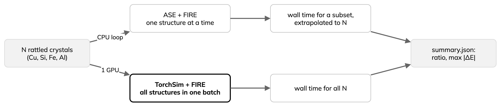

---
jupytext:
  text_representation:
    extension: .md
    format_name: myst
    format_version: '0.13'
kernelspec:
  display_name: Python 3
  language: python
  name: python3
---

# Batched relaxation for screening

:::{objectives}
- Explain why batched GPU relaxation speeds up screening.
- Relax one set serially with ASE and in one TorchSim batch.
- Compare wall time and energy agreement.
:::

Serial relaxation leaves the GPU idle; batching fills it
({ref}`background-engines`).

- One MACE-MP model, two routes: serial ASE and one batched
  [TorchSim](https://github.com/TorchSim/torch-sim) call on one GPU.
- Part A: own pixi environment, MACE-MP-0b small (not Part B's MACE-MP-0a).
- Workload: rattled copies of Cu fcc, Si diamond, Fe bcc and Al fcc (8 to
  32 atoms); each copy needs its own relaxation.

:::{dropdown} workload.py
```{literalinclude} ../examples/torchsim/workload.py
:language: python
:start-at: FAMILIES
:lineno-match:
```
:::



## Serial and batched runs

Both routes use FIRE with a fixed cell.

- Stop at `--fmax` (default 0.05 eV/Å) or `--max-steps`.
- Serial relaxes only the first `--baseline-n` structures and extrapolates
  to the full set; a full serial run would use most of the allocation.

:::{dropdown} runners.py
```{literalinclude} ../examples/torchsim/runners.py
:language: python
:start-at: class SerialRelaxer
:lineno-match:
```
:::

- TorchSim advances all ASE `Atoms` as one batched state; converged
  structures leave the batch.
- `--autobatch` splits the set to fit GPU memory.
- Same checkpoint for both; TorchSim needs the raw model
  (`return_raw_model=True`):

:::{dropdown} models.py
```{literalinclude} ../examples/torchsim/models.py
:language: python
:start-at: def load_mace
:end-before: def load_models
:lineno-match:
```
:::

Outputs: ASE versus TorchSim energies on the shared structures,
`summary.json` and `relaxed.extxyz`. A local `--checkpoint` file also gets
its SHA-256 recorded.

## Laptop run

- Package `examples/torchsim/` with its own [pixi](https://pixi.sh)
  environment; entry point
  [`examples/torchsim/__main__.py`](../examples/torchsim/__main__.py).
- `smoke` uses a toy Lennard-Jones potential: no download, seconds to run,
  no physical meaning.

```bash
cd examples/torchsim
pixi run smoke
```

Output goes to `examples/torchsim_smoke/`. Existing output directories are
never overwritten: remove it or pass a new `--outdir`.

Expected output (numbers vary):

```text
model=lj device=cpu dtype=float64 structures=8 serial subset=2
                             wall time   s/structure
serial, measured                 0.1 s        0.03 s   (2 structures)
serial, estimated                0.2 s        0.03 s   (8 structures)
batched, measured                5.4 s        0.68 s   (8 structures)
estimated serial / batched: 0.04
max |E_ASE - E_TorchSim| on the serial subset: 2.03e-01 eV
```

- Batching is slower on a CPU with a cheap potential: no GPU parallelism.
- The energy gap comes from different Lennard-Jones cutoff and shift
  conventions in ASE and TorchSim. Only the MACE run is a consistency check
  (a few meV).

MACE on a CPU: the `cpu` task relaxes four structures for at most 20 steps
into `examples/torchsim_cpu/`. First run downloads MACE-MP-0b small (about
68 MB):

```bash
pixi run cpu
```

## Leonardo run (one A100)

Compute nodes have no internet. On a login node, install the pixi environment in your lesson copy and download
the checkpoint to a private location outside Git:

:::{dropdown} Commands
```bash
cd /leonardo_scratch/fast/<PROJECT>/<USER>/mlip-md-lesson/examples/torchsim
pixi install
curl -L -o <SCRATCH>/models/mace-mp-0b-small.model \
  https://github.com/ACEsuit/mace-mp/releases/download/mace_mp_0b/mace_agnesi_small.model
printf '%s  %s\n' \
  7e3a0abcaf41e03a80e69f778e1b11b29de1cca704783dc25917a736392f8cf0 \
  <SCRATCH>/models/mace-mp-0b-small.model | sha256sum -c -
```
:::

The job checks this SHA-256 and refuses any other file. Submit from the
repository root; missing inputs or an existing output directory abort it:

:::{dropdown} Commands
```bash
export MLIP_LESSON_ROOT=/leonardo_scratch/fast/<PROJECT>/<USER>/mlip-md-lesson
export MLIP_TORCHSIM_CHECKPOINT=<SCRATCH>/models/mace-mp-0b-small.model
export MLIP_RESULTS_DIR=/path/to/private/results
sbatch --account=<PROJECT> \
  --export=ALL,MLIP_LESSON_ROOT,MLIP_TORCHSIM_CHECKPOINT,MLIP_RESULTS_DIR \
  scripts/test-leonardo-torchsim.sbatch
```
:::

:::{dropdown} test-leonardo-torchsim.sbatch
```{literalinclude} ../scripts/test-leonardo-torchsim.sbatch
:language: bash
:start-at: outdir=
:lineno-match:
```
:::

This script has not yet been qualified. Neither result row below comes
from it: float64 is from an earlier script with the same workload and
options; float32 is from a separate tuned run (options under the table).

## Leonardo results

One A100, MACE-MP-0b small, no cuEquivariance. Serial measured
8 structures, scaled to the full set.

| Precision and batching | Structures | Serial, 8 measured (s) | Serial, estimated (s) | Batched (s) | Estimated serial / batched |
|---|---:|---:|---:|---:|---:|
| float64 | 64 | 37.4 | 299.5 | 59.3 | 5.05 |
| float32, `--autobatch` | 128 | 38.7 | 619.6 | 85.2 | 7.27 |

The float32 run used `--dtype float32 --n-variants 32 --autobatch`.

:::{warning}
Single examples, not a benchmark.

- One run per row: no repeats, medians or ranges.
- Full-set serial time is extrapolated from 8 structures.
- MACE-MP-0b small, not Part B's MACE-MP-0a: energies and costs are not
  interchangeable.
- No cuEquivariance kernels; they would change the timings.
- Relaxation, not MD: do not compare with Part B timings.
:::

## LUMI (AMD MI250X) check

MACE runs on AMD via ROCm PyTorch (CSC `pytorch` module). Separate ASE
script, no TorchSim batching, one MI250X GCD:

| Step | System | Time (s) |
|---|---|---:|
| Single point | 32 atoms | 1.6 |
| FIRE relaxation, serial | 6 structures (Cu, Al, Fe, Si) | 17.0 |
| MD, 600 K | 200 steps, 32 atoms | 3.9 |

- One run, float64, MACE-MP-0a small.
- Shows the model runs on AMD; not a speed comparison with the A100 table.
- CUDA-only kernels (cuEquivariance, ALCHEMI) are not available on AMD.

## Reading the results

- One A100: batched about 5 times faster than serial estimate (float64),
  about 7 times (float32, `--autobatch`).
- CPU with the toy potential: batching slower; the gain is GPU parallelism.
- One run each, extrapolated serial time: ratios are indicative.

:::{keypoints}
- Batching runs many relaxations in one GPU call; 5 to 7 times faster on an A100.
- On a CPU, batching gives no gain.
- Check serial and batched energies agree before comparing timings.
:::
