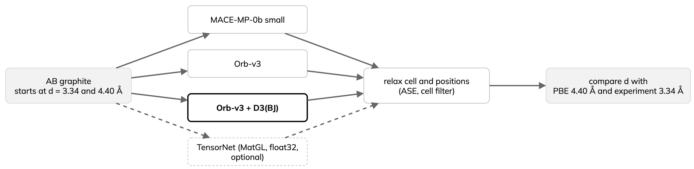

---
jupytext:
  text_representation:
    extension: .md
    format_name: myst
    format_version: '0.13'
kernelspec:
  display_name: Python 3
  language: python
  name: python3
---

# Orb-v3, MatGL and dispersion

:::{objectives}
- Run the screening workflow with another universal model.
- Test whether a PBE-trained model binds graphite layers.
- Add D3 dispersion and judge against the right reference.
:::

The same screening runs with Orb-v3 and MatGL TensorNet; graphite then shows
what PBE-trained models miss.

- PBE has no dispersion ({ref}`background-foundation`).
- Graphite layers are held together by van der Waals (dispersion)
  attraction.

## Orb-v3

- [Orb-v3](https://arxiv.org/abs/2504.06231) (2025): universal potentials
  from Orbital Materials, Apache-2.0, in
  [`orb-models`](https://github.com/orbital-materials/orb-models).
- Not equivariant by construction; its developers report accurate
  properties at much lower latency and memory than MACE.
- Comparison with other fast models: {ref}`background-choosing`.

Model names encode three choices:

| Part of the name | Options | Meaning |
|---|---|---|
| `conservative` / `direct` | forces from the energy gradient, or predicted directly | conservative is slower but gives a consistent energy surface; use it for relaxations, elastic constants, phonons and NVE MD |
| `inf` / `20` | up to 120 neighbours, or at most 20 | the cap of 20 makes the energy surface discontinuous |
| `omat` / `mpa` | trained on OMat24, or on MPtrj and Alexandria | the Orb authors advise `omat` unless a benchmark needs `mpa` |

The example uses `orb-v3-conservative-inf-omat`: trained on PBE and PBE+U
without dispersion, so it has learnt none, despite its 6 Å cutoff.

## Switch the model

The Orb loader returns a model and an atoms adapter, used by both the ASE
calculator (serial) and the TorchSim wrapper (batch):

:::{dropdown} Code: models.py
```{literalinclude} ../examples/torchsim/models.py
:language: python
:start-at: def load_orb
:end-before: def load_models
:lineno-match:
```
:::

Laptop CPU check: change only `--model`. First run downloads about 100 MB:

```bash
cd examples
pixi run --manifest-path torchsim/pixi.toml \
  python -m torchsim --model orb-v3-conservative-inf-omat --device cpu \
  --n-variants 1 --baseline-n 1 --max-steps 20 --outdir orb_cpu
```

ASE and TorchSim energies differed by 4 × 10⁻⁴ eV after at most 20 steps.
This is the optimiser paths, not the model: single points agree to about
10⁻¹² eV.

Implementation details that affect accuracy:

- Set precision in the loader (`precision="float32-highest"` or
  `"float64"`), not with `torch.set_float32_matmul_precision`: the loader
  resets it.
- The Orb and MACE loaders change torch's global default dtype; the example
  restores it after each load, or results depend on load order.
- The Orb ASE calculator builds its graph in the global default dtype; the
  example sets the dtype per call, or a float64 model gets float32
  positions.
- `compile=False` turns off `torch.compile`, which would add a one-off cost
  to the timed serial baseline.

## MatGL

- [MatGL](https://github.com/materialyzeai/matgl) (BSD-3-Clause):
  TensorNet, CHGNet, M3GNet, QET and others; pretrained on MatPES (PBE or
  r2SCAN), distributed through Hugging Face.
- Since 4.0: PyTorch Geometric only; DGL removed.
- Example: `TensorNet-PES-MatPES-PBE-2025.2` (0.84 M parameters, 5 Å
  cutoff) through MatGL's ASE calculator:

:::{dropdown} Code: models.py
```{literalinclude} ../examples/torchsim/models.py
:language: python
:start-at: def load_matgl
:end-before: def load_models
:lineno-match:
```
:::

TorchSim 0.6 has no MatGL interface: serial ASE only, in float32. First
run downloads to `MATGL_CACHE`:

```bash
cd examples
pixi run --manifest-path torchsim/pixi.toml \
  python -m torchsim --model matgl-tensornet-pbe --device cpu --dtype float32 \
  --n-variants 1 --baseline-n 1 --max-steps 20 --outdir matgl_cpu
```

Output on a laptop CPU (`matgl` 4.0.3, `torch` 2.9.1):

```text
model=matgl-tensornet-pbe device=cpu dtype=float32 structures=4 serial subset=1
matgl-tensornet-pbe has no TorchSim interface; ran the ASE baseline only
serial, measured: 0.9 s, 0.86 s/structure (1 structures)
```

- Relaxed 32-atom copper cell: −119.344 eV.
- Set `stress_unit="eV/A3"` on `PESCalculator` (as the loader does): the
  default is GPa; ASE expects eV/ų.

## Graphite interlayer spacing



- Bernal (AB) graphite, four atoms per cell; layers bound almost entirely
  by dispersion.
- Plain PBE: 4.40 Å spacing, 1 meV per carbon binding
  ([2014](https://doi.org/10.1103/PhysRevB.90.155448)); experiment 3.34 Å
  ([1955](https://doi.org/10.1103/PhysRev.100.544), as tabulated in the
  2014 study).
- A PBE-trained model inherits this error whatever its cutoff; dispersion
  must come from an added term such as D3.

[`examples/torchsim/layered.py`](../examples/torchsim/layered.py) relaxes
cell and positions with ASE (`FrechetCellFilter`, FIRE, 0.002 eV/Å) for
MACE-MP-0b small, Orb-v3, and Orb-v3 plus D3(BJ) with PBE parameters.
`--variants tensornet` runs MatGL instead, in float32. D3 comes from
`orb-models`:

```python
orbff = D3SumModel(orbff, AlchemiDFTD3(functional="PBE", damping="BJ"))
```

- PBE is the right D3 functional: it matches the training data.
- Never add D3 to a model already trained with dispersion (such as
  `orb-d3-v2`): it counts twice. This page adds D3 to Orb only.
- Each model starts from 3.34 Å (experiment) and 4.4 Å (PBE); different
  results mean the surface is too flat to define a spacing.
- `graphite.json` gets one row per run: versions, steps, convergence.

```bash
cd examples/torchsim
pixi run graphite-cpu
```

Output on a laptop CPU (one run, float64, `orb-models` 0.7.0):

```text
variant      start d   a (A)   d (A)   d err  steps  converged
mace-small      3.34   2.467   4.101   22.8%     58  True
mace-small      4.40   2.467   4.099   22.7%     34  True
orb-v3          3.34   2.468   4.310   29.0%    526  True
orb-v3          4.40   2.468   4.365   30.7%    135  True
orb-v3+d3       3.34   2.466   3.443    3.1%    103  True
orb-v3+d3       4.40   2.466   3.448    3.2%    229  True
tensornet       3.34   2.464   4.884   46.2%    588  True
tensornet       4.40   2.464   4.883   46.2%    429  True
PBE                    2.470   4.400
experiment             2.460   3.340
```

`d = c/2` is the interlayer spacing; `d err` is against experiment.

- In-plane `a`: within 0.4 % of experiment for both models.
- Without D3, the reference is PBE: plain Orb-v3 (4.31 to 4.37 Å) is near
  PBE's 4.40 Å; MACE stops at 4.10 Å. Its smaller error is not better
  binding: on a nearly unbound surface, small fitting differences shift the
  spacing a lot.
- Plain Orb-v3 is poorly defined: starts end 0.05 Å apart after more than
  500 steps, a nearly flat surface.
- With D3: clear minimum within about 3 % of experiment; starts agree to
  0.005 Å. At the looser 0.01 eV/Å they differed by about 0.04 Å, so check
  convergence before quoting a spacing.
- Step counts can change by a few between runs; spacings do not.
- TensorNet (`matgl` 4.0.3, float32): energy falls monotonically, 36 meV
  per atom from 3.34 to 4.88 Å, constant beyond its 5 Å cutoff. Both starts
  stop at 4.88 Å where the force vanishes: no interlayer minimum.

:::{note}
- Experiment is low-temperature; relaxations are static (no zero-point
  motion or temperature).
- In `orb-models` 0.7.0 the D3 neighbour list assumes atoms inside the cell.
  The graphite cell is built that way and atoms stay inside. A fix for
  unwrapped positions is only on the main branch.
:::

## Leonardo run (one A100)

Set the variables of the previous page. On a login node (compute nodes
have no internet):

1. Update pixi (this page adds `orb-models`).
2. Download the Orb checkpoint next to the MACE one; check its SHA-256.
3. Submit the job: graphite study plus Orb screening batch.

:::{dropdown} Commands
```bash
cd "$MLIP_LESSON_ROOT/examples/torchsim"
pixi install
cd "$MLIP_LESSON_ROOT"
curl -L -o <SCRATCH>/models/orb-v3-conservative-inf-omat.ckpt \
  https://orbitalmaterials-public-models.s3.us-west-1.amazonaws.com/forcefields/orb-v3/orb-v3-conservative-inf-omat-20250404.ckpt
printf '%s  %s\n' \
  0a41ef1132ad9c41ee0c7b9d855fccabfefb97abe04625c97ec0d07930b6c0f0 \
  <SCRATCH>/models/orb-v3-conservative-inf-omat.ckpt | sha256sum -c -
export MLIP_ORB_CHECKPOINT=<SCRATCH>/models/orb-v3-conservative-inf-omat.ckpt
sbatch --account=<PROJECT> \
  --export=ALL,MLIP_LESSON_ROOT,MLIP_TORCHSIM_CHECKPOINT,MLIP_ORB_CHECKPOINT,MLIP_RESULTS_DIR \
  scripts/test-leonardo-orb.sbatch
```
:::

This script has **not yet been qualified**. The laptop results above are
the reference.

## Reading the results

- Switching model needs only `--model` (plus float32 for TensorNet).
- Without D3, no model gets the graphite spacing: Orb-v3 stays near PBE's
  4.40 Å; TensorNet (5 Å cutoff) has no minimum.
- With D3, Orb-v3 is within about 3 % of experiment. Judge uncorrected
  models against PBE, not experiment.

:::{keypoints}
- Other universal models plug in; TensorNet runs serial ASE only.
- PBE-trained models miss dispersion; add D3 once, never twice.
- Start from two spacings and check convergence before quoting a result.
:::

## References

- B. Rhodes et al., *Orb-v3: atomistic simulation at scale*,
  [arXiv:2504.06231](https://arxiv.org/abs/2504.06231) (2025).
- Y. Baskin and L. Meyer, *Lattice constants of graphite at low
  temperatures*, [Phys. Rev. 100, 544](https://doi.org/10.1103/PhysRev.100.544)
  (1955).
- E. Hazrati, G. A. de Wijs and G. Brocks, *Li intercalation in graphite: a
  van der Waals density-functional study*,
  [Phys. Rev. B 90, 155448](https://doi.org/10.1103/PhysRevB.90.155448) (2014).
- S. Grimme, S. Ehrlich and L. Goerigk, *Effect of the damping function in
  dispersion corrected density functional theory*,
  [J. Comput. Chem. 32, 1456](https://doi.org/10.1002/jcc.21759) (2011).
