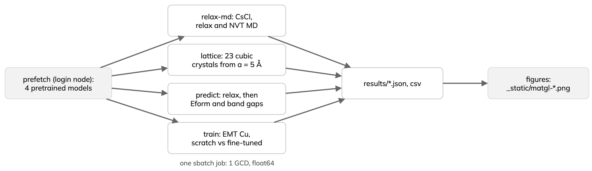
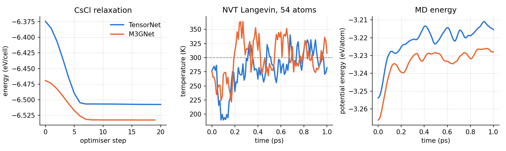
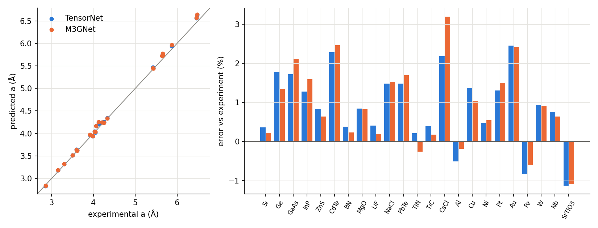
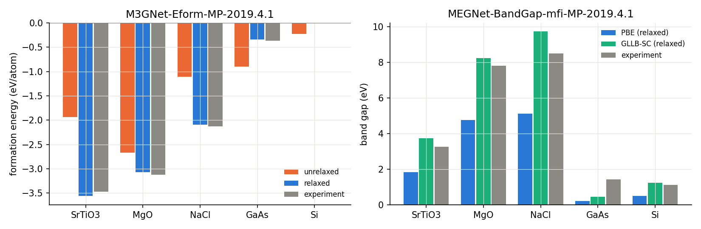
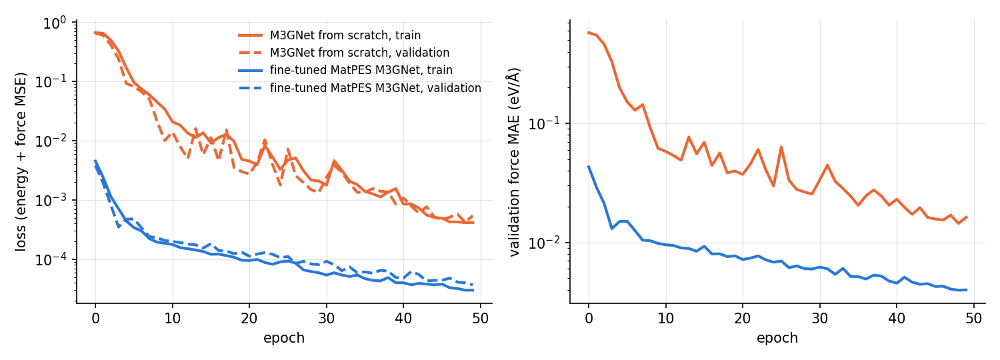

---
jupytext:
  text_representation:
    extension: .md
    format_name: myst
    format_version: '0.13'
kernelspec:
  display_name: Python 3
  language: python
  name: python3
---

# A3 MatGL: relaxation, MD, lattice benchmark and training

:::{objectives}
- Relax crystals and run MD with two MatGL universal potentials.
- Benchmark lattice constants and predict properties after relaxation.
- Compare training from scratch with fine-tuning a pretrained potential.
:::

[MatGL](https://github.com/materialyzeai/matgl) [[1](https://arxiv.org/abs/2503.03837)]
ships universal potentials and property models. This page runs four
workflows from the MatGL tutorials on one LUMI GPU:

- Potentials: `TensorNet-PES-MatPES-PBE-2025.2` [[2](https://arxiv.org/abs/2306.06482)]
  and `M3GNet-PES-MatPES-PBE-2025.2` [[3](https://doi.org/10.1038/s43588-022-00349-3)],
  both trained on MatPES PBE data [[4](https://arxiv.org/abs/2503.04070)].
- Property models: `M3GNet-Eform-MP-2019.4.1` (formation energy) and
  `MEGNet-BandGap-mfi-MP-2019.4.1` (band gap at four levels of theory)
  [[5](https://doi.org/10.1021/acs.chemmater.9b01294), [6](https://doi.org/10.1038/s43588-020-00002-x)].
- No database or API key: crystals are built from space groups, and the
  training data are labelled with ASE's EMT potential [[7](https://doi.org/10.1016/0039-6028%2896%2900816-3)].



Each step is one command, `python cli.py <step>`, in `examples/matgl`.

## Precision switch

`MATGL_FLOAT_BITS` (default 32) or `--float-bits {32,64}` sets the float
size for graphs, labels and models. Every model is cast to that dtype on
load, and training uses Lightning `precision="64-true"` in float64.

:::{dropdown} common.py
```{literalinclude} ../examples/matgl/common.py
:language: python
:start-at: FLOAT_BITS =
:end-at: return matgl.load_model
:lineno-match:
```
:::

:::{note}
On LUMI with `torch` 2.7.1+rocm6.2.4, the float32 `det` and `prod` kernels
fail with `CUDA driver error: 209`; float64 works. The job script sets
`MATGL_FLOAT_BITS=64`, so all results below are float64.
:::

## Run on LUMI

On a login node (compute nodes have no internet), in a copy of this
repository at `<SCRATCH>/mlip-matgl`:

```bash
module purge && module use /appl/local/csc/modulefiles/ && module load pytorch
python -m venv --system-site-packages .venv && source .venv/bin/activate
pip install -r examples/matgl/requirements.txt
HF_HOME=$PWD/hf-home python examples/matgl/cli.py prefetch
sbatch --account=<PROJECT> scripts/lumi-matgl.sbatch
```

The job runs `versions`, `relax-md`, `lattice`, `predict`, `train` and
`figures` on one GCD, offline, and ends with:

```text
== done ..., failed: none
```

:::{dropdown} lumi-matgl.sbatch
```{literalinclude} ../scripts/lumi-matgl.sbatch
:language: bash
:start-at: export PYTHONNOUSERSITE
:lineno-match:
```
:::

Conditions for all results: one AMD MI250X GCD, float64, one run (about 8.5 min in total), `matgl` 4.0.3, `torch`
2.7.1+rocm6.2.4, `lightning` 2.6.1, `torch_geometric` 2.8.0.post1, `ase`
3.29.0, `pymatgen` 2026.9.24.

## Relaxation and MD

CsCl is relaxed from a = 4.5 Å (FIRE, fmax 0.01 eV/Å), then a 3×3×3
supercell (54 atoms) runs 1000 steps of 1 fs NVT Langevin MD at 300 K.

:::{dropdown} relax_md.py
```{literalinclude} ../examples/matgl/relax_md.py
:language: python
:pyobject: run_md
:lineno-match:
```
:::

```text
TensorNet: a = 4.2096 A, E = -6.5076 eV, {'relax_s': 2.02, 'md_s': 20.33}
M3GNet: a = 4.2535 A, E = -6.5325 eV, {'relax_s': 0.78, 'md_s': 26.93}
```

| | TensorNet | M3GNet |
|---|---|---|
| relaxed a (expt 4.123 Å) | 4.2096 Å | 4.2535 Å |
| relaxed energy (2-atom cell) | −6.5076 eV | −6.5325 eV |
| relaxation | 21 steps, 2.02 s | 20 steps, 0.78 s |
| MD, 1000 steps | 20.33 s | 26.93 s |
| mean temperature, second half | 297.3 K | 306.2 K |



- Both overestimate a (+2.1 % and +3.2 %), as PBE often does for ionic
  crystals.
- The thermostat holds 300 K within a few per cent over 0.5 ps.
- TensorNet ran first, so its relaxation time likely includes GPU warm-up.

## Lattice benchmark

23 cubic crystals (elements, III-V and II-VI semiconductors, rock salts,
CsCl, SrTiO3), all started from a = 5.0 Å and compared with room-temperature
experiment.

:::{dropdown} lattice.py
```{literalinclude} ../examples/matgl/lattice.py
:language: python
:pyobject: relaxed_a
:lineno-match:
```
:::

| | TensorNet | M3GNet |
|---|---|---|
| MAE | 0.0525 Å | 0.0532 Å |
| MAPE | 1.11 % | 1.11 % |
| mean signed error | +0.89 % | +0.92 % |
| max error | 2.46 % (Au) | 3.20 % (CsCl) |
| time, 23 relaxations | 28.9 s | 106.49 s |



- Same accuracy for both; TensorNet is 3.7 times faster here.
- Both mostly overestimate a, typical of PBE. Underestimates: Al, Fe and
  SrTiO3 (both), TiN (M3GNet).
- Per-crystal values: `examples/matgl/results/lattice.csv`.

## Relax, then predict

TensorNet relaxes five crystals from a = 4.5 Å; the property models are
applied before and after relaxation. The band-gap model takes the level of
theory as an input: PBE, GLLB-SC, HSE or SCAN.

:::{dropdown} predict.py
```{literalinclude} ../examples/matgl/predict.py
:language: python
:pyobject: properties
:lineno-match:
```
:::

| Crystal | a (Å) | Eform, eV/atom: unrelaxed → relaxed (expt) | gap after relaxation, eV: PBE / GLLB-SC / HSE / SCAN (expt) |
|---|---|---|---|
| SrTiO3 | 3.9427 | −1.932 → −3.561 (−3.47) | 1.83 / 3.74 / 3.52 / 2.29 (3.25) |
| MgO | 4.2474 | −2.664 → −3.072 (−3.12) | 4.76 / 8.23 / 6.35 / 5.57 (7.8) |
| NaCl | 5.7227 | −1.111 → −2.095 (−2.13) | 5.13 / 9.73 / 6.29 / 5.75 (8.5) |
| GaAs | 5.7502 | −0.896 → −0.338 (−0.37) | 0.22 / 0.45 / 0.57 / 0.63 (1.42) |
| Si | 5.45 | −0.223 → −0.006 (0.0) | 0.50 / 1.24 / 1.11 / 0.73 (1.12) |

Total time for five crystals: 8.41 s.



- Relax first: after relaxation every formation energy is within 0.1
  eV/atom of experiment; before, errors reach 1.5 eV/atom.
- PBE gaps are too small, as expected; GLLB-SC and HSE are closer.
- GaAs is underestimated at every level.

## Training from scratch and fine-tuning

100 strained and rattled 32-atom fcc Cu cells labelled with EMT, split
70/15/15, 50 epochs, same test set for both runs:

- Scratch: small M3GNet (two blocks, 32 units), learning rate 2 × 10⁻³.
- Fine-tuned: MatPES M3GNet, learning rate 1 × 10⁻⁴. EMT energies are on a
  different scale from PBE, so the Cu reference energy is shifted by the
  mean difference first; the pretrained scaling is kept.

:::{dropdown} train.py
```{literalinclude} ../examples/matgl/train.py
:language: python
:pyobject: finetune_module
:lineno-match:
```
:::

```text
scratch {'energy_meV_atom': 59.13, 'force_eV_A': 0.5655} -> {'energy_meV_atom': 5.87, 'force_eV_A': 0.0147} 48.89 s
finetune {'energy_meV_atom': 15.88, 'force_eV_A': 0.0609} -> {'energy_meV_atom': 1.21, 'force_eV_A': 0.0038} 66.89 s
```

| Run | test energy MAE, before → after (meV/atom) | test force MAE, before → after (eV/Å) | fit time | final validation force MAE |
|---|---|---|---|---|
| M3GNet from scratch | 59.13 → 5.87 | 0.5655 → 0.0147 | 48.89 s | 0.01625 eV/Å |
| fine-tuned MatPES M3GNet | 15.88 → 1.21 | 0.0609 → 0.0038 | 66.89 s | 0.00400 eV/Å |



- With 70 training cells, fine-tuning ends about five times more accurate
  than training from scratch for energies and four times for forces.
- The pretrained model starts with forces nine times closer to EMT, after only
  a shift of the reference energy.
- One seed and one split: treat this as one sample, not a benchmark.

:::{keypoints}
- MatGL potentials relax and run MD through ASE; set float64 on LUMI.
- Relax before predicting properties; compare against the right reference.
- Fine-tuning a pretrained potential beats training from scratch on small data.
:::

## References

1. T. W. Ko et al., Materials Graph Library (MatGL).
   [arXiv:2503.03837](https://arxiv.org/abs/2503.03837)
2. G. Simeon and G. De Fabritiis, TensorNet.
   [arXiv:2306.06482](https://arxiv.org/abs/2306.06482)
3. C. Chen and S. P. Ong, Nat. Comput. Sci. 2, 718 (2022).
   [doi:10.1038/s43588-022-00349-3](https://doi.org/10.1038/s43588-022-00349-3)
4. A. D. Kaplan et al., MatPES.
   [arXiv:2503.04070](https://arxiv.org/abs/2503.04070)
5. C. Chen et al., Chem. Mater. 31, 3564 (2019).
   [doi:10.1021/acs.chemmater.9b01294](https://doi.org/10.1021/acs.chemmater.9b01294)
6. C. Chen et al., Nat. Comput. Sci. 1, 46 (2021).
   [doi:10.1038/s43588-020-00002-x](https://doi.org/10.1038/s43588-020-00002-x)
7. K. W. Jacobsen, P. Stoltze and J. K. Nørskov, Surf. Sci. 366, 394 (1996).
   [doi:10.1016/0039-6028(96)00816-3](https://doi.org/10.1016/0039-6028%2896%2900816-3)

The workflows follow the
[MatGL tutorials](https://github.com/materialsvirtuallab/matgl/tree/main/examples)
(BSD-3-Clause); see `THIRD_PARTY.md`.
