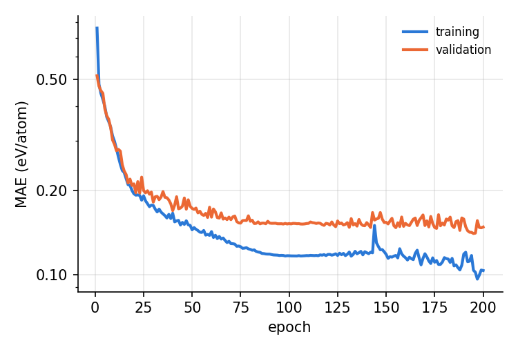
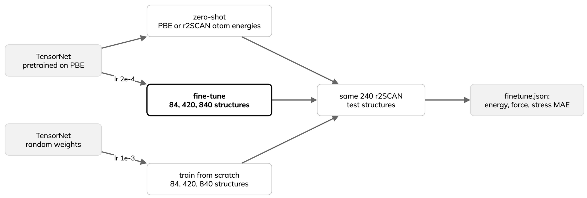
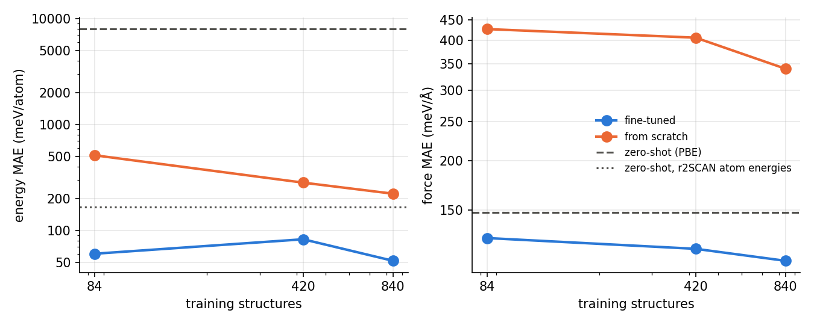

---
jupytext:
  text_representation:
    extension: .md
    format_name: myst
    format_version: '0.13'
kernelspec:
  display_name: Python 3
  language: python
  name: python3
---

# Train and fine-tune a potential

:::{objectives}
- Train a small formation-energy model and read its learning curve.
- Fine-tune a PBE foundation potential on r2SCAN data.
- Compare zero-shot, fine-tuned and from-scratch errors on one test set.
:::

The earlier pages use foundation potentials zero-shot. The
{doc}`Background <00-background>` section "Pre-train, then fine-tune" gives
the recipe for when that is not enough: fine-tune on a small targeted set.
This page runs both halves with [MatGL](https://github.com/materialyzeai/matgl)
4.0.3 [[1](https://arxiv.org/abs/2503.03837)], following the MatGL tutorials
on formation-energy training and potential fine-tuning.

The example is a small package, `examples/training`:

| File | Role |
|---|---|
| `prefetch.py` | downloads data and the pretrained model (login node); writes subsets |
| `eform.py` | formation-energy model (MEGNet or M3GNet) |
| `finetune.py` | zero-shot, fine-tuned and from-scratch cases |
| `potential.py` | loads, re-references and evaluates TensorNet potentials |
| `fit.py`, `report.py` | Lightning training loop; JSON and figures |

## Formation energy

- Data: Materials Project 2018.6.1 formation energies used for MEGNet
  [[2](https://doi.org/10.1021/acs.chemmater.9b01294)]; a random subset of
  5000 crystals (86 elements, seed 42), split 4000/500/500.
- Model: MEGNet as in the MatGL tutorial (4 Å cutoff, three blocks, set2set
  readout); `--model m3gnet` swaps in M3GNet
  [[3](https://doi.org/10.1038/s43588-022-00349-3)].
- Targets standardised with the training mean and standard deviation; the
  checkpoint with the lowest validation loss is kept.

```bash
python -m training eform --data <SCRATCH>/mlip-training/data \
  --outdir results/eform --epochs 200
```

Result: one run on one MI250X GCD (LUMI), float32; 200 epochs,
batch 64, learning rate 10⁻³, 460 s training.

| Set | MAE (eV/atom) |
|---|---|
| training | 0.097 |
| validation | 0.140 |
| test | 0.137 |



- Validation error falls fast for about 50 epochs, then slowly from 0.16
  to 0.14 eV/atom; the growing gap to the training error signals
  overfitting on 4000 crystals.
- The original MEGNet paper reports 0.028 eV/atom with all 69 239
  crystals [[2](https://doi.org/10.1021/acs.chemmater.9b01294)]; 5000
  crystals is a demonstration, not a converged model.

## Fine-tuning a foundation potential



- Start: `TensorNet-PES-MatPES-PBE-2025.2`
  [[4](https://arxiv.org/abs/2306.06482)], trained on PBE energies, forces
  and stresses from MatPES [[5](https://arxiv.org/abs/2503.04070)].
- Target: r2SCAN [[6](https://doi.org/10.1021/acs.jpclett.0c02405)], a more
  accurate meta-GGA. Data come from the MatPES r2SCAN test split, which the
  PBE model never saw: all Li-containing structures with at most 64 atoms
  (1200), split 840/120/240. The test set is fixed for every case.
- Trained cases: 10, 50 and 100% of the training set (84, 420, 840
  structures, nested); 150 epochs, batch 16, Huber loss on energy per atom,
  forces and stress (weight 0.1), cosine decay, seed 42. Learning rate
  2 × 10⁻⁴ for fine-tuning, 10⁻³ from scratch.

Two details matter:

- MatGL adds per-element reference energies to the network output. PBE and
  r2SCAN total energies differ by several eV/atom, so the second zero-shot
  case swaps in r2SCAN atom energies without touching the network; trained
  cases use them too.
- The fine-tuned module must keep the pretrained scaling (`data_std`); the
  MatGL default of 1.0 silently rescales every prediction.

:::{dropdown} finetune.py
```{literalinclude} ../examples/training/finetune.py
:language: python
:pyobject: train_case
:lineno-match:
```
:::

:::{dropdown} potential.py
```{literalinclude} ../examples/training/potential.py
:language: python
:start-at: def with_refs
:end-before: def evaluate
:lineno-match:
```
:::

Result: one run on one MI250X GCD (LUMI), float64; test set
of 240 structures, lower is better.

| Case | Training structures | Energy (meV/atom) | Force (meV/Å) | Stress (GPa) | Training (s) |
|---|---|---|---|---|---|
| zero-shot (PBE) | 0 | 7949.7 | 148.2 | 1.19 | |
| zero-shot, r2SCAN atom energies | 0 | 165.9 | 148.2 | 1.19 | |
| fine-tuned | 84 | 60.4 | 127.8 | 0.75 | 117 |
| from scratch | 84 | 512.7 | 427.0 | 2.97 | 117 |
| fine-tuned | 420 | 82.7 | 120.1 | 0.70 | 425 |
| from scratch | 420 | 282.9 | 406.4 | 2.63 | 428 |
| fine-tuned | 840 | 51.8 | 112.0 | 0.63 | 798 |
| from scratch | 840 | 222.5 | 339.6 | 2.37 | 805 |



- Re-referencing alone takes the zero-shot energy error from 7950 to
  166 meV/atom; forces and stresses do not depend on atom energies. The raw
  PBE row measures the functional gap, not the model.
- Fine-tuning beats training from scratch at every size: energy 3 to 8
  times lower, force about 3 times, stress about 4 times. With 84
  structures, fine-tuning already beats scratch with 840.
- Forces improve steadily with data (128, 120, 112 meV/Å). The 420-structure
  energy (83) is worse than the 84-structure one (60): one seed and one
  split, so this is noise, not a trend.
- This matches the Background section qualitatively: a foundation model is
  a data-efficient start, and fine-tuning moves it to a new level of theory.
  The fine-tuned model is specialised to Li compounds at r2SCAN level; keep
  the original for other chemistry.

## Run on LUMI

On a login node, build a virtual environment on top of the CSC ROCm
PyTorch module and download everything once (about 1.3 GB):

```bash
export MLIP_LESSON_ROOT=<SCRATCH>/mlip-hands-on
export MLIP_TRAINING_DIR=<SCRATCH>/mlip-training
bash $MLIP_LESSON_ROOT/scripts/lumi-training-setup.sh
```

Submit one job for both examples on one GCD (`MLIP_TASKS=finetune` runs one):

```bash
sbatch --account=<PROJECT> --export=ALL \
  $MLIP_LESSON_ROOT/scripts/lumi-training.sbatch
```

Results go to `$MLIP_TRAINING_DIR/results-<jobid>/{eform,finetune}` as JSON
and PNG. The fine-tuning job took 46 min.

:::{note}
On LUMI with `torch` 2.7.1+rocm6.2.4, `torch.det` and `Tensor.prod` fail in
float32 (error 209); float64 works. The MatGL potential calls `torch.det`
for the cell volume in its stress, so the job script sets
`MLIP_FLOAT_BITS=64` (same as `--float-bits 64`). The MEGNet run did not
hit them and ran in float32.
:::

To check the code on a laptop CPU first, use a few structures and two
epochs:

```bash
cd examples
uv run --with matgl==4.0.3 --with pandas --with matplotlib \
  python -m training prefetch --data training_data --skip-eform --n-pes 60
uv run --with matgl==4.0.3 --with pandas --with matplotlib \
  python -m training finetune --data training_data --accelerator cpu \
  --epochs 2 --fractions 0.5 1.0
```

This tests the plumbing only.

:::{keypoints}
- Fine-tuning a foundation potential on a few hundred structures beats
  training from scratch several times over.
- When the functional changes, change the atom reference energies and keep
  the pretrained scaling.
- Evaluate every case on the same held-out test set; one run is one sample.
:::

## References

1. T. W. Ko et al., Materials Graph Library (MatGL).
   [arXiv:2503.03837](https://arxiv.org/abs/2503.03837)
2. C. Chen et al., MEGNet, Chem. Mater. 31, 3564 (2019).
   [doi:10.1021/acs.chemmater.9b01294](https://doi.org/10.1021/acs.chemmater.9b01294)
3. C. Chen and S. P. Ong, M3GNet, Nat. Comput. Sci. 2, 718 (2022).
   [doi:10.1038/s43588-022-00349-3](https://doi.org/10.1038/s43588-022-00349-3)
4. G. Simeon and G. De Fabritiis, TensorNet.
   [arXiv:2306.06482](https://arxiv.org/abs/2306.06482)
5. A. D. Kaplan et al., MatPES. [arXiv:2503.04070](https://arxiv.org/abs/2503.04070)
6. J. W. Furness et al., r2SCAN, J. Phys. Chem. Lett. 11, 8208 (2020).
   [doi:10.1021/acs.jpclett.0c02405](https://doi.org/10.1021/acs.jpclett.0c02405)
