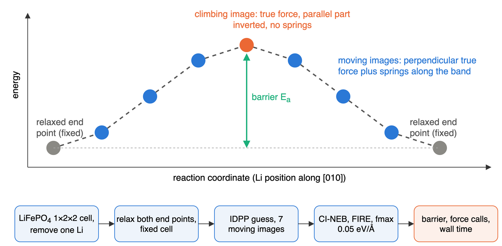

---
jupytext:
  text_representation:
    extension: .md
    format_name: myst
    format_version: '0.13'
kernelspec:
  display_name: Python 3
  language: python
  name: python3
---

# A5 Li migration in LiFePO4 with CI-NEB

:::{objectives}
- Set up a climbing-image NEB for a Li vacancy hop in olivine LiFePO4.
- Run it with MACE-MP-0b, Orb-v3 and TensorNet and compare barrier, force calls and time.
- Judge MLIP barriers against DFT and experiment, including the known softening bias.
:::

Olivine LiFePO4 is a common Li-ion cathode [[1](https://doi.org/10.1149/1.1837571)].
Li moves through one-dimensional channels along [010]; hops between channels
cost more than 2 eV [[2](https://doi.org/10.1149/1.1633511)]. The rate of a
single hop is set by its migration barrier E<sub>a</sub>, the energy of the
saddle point above the initial minimum. This page finds that saddle with the
climbing-image nudged elastic band (CI-NEB) method
[[3](https://doi.org/10.1063/1.1329672)] in ASE [[4](https://doi.org/10.1088/1361-648X/aa680e)],
using three universal MLIPs in place of DFT.



In NEB, a chain of images between two minima is relaxed together. Each moving
image feels the true force perpendicular to the band plus spring forces along
it, which keep the images evenly spaced. In CI-NEB the highest image has no
springs and the parallel part of its true force is inverted, so it climbs to
the saddle point [[3](https://doi.org/10.1063/1.1329672)]. The barrier is
then read from that image instead of being interpolated.

## The system

The cell and atomic positions are the X-ray structure of LiFePO4
(Pnma, a = 10.332 Å, b = 6.010 Å, c = 4.692 Å)
[[5](https://doi.org/10.1107/S0108768192004701)], taken from the
Crystallography Open Database (entry 2100916). pymatgen expands the six
symmetry-distinct sites into the 28-atom cell.

- Supercell 1×2×2 (112 atoms, 10.3 × 12.0 × 9.4 Å), so periodic copies of
  the vacancy are at least 9.4 Å apart.
- One Li at the origin is removed (111 atoms). The neighbouring Li along b,
  3.005 Å away, hops into the vacancy.
- Both end points have the same atom order, so the band is a simple
  interpolation between them.

:::{dropdown} structures.py
```{literalinclude} ../examples/neb/structures.py
:language: python
:lineno-match:
```
:::

Bond lengths of the built cell (Li–O 2.09 to 2.19 Å, Fe–O 2.06 to 2.25 Å,
P–O 1.52 to 1.56 Å) match the experimental octahedra and tetrahedra.

## Models

| Model | Checkpoint | Training data | Reference level |
|---|---|---|---|
| MACE-MP-0b | `mace-mp-0b` small | MPtrj [[6](https://doi.org/10.1038/s42256-023-00716-3)] | PBE and PBE+U |
| Orb-v3 | `orb-v3-conservative-inf-omat` | OMat24 [[7](https://arxiv.org/abs/2410.12771)] | PBE and PBE+U |
| TensorNet | `TensorNet-PES-MatPES-PBE-2025.2` | MatPES [[8](https://arxiv.org/abs/2503.04070)] | PBE, no U |

References for the architectures: MACE-MP-0 [[9](https://arxiv.org/abs/2401.00096)],
Orb-v3 [[10](https://arxiv.org/abs/2504.06231)], TensorNet [[11](https://arxiv.org/abs/2306.06482)].

:::{dropdown} models.py
```{literalinclude} ../examples/neb/models.py
:language: python
:lineno-match:
```
:::

:::{note}
Fe<sup>2+</sup> in LiFePO4 carries a magnetic moment. These MLIPs take no
spins or charges as input: they were trained mostly on spin-polarised DFT, but
predict one non-magnetic energy surface. Removing a neutral Li atom also
leaves a hole on a nearby Fe (Fe<sup>3+</sup>); the models cannot place
this polaron, so the result is closest to a DFT calculation with a
delocalised hole.
:::

On LUMI, `torch` 2.7.1+rocm6.2.4 fails in float32 `det` and `prod` kernels
(`CUDA driver error: 209`), so every model runs in float64. The module has
Python 3.11, so `orb-models` is 0.5.5 (0.6 and later need Python 3.12).

## NEB set-up

- Relax both end points at fixed cell with FIRE [[12](https://doi.org/10.1103/PhysRevLett.97.170201)]
  to fmax 0.05 eV/Å.
- Seven moving images, first guess from IDPP
  [[13](https://doi.org/10.1063/1.4878664)], which avoids atoms coming too
  close in a straight-line guess.
- CI-NEB from the start, spring constant 0.1 eV/Ų (ASE default), FIRE to
  fmax 0.05 eV/Å, at most 1000 steps.
- Barrier: highest image energy minus the initial energy. Force calls: model
  evaluations counted in the calculator. Wall time: the NEB optimisation only.

:::{dropdown} neb.py
```{literalinclude} ../examples/neb/neb.py
:language: python
:pyobject: run
:lineno-match:
```
:::

One model is loaded once and shared by all images. If the images share one
ASE calculator directly (`allow_shared_calculator=True`), its cache only
holds the last image, and ASE evaluates every image again each time the
optimiser asks the band for forces: about three times per step. A thin
per-image wrapper keeps a cache for each image:

:::{dropdown} neb.py: ImageCalculator
```{literalinclude} ../examples/neb/neb.py
:language: python
:pyobject: ImageCalculator
:lineno-match:
```
:::

## Run on LUMI

On a login node (compute nodes have no internet), in a copy of this
repository at `<SCRATCH>/mlip-neb`:

```bash
module purge && module use /appl/local/csc/modulefiles/ && module load pytorch
python -m venv --system-site-packages .venv && source .venv/bin/activate
pip install -r examples/neb/requirements.txt
for m in MACE-MP-0b Orb-v3 TensorNet; do
    HF_HOME=$PWD/hf-home python examples/neb/cli.py prefetch --model $m
done
sbatch --account=<PROJECT> scripts/lumi-neb.sbatch
```

The job runs each model in its own process, then draws the figures, and
ends with:

```text
MACE-MP-0b: barrier 0.263 eV, NEB 343 calls, 12.01 s, converged True
Orb-v3: barrier 0.317 eV, NEB 329 calls, 19.37 s, converged True
TensorNet: barrier 0.143 eV, NEB 252 calls, 7.33 s, converged True
== done ..., failed: none
```

:::{dropdown} lumi-neb.sbatch
```{literalinclude} ../scripts/lumi-neb.sbatch
:language: bash
:start-at: export PYTHONNOUSERSITE
:lineno-match:
```
:::

:::{dropdown} cli.py
```{literalinclude} ../examples/neb/cli.py
:language: python
:start-at: def main
:lineno-match:
```
:::

## Results

Conditions: one AMD MI250X GCD, float64, one run, 111 atoms, 7 moving
images, `torch` 2.7.1+rocm6.2.4, `ase` 3.29.0, `pymatgen` 2026.9.24,
`mace-torch` 0.3.16, `orb-models` 0.5.5, `matgl` 4.0.3.

| | MACE-MP-0b | Orb-v3 | TensorNet |
|---|---|---|---|
| barrier E<sub>a</sub> | 0.263 eV | 0.317 eV | 0.143 eV |
| end-point energy difference | 0.000 eV | 0.000 eV | 0.000 eV |
| NEB steps | 48 | 46 | 35 |
| NEB force calls | 343 | 329 | 252 |
| NEB wall time | 12.0 s | 19.4 s | 7.3 s |
| time per force call | 35 ms | 59 ms | 29 ms |
| end-point relaxation (2 structures) | 74 calls, 16.9 s | 90 calls, 19.3 s | 78 calls, 3.0 s |
| path length of the hopping Li | 3.35 Å | 3.26 Å | 3.24 Å |
| offset from straight line at saddle | 0.67 Å | 0.65 Å | 0.64 Å |


- All three runs converged, and both end points have the same energy, as
  the symmetry of the hop requires.
- All three find the same curved path: the Li bulges 0.64 to 0.67 Å off the
  straight line, so it travels about 3.3 Å instead of 3.0 Å. Atomistic
  simulations predicted this curved path [[14](https://doi.org/10.1021/cm050999v)]
  and neutron diffraction later imaged it [[15](https://doi.org/10.1038/nmat2251)].
- The end-point relaxation times include loading the model and GPU warm-up;
  use the NEB times to compare cost.
- With one shared calculator (`allow_shared_calculator=True`) the same job
  needed 1022, 980 and 749 force calls and 34.4, 56.3 and 20.6 s for the
  same barriers.

## Comparison with DFT and experiment

| Method | Barrier |
|---|---|
| GGA, ferromagnetic, Li-rich limit [[2](https://doi.org/10.1149/1.1633511)] | 0.27 eV |
| GGA+U (U = 4.3 eV), hole on an in-plane Fe [[16](https://doi.org/10.1021/cm201604g)] | 0.29 eV |
| GGA+U, hole on an out-of-plane Fe [[16](https://doi.org/10.1021/cm201604g)] | 0.47 eV |
| Classical shell-model potentials [[14](https://doi.org/10.1021/cm050999v)] | 0.55 eV |
| MACE-MP-0b, Orb-v3, TensorNet (this page) | 0.26, 0.32, 0.14 eV |

- MACE-MP-0b and Orb-v3 fall within 0.05 eV of the DFT vacancy barriers
  without a localised hole (0.27 to 0.29 eV).
- TensorNet gives half of that. The missing U is not the main cause, since
  plain GGA gives 0.27 eV [[2](https://doi.org/10.1149/1.1633511)]; a too
  soft energy surface is the likely reason.
- Where the hole sits changes the DFT barrier by almost 0.2 eV
  [[16](https://doi.org/10.1021/cm201604g)]. No model here can resolve this,
  and it is larger than the spread between MACE-MP-0b and Orb-v3.

Universal MLIPs tend to underestimate barriers. Their training sets are
mostly near-equilibrium structures, so the curvature of the energy surface
is underestimated ("softening") [[17](https://doi.org/10.1038/s41524-024-01500-6)].
Across 470 Mg<sup>2+</sup> migration paths, M3GNet, CHGNet and MACE-MP-0
underestimated 74 to 85 % of the barriers, with mean absolute errors of 0.34
to 0.49 eV against DFT:


Figure: B. Deng et al., npj Comput. Mater. 11, 9 (2025), Fig. 3
[[17](https://doi.org/10.1038/s41524-024-01500-6)],
[CC BY 4.0](https://creativecommons.org/licenses/by/4.0/), unmodified.

The same work shows that the error is systematic enough for fine-tuning on
even one high-energy DFT structure to remove much of it (see {doc}`a4-training`). For a
screening study, use a universal MLIP to find the path and rank candidates,
then check the lowest barriers with DFT at the MLIP saddle geometry.

## Try it

Inside a GPU allocation, from `examples/neb`; each option changes one
setting and overwrites that model's files in `results/`:

```bash
python cli.py run --model TensorNet --optimiser BFGS
python cli.py run --model MACE-MP-0b --images 5 --fmax 0.03
```

:::{keypoints}
- CI-NEB with a universal MLIP gives a Li migration path and barrier in
  seconds on one GPU; all three models find the curved [010] path.
- Barriers differ by a factor of two between models (0.14 to 0.32 eV);
  softening makes underestimates more likely than overestimates.
- The models are non-magnetic and charge-blind: polaron effects on the
  barrier need DFT.
:::

## References

1. A. K. Padhi et al., J. Electrochem. Soc. 144, 1188 (1997).
   [doi:10.1149/1.1837571](https://doi.org/10.1149/1.1837571)
2. D. Morgan, A. Van der Ven and G. Ceder, Electrochem. Solid-State Lett. 7, A30 (2004).
   [doi:10.1149/1.1633511](https://doi.org/10.1149/1.1633511)
3. G. Henkelman, B. P. Uberuaga and H. Jónsson, J. Chem. Phys. 113, 9901 (2000).
   [doi:10.1063/1.1329672](https://doi.org/10.1063/1.1329672)
4. A. Hjorth Larsen et al., ASE, J. Phys.: Condens. Matter 29, 273002 (2017).
   [doi:10.1088/1361-648X/aa680e](https://doi.org/10.1088/1361-648X/aa680e)
5. V. A. Streltsov et al., Acta Cryst. B 49, 147 (1993).
   [doi:10.1107/S0108768192004701](https://doi.org/10.1107/S0108768192004701)
6. B. Deng et al., CHGNet and MPtrj, Nat. Mach. Intell. 5, 1031 (2023).
   [doi:10.1038/s42256-023-00716-3](https://doi.org/10.1038/s42256-023-00716-3)
7. L. Barroso-Luque et al., OMat24. [arXiv:2410.12771](https://arxiv.org/abs/2410.12771)
8. A. D. Kaplan et al., MatPES. [arXiv:2503.04070](https://arxiv.org/abs/2503.04070)
9. I. Batatia et al., MACE-MP-0. [arXiv:2401.00096](https://arxiv.org/abs/2401.00096)
10. B. Rhodes et al., Orb-v3. [arXiv:2504.06231](https://arxiv.org/abs/2504.06231)
11. G. Simeon and G. De Fabritiis, TensorNet. [arXiv:2306.06482](https://arxiv.org/abs/2306.06482)
12. E. Bitzek et al., FIRE, Phys. Rev. Lett. 97, 170201 (2006).
    [doi:10.1103/PhysRevLett.97.170201](https://doi.org/10.1103/PhysRevLett.97.170201)
13. S. Smidstrup et al., IDPP, J. Chem. Phys. 140, 214106 (2014).
    [doi:10.1063/1.4878664](https://doi.org/10.1063/1.4878664)
14. M. S. Islam et al., Chem. Mater. 17, 5085 (2005).
    [doi:10.1021/cm050999v](https://doi.org/10.1021/cm050999v)
15. S. Nishimura et al., Nat. Mater. 7, 707 (2008).
    [doi:10.1038/nmat2251](https://doi.org/10.1038/nmat2251)
16. G. K. P. Dathar et al., Chem. Mater. 23, 4032 (2011).
    [doi:10.1021/cm201604g](https://doi.org/10.1021/cm201604g)
17. B. Deng et al., npj Comput. Mater. 11, 9 (2025).
    [doi:10.1038/s41524-024-01500-6](https://doi.org/10.1038/s41524-024-01500-6)
