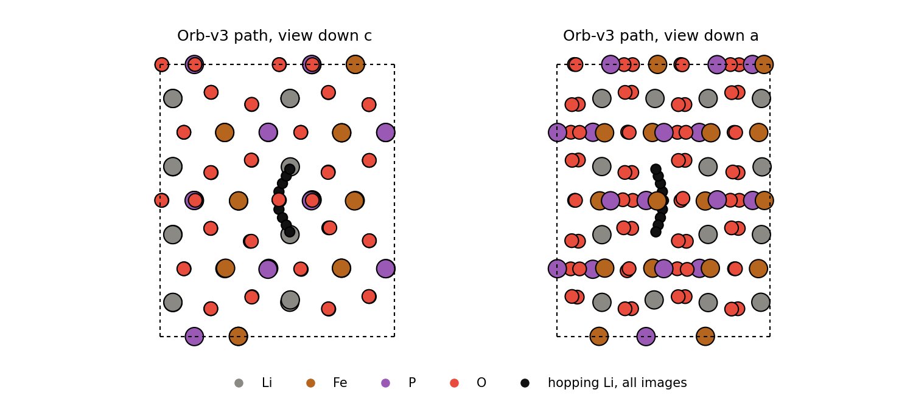
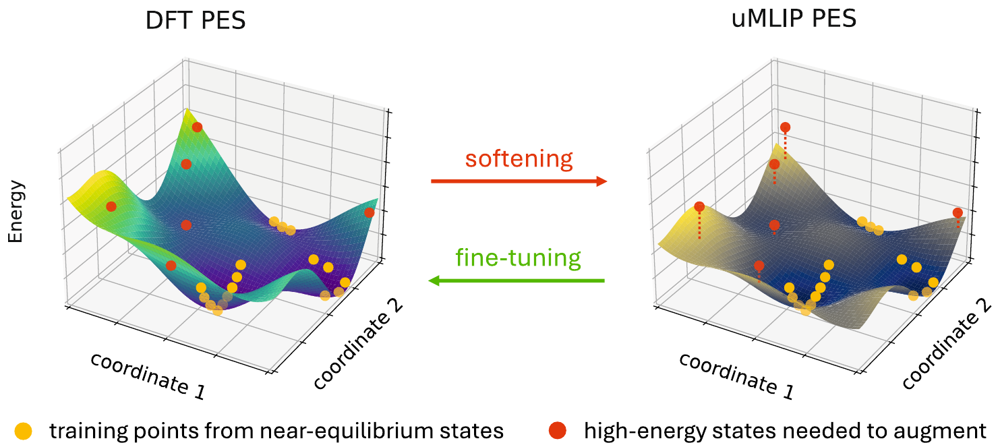
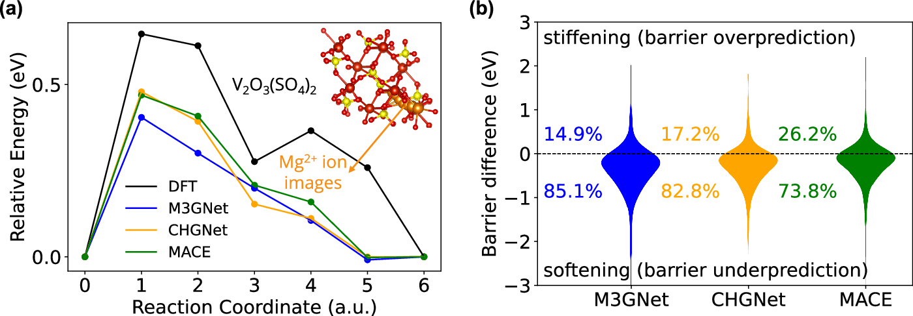
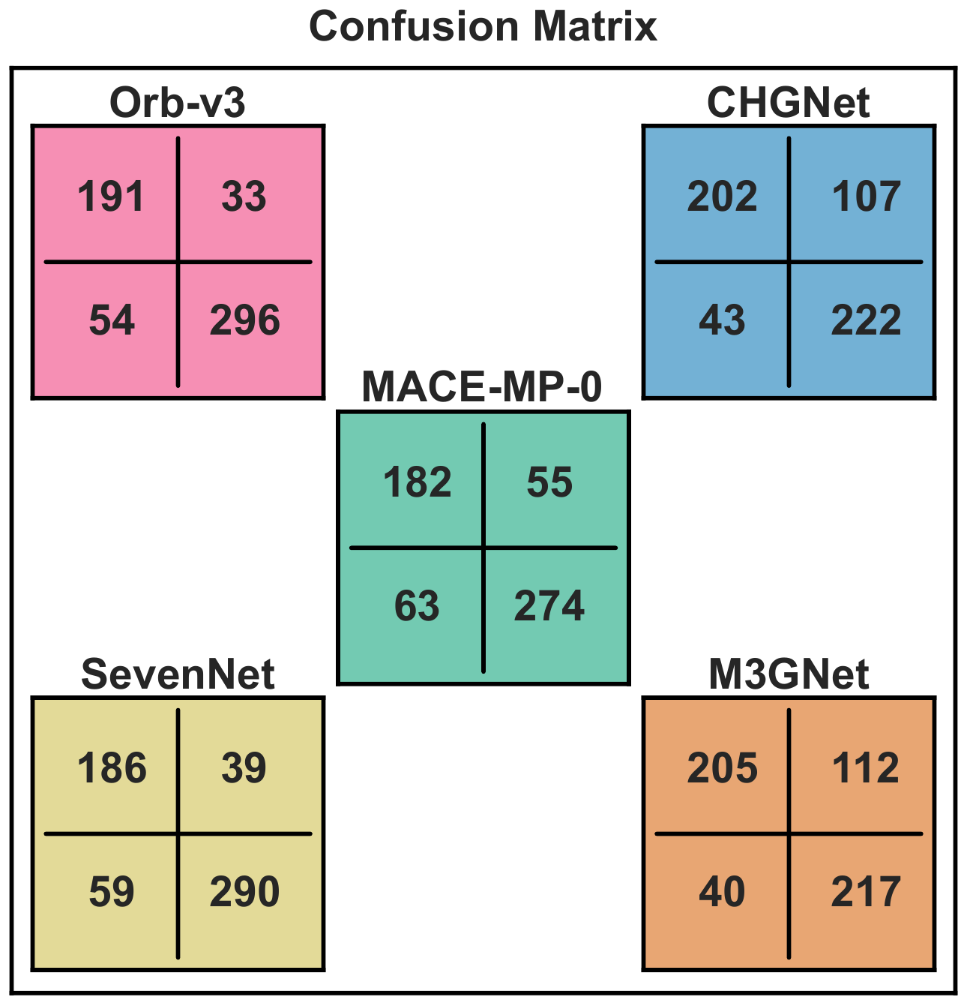
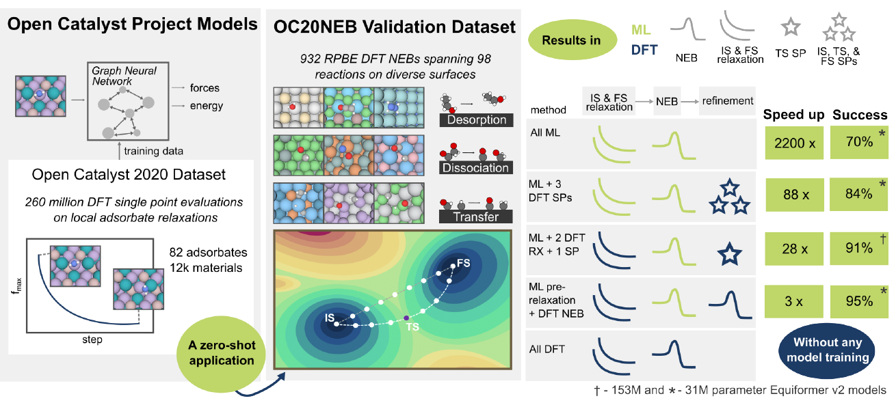
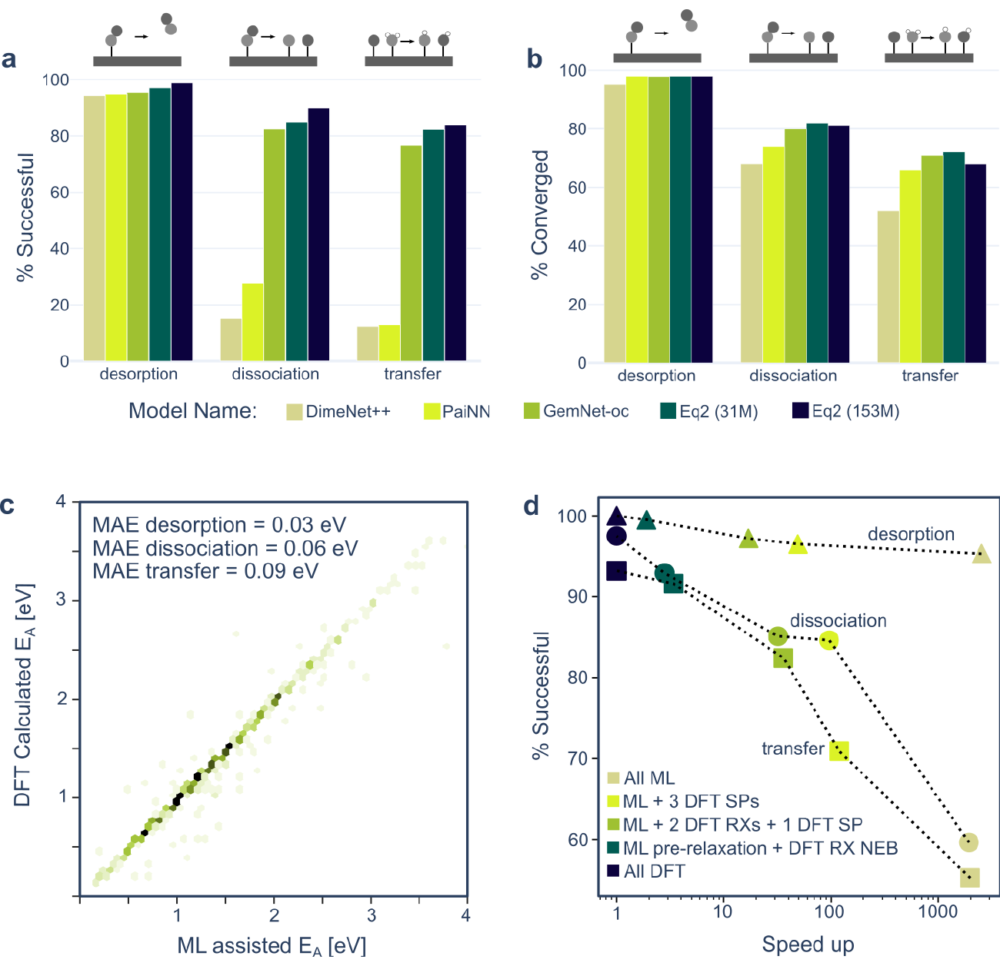

---
jupytext:
  text_representation:
    extension: .md
    format_name: myst
    format_version: '0.13'
kernelspec:
  display_name: Python 3
  language: python
  name: python3
---

# A5 NEB: migration barriers with MLIPs

:::{objectives}
- Explain what a climbing-image NEB computes and why barriers matter.
- Run a Li vacancy hop in olivine LiFePO4 with MACE-MP-0b, Orb-v3 and TensorNet.
- Judge MLIP barriers against DFT, experiment and published benchmarks.
:::

## Why barriers matter

Ion transport, defect diffusion and surface reactions are rare events: the
system waits in a minimum, then crosses a saddle point. In harmonic
transition-state theory the rate of one hop is

k = ν exp(−E<sub>a</sub> / k<sub>B</sub>T),

with an attempt frequency ν of about 10<sup>12</sup> to 10<sup>13</sup> s<sup>−1</sup>
and the migration barrier E<sub>a</sub>, the energy of the saddle above the
initial minimum. Because E<sub>a</sub> sits in an exponent, small errors are
large in rate: at 298 K, 60 meV changes the diffusivity by about a factor
of ten [[18](https://doi.org/10.1039/D5DD00534E)]. DFT-NEB itself carries an
error of about that size, and a DFT-NEB for a cell of about 100 atoms is an
expensive calculation. A universal MLIP can run the same NEB in seconds on
one GPU, if its energy surface is right far from equilibrium.

## The nudged elastic band


- A chain of images is placed between two relaxed minima and optimised
  together.
- Each moving image feels the true force perpendicular to the band and a
  spring force along it. The springs only keep the images evenly spaced;
  they do not pull the band off the minimum-energy path.
- In the climbing-image variant (CI-NEB), the highest image has no springs
  and the component of its true force along the band is inverted. It moves
  uphill along the path and downhill across it, and converges on the saddle
  [[3](https://doi.org/10.1063/1.1329672)]. The barrier is then read from that
  image, not interpolated between images.
- Cost: images × optimiser steps force calls. Every image is an independent
  energy and force evaluation, which suits a GPU model.

## The case: Li in olivine LiFePO4

Olivine LiFePO4 is a common Li-ion cathode [[1](https://doi.org/10.1149/1.1837571)].
Li moves through one-dimensional channels along [010]; hops between channels
cost more than 2.5 eV [[2](https://doi.org/10.1149/1.1633511)]. Atomistic
simulations predicted a curved path between neighbouring Li sites
[[14](https://doi.org/10.1021/cm050999v)], and neutron diffraction later
imaged it [[15](https://doi.org/10.1038/nmat2251)]. The system is well
studied with DFT, so it is a fair test for a universal MLIP.

- Cell and positions: the X-ray structure (Pnma, a = 10.332 Å,
  b = 6.010 Å, c = 4.692 Å) [[5](https://doi.org/10.1107/S0108768192004701)],
  from the Crystallography Open Database (entry 2100916). pymatgen expands
  the six symmetry-distinct sites into the 28-atom cell.
- Supercell 1×2×2 (112 atoms, 10.3 × 12.0 × 9.4 Å), the same size as a
  published GGA+U study [[22](https://arxiv.org/abs/1105.3492)]. Periodic
  copies of the vacancy are at least 9.4 Å apart.
- One Li at the origin is removed (111 atoms). The neighbouring Li along b,
  3.005 Å away, hops into the vacancy.
- Both end points have the same atom order, so the band is a simple
  interpolation between them.

:::{dropdown} structures.py
```{literalinclude} ../examples/neb/structures.py
:language: python
:lineno-match:
```
:::

Bond lengths of the built cell (Li–O 2.09 to 2.19 Å, Fe–O 2.06 to 2.25 Å,
P–O 1.52 to 1.56 Å) match the experimental octahedra and tetrahedra.

### Models

| Model | Checkpoint | Training data | Reference level |
|---|---|---|---|
| MACE-MP-0b | `mace-mp-0b` small | MPtrj [[6](https://doi.org/10.1038/s42256-023-00716-3)] | PBE and PBE+U |
| Orb-v3 | `orb-v3-conservative-inf-omat` | OMat24 [[7](https://arxiv.org/abs/2410.12771)] | PBE and PBE+U |
| TensorNet | `TensorNet-PES-MatPES-PBE-2025.2` | MatPES [[8](https://arxiv.org/abs/2503.04070)] | PBE, no U |

Architectures: MACE-MP-0 [[9](https://arxiv.org/abs/2401.00096)],
Orb-v3 [[10](https://arxiv.org/abs/2504.06231)], TensorNet [[11](https://arxiv.org/abs/2306.06482)].

:::{dropdown} models.py
```{literalinclude} ../examples/neb/models.py
:language: python
:lineno-match:
```
:::

On LUMI, `torch` 2.7.1+rocm6.2.4 fails in float32 `det` and `prod` kernels
(`CUDA driver error: 209`), so every model runs in float64. The module has
Python 3.11, so `orb-models` is 0.5.5 (0.6 and later need Python 3.12).

### NEB set-up

- Relax both end points at fixed cell with FIRE [[12](https://doi.org/10.1103/PhysRevLett.97.170201)]
  to fmax 0.05 eV/Å.
- Seven moving images, first guess from IDPP
  [[13](https://doi.org/10.1063/1.4878664)], which avoids atoms coming too
  close in a straight-line guess.
- CI-NEB in ASE [[4](https://doi.org/10.1088/1361-648X/aa680e)] from the
  start, spring constant 0.1 eV/Ų (ASE default), FIRE to fmax 0.05 eV/Å,
  at most 1000 steps.
- Barrier: highest image energy minus the initial energy. Force calls: model
  evaluations counted in the calculator. Wall time: the NEB optimisation only.

:::{dropdown} neb.py
```{literalinclude} ../examples/neb/neb.py
:language: python
:pyobject: run
:lineno-match:
```
:::

One model is loaded once and shared by all images. If the images share one
ASE calculator directly (`allow_shared_calculator=True`), its cache only
holds the last image, and ASE evaluates every image again each time the
optimiser asks the band for forces: about three times per step. A thin
per-image wrapper keeps a cache for each image:

:::{dropdown} neb.py: ImageCalculator
```{literalinclude} ../examples/neb/neb.py
:language: python
:pyobject: ImageCalculator
:lineno-match:
```
:::

## Run on LUMI

On a login node (compute nodes have no internet), in a copy of this
repository at `<SCRATCH>/mlip-neb`:

```bash
module purge && module use /appl/local/csc/modulefiles/ && module load pytorch
python -m venv --system-site-packages .venv && source .venv/bin/activate
pip install -r examples/neb/requirements.txt
for m in MACE-MP-0b Orb-v3 TensorNet; do
    HF_HOME=$PWD/hf-home python examples/neb/cli.py prefetch --model $m
done
sbatch --account=<PROJECT> scripts/lumi-neb.sbatch
```

The job runs each model in its own process, then draws the figures, and
ends with:

```text
MACE-MP-0b: barrier 0.263 eV, NEB 343 calls, 12.01 s, converged True
Orb-v3: barrier 0.317 eV, NEB 329 calls, 19.37 s, converged True
TensorNet: barrier 0.143 eV, NEB 252 calls, 7.33 s, converged True
== done ..., failed: none
```

:::{dropdown} lumi-neb.sbatch
```{literalinclude} ../scripts/lumi-neb.sbatch
:language: bash
:start-at: export PYTHONNOUSERSITE
:lineno-match:
```
:::

:::{dropdown} cli.py
```{literalinclude} ../examples/neb/cli.py
:language: python
:start-at: def main
:lineno-match:
```
:::

To vary one setting inside a GPU allocation, from `examples/neb` (this
overwrites that model's files in `results/`):

```bash
python cli.py run --model TensorNet --optimiser BFGS
python cli.py run --model MACE-MP-0b --images 5 --fmax 0.03
```

## Results

Conditions: one AMD MI250X GCD, float64, one run, 111 atoms, 7 moving
images, `torch` 2.7.1+rocm6.2.4, `ase` 3.29.0, `pymatgen` 2026.9.24,
`mace-torch` 0.3.16, `orb-models` 0.5.5, `matgl` 4.0.3.

| | MACE-MP-0b | Orb-v3 | TensorNet |
|---|---|---|---|
| barrier E<sub>a</sub> | 0.263 eV | 0.317 eV | 0.143 eV |
| end-point energy difference | 0.000 eV | 0.000 eV | 0.000 eV |
| NEB steps | 48 | 46 | 35 |
| NEB force calls | 343 | 329 | 252 |
| NEB wall time | 12.0 s | 19.4 s | 7.3 s |
| time per force call | 35 ms | 59 ms | 29 ms |
| end-point relaxation (2 structures) | 74 calls, 16.9 s | 90 calls, 19.3 s | 78 calls, 3.0 s |
| path length of the hopping Li | 3.35 Å | 3.26 Å | 3.24 Å |
| offset from straight line at saddle | 0.67 Å | 0.65 Å | 0.64 Å |




- All three runs converged, and both end points have the same energy, as
  the symmetry of the hop requires.
- All three find the curved path: the Li bulges 0.64 to 0.67 Å off the
  straight line, so it travels about 3.3 Å instead of 3.0 Å, as predicted
  [[14](https://doi.org/10.1021/cm050999v)] and observed
  [[15](https://doi.org/10.1038/nmat2251)].
- The end-point relaxation times include loading the model and GPU warm-up;
  use the NEB times to compare cost.
- With one shared calculator (`allow_shared_calculator=True`) the same job
  needed 1022, 980 and 749 force calls and 34.4, 56.3 and 20.6 s for the
  same barriers. The per-image wrapper saves about a factor of three.

## Comparison with DFT and experiment

| Method | Barrier |
|---|---|
| GGA (PW91), ferromagnetic, vacancy in LiFePO4 [[2](https://doi.org/10.1149/1.1633511)] | 0.27 eV |
| GGA+U (U = 4.3 eV), vacancy, hole on an in-plane Fe [[16](https://doi.org/10.1021/cm201604g)] | 0.29 eV |
| GGA+U, vacancy, hole on an out-of-plane Fe [[16](https://doi.org/10.1021/cm201604g)] | 0.47 eV |
| GGA+U, charged vacancy, 1×2×2 cell [[22](https://arxiv.org/abs/1105.3492)] | 0.32 eV |
| Classical shell-model potentials [[14](https://doi.org/10.1021/cm050999v)] | 0.55 eV |
| Experiment, single-crystal impedance along b [[24](https://doi.org/10.1016/j.ssi.2008.06.028)] | about 0.54 eV |
| Experiment, single-crystal muon spin relaxation [[23](https://arxiv.org/abs/2111.11941)] | 0.14 to 0.17 eV |
| MACE-MP-0b, Orb-v3, TensorNet (this page) | 0.26, 0.32, 0.14 eV |

- MACE-MP-0b and Orb-v3 fall within 0.05 eV of the DFT vacancy barriers
  without a localised hole (0.27 to 0.32 eV).
- TensorNet gives about half. The missing U is not the main cause, since
  plain GGA gives 0.27 eV [[2](https://doi.org/10.1149/1.1633511)]; a too
  soft energy surface is the likely reason (next section).
- The 0.17 eV spread between models is close to a factor of 1000 in hop
  rate at 298 K.
- Experiments do not measure the same quantity. Macroscopic transport
  (about 0.5 eV and higher) includes antisite defects that block channels
  and polarons; muon spin relaxation probes local hops. Compare an MLIP
  with the DFT level it was trained on, not with experiment.

## Reading the results

### Softening: expect underestimates

Universal MLIPs are trained mostly on structures near equilibrium. Far from
it, their energy surface is too flat ("softened"), and energies and forces of
high-energy states such as saddle points come out too low
[[17](https://doi.org/10.1038/s41524-024-01500-6)].



Figure: B. Deng et al., npj Comput. Mater. 11, 9 (2025), Fig. 1
[[17](https://doi.org/10.1038/s41524-024-01500-6)],
[CC BY 4.0](https://creativecommons.org/licenses/by/4.0/); caption removed.

For 470 Mg<sup>2+</sup> migration paths (reference: ApproxNEB with GGA),
MACE-MP-0, CHGNet and M3GNet gave barrier mean absolute errors (MAE) of 0.34,
0.39 and 0.49 eV, and all three distributions are shifted to negative
errors:



Figure: B. Deng et al., npj Comput. Mater. 11, 9 (2025), Fig. 3
[[17](https://doi.org/10.1038/s41524-024-01500-6)],
[CC BY 4.0](https://creativecommons.org/licenses/by/4.0/), unmodified.

The same work shows the error is systematic: fine-tuning CHGNet on one
structure moved its force-slope from 0.86 to 0.97 of DFT, and ten structures
cut the force MAE from 0.19 to 0.13 eV/Å (see {doc}`a4-training`).

### How good are zero-shot barriers?

The largest solid-state test ran five universal MLIPs, unchanged, on 574
battery migration paths with GGA DFT-NEB references
[[18](https://doi.org/10.1039/D5DD00534E)]. Their NEB had no climbing image
and only three moving images, so each band maximum is a lower bound on the
model's own saddle. Its Orb-v3 is the checkpoint used on this page; its
MACE-MP-0 is the large MPtrj model, not MACE-MP-0b small.


Figure: A. K. Bheemaguli, P. Xiao and G. Sai Gautam, Fig. 2 of
[arXiv:2512.03642](https://arxiv.org/abs/2512.03642) [[18](https://doi.org/10.1039/D5DD00534E)],
[CC BY 4.0](https://creativecommons.org/licenses/by/4.0/), cropped to the
plot.

| | MACE-MP-0 | Orb-v3 | SevenNet | CHGNet | M3GNet |
|---|---|---|---|---|---|
| MAE, all 574 paths | 0.310 eV | 0.336 eV | 0.344 eV | 0.343 eV | 0.349 eV |
| MAE, 17 common outliers removed | 0.239 eV | 0.245 eV | 0.251 eV | 0.275 eV | 0.290 eV |
| correct good/bad at 0.5 eV | 79.4 % | 84.8 % | 82.9 % | 73.9 % | 73.5 % |
| underestimated paths | 52 % | 42 % | 43 % | 73 % | 78 % |

- An MAE of 0.2 to 0.3 eV is far too large for a quantitative rate, but
  good enough to sort fast from slow conductors about 80 % of the time.
- CHGNet and M3GNet underestimate most barriers; MACE, SevenNet and Orb-v3
  show no clear bias on this set.
- The MLIP path is a good start: the MLIP images were better first guesses
  for DFT than a linear interpolation in about 66 % of cases (above 71 % for
  MACE-MP-0 and SevenNet).



Figure: A. K. Bheemaguli, P. Xiao and G. Sai Gautam, Fig. 4 of
[arXiv:2512.03642](https://arxiv.org/abs/2512.03642) [[18](https://doi.org/10.1039/D5DD00534E)],
[CC BY 4.0](https://creativecommons.org/licenses/by/4.0/), cropped to the
plot.

Newer models trained on more off-equilibrium data do better. On 154
DFT-NEB ion-migration paths with a full CI-NEB workflow, barrier MAE ranged
from about 0.05 eV (UMA) and 0.06 eV (MACE-MPA-0) to 0.10 to 0.17 eV for
MatPES and older models, and most models still underestimated
[[20](https://arxiv.org/abs/2609.05714)]. Static evaluations along the DFT
paths gave similar errors, so the error comes from the energy surface, not
from the NEB.

### Screening, then refinement

The most reliable use of an MLIP-NEB is as a cheap first stage whose path and
saddle are checked with a few DFT calculations. For 932 surface reactions
(OC20NEB, RPBE), models trained only on adsorbate relaxations found
transition states within 0.1 eV of DFT 91 % of the time, with a 28×
speed-up [[19](https://doi.org/10.1021/acscatal.4c04272)]. The two numbers
come from different model sizes; the trade-off for one model is in panel d
below.



Figure: B. Wander et al., Fig. 1 of [arXiv:2405.02078](https://arxiv.org/abs/2405.02078)
[[19](https://doi.org/10.1021/acscatal.4c04272)],
[CC BY 4.0](https://creativecommons.org/licenses/by/4.0/), cropped to the
figure.

| Protocol (EquiformerV2, 31M) | Speed-up | Success within 0.1 eV |
|---|---|---|
| all ML | 2200× | 70 % |
| ML, then 3 DFT single points | 88× | 84 % |
| ML, then 2 DFT relaxations and 1 DFT single point | 28× | 88 % |
| ML pre-relaxation, then DFT NEB | 3× | DFT level |



Figure: B. Wander et al., Fig. 2 of [arXiv:2405.02078](https://arxiv.org/abs/2405.02078)
[[19](https://doi.org/10.1021/acscatal.4c04272)],
[CC BY 4.0](https://creativecommons.org/licenses/by/4.0/), cropped to the
figure.

- A full reaction network (CO hydrogenation on Rh(111), about 19 000 NEBs)
  took 12 GPU days, against an estimated 52 GPU years with DFT.
- ML pre-optimised bands sometimes found lower transition states than DFT
  alone (7 % of transfers), since cheap sampling explores more paths.
- For organic molecules, MLIP path searches followed by DFT saddle
  refinement reached 96.6 % success (MACE-OMol25) with about four DFT gradients per reaction
  [[21](https://arxiv.org/abs/2604.00405)].
- Uncertainty-aware NEB, which weights forces by the model's force
  covariance, is an early research direction
  [[25](https://arxiv.org/abs/2605.24401)].

For LiFePO4 this means: take the MLIP path and saddle geometry, then run a
few DFT (+U) single points or a short DFT CI-NEB started from the MLIP band.

### Magnetism, charge and PBE+U

- Fe<sup>2+</sup> in LiFePO4 carries a magnetic moment. These MLIPs take no
  spins or charges as input: they were trained mostly on spin-polarised DFT,
  but predict one energy surface without a magnetic state.
- Removing a neutral Li leaves a hole on a nearby Fe (Fe<sup>3+</sup>). The
  models cannot place this polaron, so the result is closest to a DFT
  calculation with a delocalised hole.
- Where the hole sits changes the DFT barrier by almost 0.2 eV
  [[16](https://doi.org/10.1021/cm201604g)], more than the spread between
  MACE-MP-0b and Orb-v3. Polaron effects need DFT+U or hybrid DFT.
- MPtrj and OMat24 mix PBE and PBE+U labels; MatPES is PBE only. Know which
  reference a model reproduces before comparing it with a DFT+U number.

:::{keypoints}
- CI-NEB with a universal MLIP gives the curved Li path in LiFePO4 and a
  barrier in seconds on one GPU; barriers differ by a factor of two between
  models (0.14 to 0.32 eV).
- Zero-shot MLIP barriers have errors of 0.05 to 0.35 eV and tend to be too
  low (softening): good for ranking and paths, not for rates.
- Use MLIP-NEB to screen and to start DFT; refine the saddle with DFT,
  especially where magnetism or polarons matter.
:::

## References

1. A. K. Padhi et al., J. Electrochem. Soc. 144, 1188 (1997).
   [doi:10.1149/1.1837571](https://doi.org/10.1149/1.1837571)
2. D. Morgan, A. Van der Ven and G. Ceder, Electrochem. Solid-State Lett. 7, A30 (2004).
   [doi:10.1149/1.1633511](https://doi.org/10.1149/1.1633511)
3. G. Henkelman, B. P. Uberuaga and H. Jónsson, J. Chem. Phys. 113, 9901 (2000).
   [doi:10.1063/1.1329672](https://doi.org/10.1063/1.1329672)
4. A. Hjorth Larsen et al., ASE, J. Phys.: Condens. Matter 29, 273002 (2017).
   [doi:10.1088/1361-648X/aa680e](https://doi.org/10.1088/1361-648X/aa680e)
5. V. A. Streltsov et al., Acta Cryst. B 49, 147 (1993).
   [doi:10.1107/S0108768192004701](https://doi.org/10.1107/S0108768192004701)
6. B. Deng et al., CHGNet and MPtrj, Nat. Mach. Intell. 5, 1031 (2023).
   [doi:10.1038/s42256-023-00716-3](https://doi.org/10.1038/s42256-023-00716-3)
7. L. Barroso-Luque et al., OMat24. [arXiv:2410.12771](https://arxiv.org/abs/2410.12771)
8. A. D. Kaplan et al., MatPES. [arXiv:2503.04070](https://arxiv.org/abs/2503.04070)
9. I. Batatia et al., MACE-MP-0. [arXiv:2401.00096](https://arxiv.org/abs/2401.00096)
10. B. Rhodes et al., Orb-v3. [arXiv:2504.06231](https://arxiv.org/abs/2504.06231)
11. G. Simeon and G. De Fabritiis, TensorNet. [arXiv:2306.06482](https://arxiv.org/abs/2306.06482)
12. E. Bitzek et al., FIRE, Phys. Rev. Lett. 97, 170201 (2006).
    [doi:10.1103/PhysRevLett.97.170201](https://doi.org/10.1103/PhysRevLett.97.170201)
13. S. Smidstrup et al., IDPP, J. Chem. Phys. 140, 214106 (2014).
    [doi:10.1063/1.4878664](https://doi.org/10.1063/1.4878664)
14. M. S. Islam et al., Chem. Mater. 17, 5085 (2005).
    [doi:10.1021/cm050999v](https://doi.org/10.1021/cm050999v)
15. S. Nishimura et al., Nat. Mater. 7, 707 (2008).
    [doi:10.1038/nmat2251](https://doi.org/10.1038/nmat2251)
16. G. K. P. Dathar et al., Chem. Mater. 23, 4032 (2011).
    [doi:10.1021/cm201604g](https://doi.org/10.1021/cm201604g)
17. B. Deng et al., Systematic softening in universal machine learning
    interatomic potentials, npj Comput. Mater. 11, 9 (2025).
    [doi:10.1038/s41524-024-01500-6](https://doi.org/10.1038/s41524-024-01500-6)
18. A. K. Bheemaguli, P. Xiao and G. Sai Gautam, Evaluation of foundational
    machine learned interatomic potentials for migration barrier
    predictions, Digital Discovery 5, 1809 (2026).
    [doi:10.1039/D5DD00534E](https://doi.org/10.1039/D5DD00534E);
    [arXiv:2512.03642](https://arxiv.org/abs/2512.03642)
19. B. Wander et al., CatTSunami, ACS Catal. 15, 5283 (2025).
    [doi:10.1021/acscatal.4c04272](https://doi.org/10.1021/acscatal.4c04272);
    [arXiv:2405.02078](https://arxiv.org/abs/2405.02078)
20. K. Amirian et al., FPBench. [arXiv:2609.05714](https://arxiv.org/abs/2609.05714)
21. J. Marks, J. Vandezande and J. Gomes, automated transition-state
    searches with MLIPs. [arXiv:2604.00405](https://arxiv.org/abs/2604.00405)
22. K. Hoang and M. Johannes, Chem. Mater. 23, 3003 (2011).
    [doi:10.1021/cm200725j](https://doi.org/10.1021/cm200725j);
    [arXiv:1105.3492](https://arxiv.org/abs/1105.3492)
23. O. K. Forslund et al., single-crystal muon spin relaxation of LiFePO4.
    [arXiv:2111.11941](https://arxiv.org/abs/2111.11941)
24. J. Li, W. Yao, S. Martin and D. Vaknin, Solid State Ionics 179, 2016 (2008).
    [doi:10.1016/j.ssi.2008.06.028](https://doi.org/10.1016/j.ssi.2008.06.028)
25. Y. Yu and Y. Wang, uncertainty-aware NEB and dimer methods.
    [arXiv:2605.24401](https://arxiv.org/abs/2605.24401)
