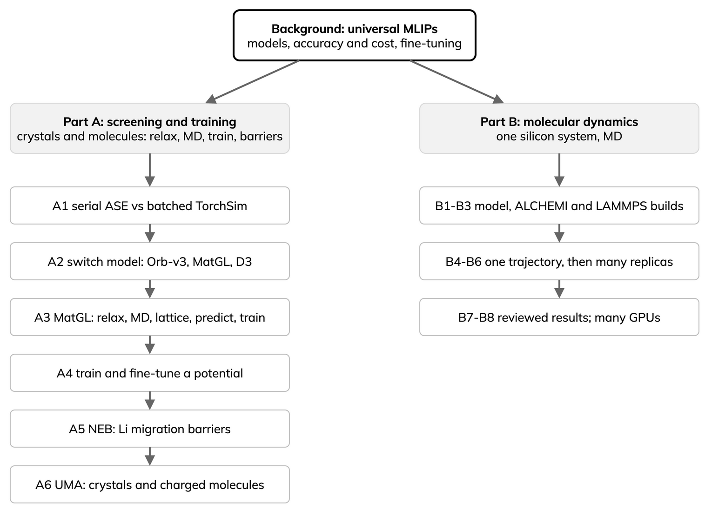

# Universal MLIPs on HPC: hands-on

Machine-learned interatomic potentials (MLIPs) give near-DFT energies and
forces at a fraction of the cost. Universal (foundation) MLIPs are trained
once across the periodic table, then used directly or fine-tuned. On HPC, GPU inference dominates, so GPU
placement sets throughput.

- Part A: relax many crystals in one batched TorchSim call versus
  serial ASE, with MACE-MP and Orb-v3; MatGL relaxation, MD and a lattice
  benchmark; then train and fine-tune a potential, and find a Li
  migration barrier with CI-NEB; compare Orb-v3, OrbMol and UMA on
  crystals and on molecules with charge and spin.
- Part B: silicon MD with MACE-MP in ALCHEMI Toolkit and LAMMPS, from
  one trajectory to many replicas and GPUs.
- New to MLIPs? Start with {doc}`episodes/00-background`.
- Webinar slides: {doc}`slides` ([PDF](_static/slides/mlip-webinar-slides.pdf)).
- Source, scripts and job files: [GitHub](https://github.com/ENCCS/mlip-hands-on).
- Contact and access support: [training@enccs.se](mailto:training@enccs.se);
  compute and AI support from [Sweden AI Factory](https://swedenaifactory.se);
  upcoming [events](https://enccs.se/events) and
  [lessons](https://enccs.github.io/lessons/).



## Background

```{toctree}
:maxdepth: 1

episodes/00-background
slides
```

## Setup

```{toctree}
:maxdepth: 1

setup/index
setup/arrhenius
setup/jupiter
setup/leonardo
setup/notebook
```

## Part A: screening and training

```{toctree}
:maxdepth: 1

episodes/a1-batched-relaxation
episodes/a2-orb-models
episodes/a3-matgl-tutorials
episodes/a4-training
episodes/a5-neb
episodes/a6-uma
```

## Part B: molecular dynamics

Run the examples in order, or use the setup pages to prepare artifacts in
advance. Each runnable section shows its inputs and a small result table;
the reviewed-results page keeps the repeated measurements separate from a
single notebook run.

```{toctree}
:maxdepth: 1

episodes/01-model
episodes/02-alchemi-image
episodes/03-lammps-mpi
episodes/04-silicon-md
episodes/05-batched-md
episodes/06-lammps-replicas
episodes/07-reviewed-results
episodes/08-scaling
```

## Reference

```{toctree}
:maxdepth: 1

reference/choosing-a-model
reference/environment
reference/instructor
reference/limits
reference/reading
```

## Acknowledgements

ENCCS is the Swedish node of the EuroCC 3 project. EuroCC 3 has received
funding from the European High-Performance Computing Joint Undertaking (JU)
under Grant Agreement No. 101306701. The JU receives support from the
European Union's Digital Europe Programme and Germany, Albania, Austria,
Belgium, Bosnia and Herzegovina, Bulgaria, Croatia, Cyprus, Czechia,
Denmark, Estonia, Finland, France, Greece, Hungary, Iceland, Ireland, Italy,
Latvia, Lithuania, Luxembourg, Malta, Montenegro, the Netherlands, North
Macedonia, Norway, Poland, Portugal, Romania, Serbia, Slovakia, Slovenia,
Spain, Sweden, Türkiye, and Kosovo.

Funded by the European Union. Views and opinions expressed are however those
of the author(s) only and do not necessarily reflect those of the European
Union or the granting authority (EuroHPC Joint Undertaking). Neither the
European Union nor the granting authority can be held responsible for them.

ENCCS has also received national funding through Vinnova and the Swedish
Research Council (VR).
