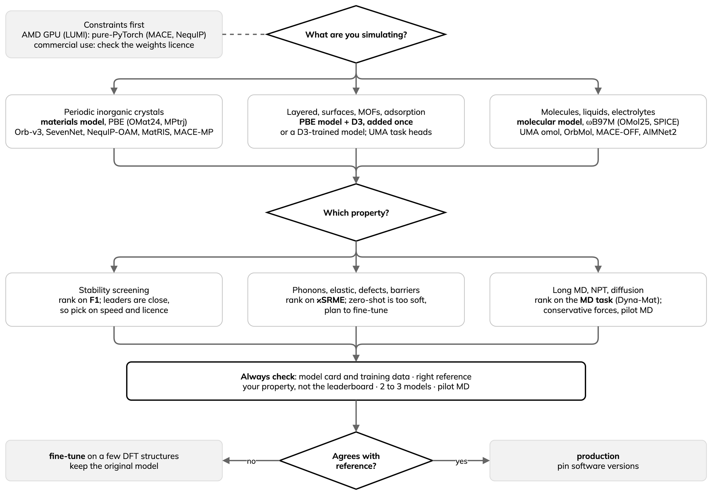

---
jupytext:
  text_representation:
    extension: .md
    format_name: myst
    format_version: '0.13'
kernelspec:
  display_name: Python 3
  language: python
  name: python3
---

# Choosing an MLIP

:::{objectives}
- Match a universal MLIP to the chemistry and DFT level it was trained on.
- Pick the benchmark metric that matches the property you study.
- Apply a short check protocol before trusting any model.
:::

A universal MLIP only knows the structures and the DFT functional in its
training set. The rules below are starting points, not verdicts: each is
backed by a published benchmark or by a run in this lesson. Leaderboard data
were accessed on 29 September 2026 and will change.

## Rules of thumb

| Situation | Start with | Why | Sources |
|---|---|---|---|
| Periodic inorganic crystals: relaxation, stability screening | Materials models trained on OMat24 or MPtrj/Alexandria (PBE, PBE+U): Orb-v3, SevenNet-Omni, NequIP-OAM-XL, MatRIS-10M-OAM, MACE-MP; MatterSim v1 5M for large batches | OMat24-class models reach F1 of about 0.92 to 0.93, and the top five are within 0.012 in combined score, so choose on speed, licence and hardware. Stable is not makeable: after relaxation, the best models picked the lowest-energy ordering only about 24 % of the time | [[1](https://doi.org/10.1038/s42256-025-01055-1)] [[2](https://arxiv.org/abs/2410.12771)] [[3](https://arxiv.org/abs/2504.06231)] [[4](https://arxiv.org/abs/2607.28461)] [[5](https://arxiv.org/abs/2609.05714)] |
| Molecules, liquids, electrolytes, biomolecules, charged or open-shell species | Molecular models at hybrid-DFT level: UMA task `omol` and OrbMol (OMol25, ωB97M-V); MACE-OFF (SPICE, 10 elements); AIMNet2 when speed matters. Not an OMat24/MPtrj materials model | For Na-ion electrolytes, UMA-OMol matched experimental densities with R² = 0.98, against 0.34 to 0.45 for two materials models, and some runs with those went unphysical. On SPICE molecules, UMA-m-1.1 was the most accurate, and UMA-s-1.1 and Orb-v3-omol reached chemical accuracy (below 1 kcal/mol) | [[6](https://arxiv.org/abs/2505.08762)] [[7](https://doi.org/10.1021/jacs.4c07099)] [[8](https://doi.org/10.1039/D4SC08572H)] [[9](https://arxiv.org/abs/2603.20183)] [[10](https://doi.org/10.1021/acs.jctc.6c00130)] |
| Layered and van der Waals materials, molecular crystals, surfaces, MOFs, adsorption | A PBE-trained model plus D3(BJ) with PBE parameters (Orb-v3 + D3, MACE-MP with `dispersion=True`, SevenNet-Omni), or a model trained with D3 (`orb-d3-v2`) without adding it again. UMA task heads: `oc20` catalysis, `odac` MOFs, `omc` molecular crystals | PBE barely binds graphite (4.40 Å, about 1 meV per C), and a PBE-trained model inherits that. In {doc}`../episodes/a2-orb-models`, plain Orb-v3 gave 4.31 to 4.37 Å; Orb-v3 + D3 gave 3.44 Å against 3.34 Å in experiment | [[11](https://doi.org/10.1103/PhysRevB.90.155448)] [[12](https://doi.org/10.1002/jcc.21759)] [[22](https://arxiv.org/abs/2506.23971)] |
| Phonons, thermal transport, elastic constants, defects, migration barriers | Rank on κSRME, not F1: EquiformerV3-OAM, PET-OAM-XL, GRACE-3L-OAM-L, NequIP-OAM-XL are among the lowest. Treat zero-shot values as qualitative and plan to fine-tune | Universal models systematically soften the energy surface; a single extra data point can correct much of it. Fine-tuning cut the Mo C₁₁ error from 45.9 % to 2.6 %. Zero-shot battery migration barriers have an MAE of 0.31 eV at best | [[1](https://doi.org/10.1038/s42256-025-01055-1)] [[13](https://doi.org/10.1038/s41524-024-01500-6)] [[14](https://doi.org/10.1063/5.0299305)] [[15](https://arxiv.org/abs/2604.01017)] [[16](https://arxiv.org/abs/2512.03642)] |
| Amorphous, disordered or other out-of-distribution structures | The largest, broadest-data models first (UMA-M-1p1 was best), compared with others; budget for fine-tuning | Of 41 universal models, some exceeded 100 % relative energy error on amorphous carbon; only UMA-M-1p1 stayed below 15 % on all five systems. Four a-SiO₂ structures cut the error by more than 5 times | [[17](https://arxiv.org/abs/2607.11384)] |
| Long MD, NPT, pressure, density, diffusion | Models that do well on the MD task (orb-v2, GRACE-2L-OAM, MACE-MH-1-OMAT) and conservative-force variants such as Orb-v3 `conservative`; a pilot MD against AIMD or experiment | In 15 foundation MLIPs, the tier with the lowest force error had the worst median pressure error (3.40 GPa). In a CdSe study, the model with the lowest validation error was unstable in MD | [[18](https://arxiv.org/abs/2607.03433)] [[19](https://arxiv.org/abs/2609.15299)] |
| Hardware and licence | AMD MI250X (LUMI): pure-PyTorch models (NequIP/Allegro, MACE). NVIDIA (Leonardo, Arrhenius): everything. Commercial use: Orb (Apache-2.0), SevenNet, NequIP (MIT), MatRIS, PET (BSD-3). Restricted: UMA/eSEN (gated), GRACE-3L-OAM and MACE-OFF (academic), DPA4 (CC-BY-NC) | NequIP/Allegro models were benchmarked on both A100 and MI250X. CUDA-only kernels (cuEquivariance, NVIDIA Warp in ALCHEMI) have no ROCm route. Licences come from each model card | [[4](https://arxiv.org/abs/2607.28461)] [ALCHEMI](https://github.com/NVIDIA/nvalchemi-toolkit) [UMA card](https://huggingface.co/facebook/UMA) |

## Always check

1. Read the model card: training set, reference functional (PBE, PBE+U,
   r2SCAN, ωB97M-V), elements covered, whether dispersion is included, and
   which task head to use. Mixed PBE and PBE+U training data are a likely cause
   of anomalies: 27 of 40 transition-metal oxide and fluoride adsorbate cells
   were flagged in one model [[20](https://arxiv.org/abs/2609.08399)].
2. Compare against the right reference. An uncorrected model should
   reproduce its training functional, not experiment. Add missing physics
   such as D3 once ({doc}`../episodes/a2-orb-models`).
3. Benchmark the property class you study (equation of state, phonons,
   elastic constants, barriers, densities), not the headline score. The F1
   and κSRME leaders differ [[1](https://doi.org/10.1038/s42256-025-01055-1)];
   [MLIP Arena](https://github.com/atomind-ai/mlip-arena) [[21](https://arxiv.org/abs/2509.20630)]
   and [mlipbenchmarks](https://github.com/peastman/mlipbenchmarks) [[10](https://doi.org/10.1021/acs.jctc.6c00130)]
   make this a few lines of code.
4. Run two or three models from different families or training sets.
   Disagreement is a warning sign.
5. Run a short pilot MD in the target ensemble. Check stability, one
   observable (pressure, density, radial distribution) and speed and GPU
   memory at your real system size [[18](https://arxiv.org/abs/2607.03433)].
6. If it is off, fine-tune on a few targeted DFT structures and keep the
   original model for other chemistry. In {doc}`../episodes/a4-training`,
   84 Li structures took TensorNet from PBE to r2SCAN with an energy error of
   60 meV/atom, against 513 meV/atom when trained from scratch. Pin software
   versions: silent-error bugs were fixed in
   [cuEquivariance 0.12.0](https://github.com/NVIDIA/cuEquivariance/releases/tag/v0.12.0),
   [NequIP 0.19.0](https://github.com/mir-group/nequip/releases/tag/v0.19.0)
   and [TorchSim 0.6.1](https://github.com/TorchSim/torch-sim/releases/tag/v0.6.1)
   between July and September 2026.

## One size does not fit all

No model leads on every metric. On Matbench Discovery, MatRIS-10M-OAM beats
NequIP-OAM-XL on stability F1 (0.921 against 0.906) but has a much larger
thermal-conductivity error (κSRME 0.22 against 0.13)
[[1](https://doi.org/10.1038/s42256-025-01055-1)]. The lowest force error
did not give the best MD pressure [[18](https://arxiv.org/abs/2607.03433)],
and lower energy error did not give better polymorph ranking
[[5](https://arxiv.org/abs/2609.05714)]. A benchmark of 15 pretrained MLIPs
concluded that "different applications will have different requirements"
[[10](https://doi.org/10.1021/acs.jctc.6c00130)]: the most accurate model was
not the fastest. Choose for your chemistry, property and hardware, then test.

:::{keypoints}
- A model knows only the chemistry and functional of its training data.
- Rank models on the metric for your property, and test that property.
- Compare several models; fine-tune when they miss your reference.
:::

## References

1. J. Riebesell et al., Matbench Discovery, Nat. Mach. Intell. 7, 836 (2025).
   [doi:10.1038/s42256-025-01055-1](https://doi.org/10.1038/s42256-025-01055-1);
   [leaderboard](https://matbench-discovery.materialsproject.org)
2. L. Barroso-Luque et al., OMat24. [arXiv:2410.12771](https://arxiv.org/abs/2410.12771)
3. B. Rhodes et al., Orb-v3. [arXiv:2504.06231](https://arxiv.org/abs/2504.06231)
4. S. R. Kavanagh et al., NequIP and Allegro foundation models.
   [arXiv:2607.28461](https://arxiv.org/abs/2607.28461)
5. FPBench, polymorph ranking with universal MLIPs.
   [arXiv:2609.05714](https://arxiv.org/abs/2609.05714)
6. D. S. Levine et al., OMol25. [arXiv:2505.08762](https://arxiv.org/abs/2505.08762)
7. D. P. Kovács et al., MACE-OFF, J. Am. Chem. Soc. (2025).
   [doi:10.1021/jacs.4c07099](https://doi.org/10.1021/jacs.4c07099)
8. D. M. Anstine, R. Zubatyuk, O. Isayev, AIMNet2, Chem. Sci. (2025).
   [doi:10.1039/D4SC08572H](https://doi.org/10.1039/D4SC08572H)
9. Kumar et al., universal MLIPs for Na-ion electrolytes.
   [arXiv:2603.20183](https://arxiv.org/abs/2603.20183)
10. P. Eastman, E. Pretti, T. E. Markland, J. Chem. Theory Comput. 22, 6108 (2026).
    [doi:10.1021/acs.jctc.6c00130](https://doi.org/10.1021/acs.jctc.6c00130)
11. E. Hazrati, G. A. de Wijs, G. Brocks, Phys. Rev. B 90, 155448 (2014).
    [doi:10.1103/PhysRevB.90.155448](https://doi.org/10.1103/PhysRevB.90.155448)
12. S. Grimme, S. Ehrlich, L. Goerigk, J. Comput. Chem. 32, 1456 (2011).
    [doi:10.1002/jcc.21759](https://doi.org/10.1002/jcc.21759)
13. B. Deng et al., systematic softening in universal MLIPs,
    npj Comput. Mater. 11, 9 (2025).
    [doi:10.1038/s41524-024-01500-6](https://doi.org/10.1038/s41524-024-01500-6)
14. X. Liu et al., J. Appl. Phys. 139, 041101 (2026).
    [doi:10.1063/5.0299305](https://doi.org/10.1063/5.0299305); companion
    study [arXiv:2506.07401](https://arxiv.org/abs/2506.07401)
15. LoRA fine-tuning of universal MLIPs for phonons.
    [arXiv:2604.01017](https://arxiv.org/abs/2604.01017)
16. Universal MLIPs for battery migration barriers.
    [arXiv:2512.03642](https://arxiv.org/abs/2512.03642)
17. Fragapane and Deringer, AM26 amorphous-materials benchmark.
    [arXiv:2607.11384](https://arxiv.org/abs/2607.11384)
18. Dyna-Mat, finite-temperature benchmark of foundation MLIPs.
    [arXiv:2607.03433](https://arxiv.org/abs/2607.03433)
19. MLIP stability in CdSe molecular dynamics.
    [arXiv:2609.15299](https://arxiv.org/abs/2609.15299)
20. MLIP Detective. [arXiv:2609.08399](https://arxiv.org/abs/2609.08399)
21. Chiang et al., MLIP Arena, NeurIPS 2025 Datasets and Benchmarks.
    [arXiv:2509.20630](https://arxiv.org/abs/2509.20630)
22. B. M. Wood et al., UMA. [arXiv:2506.23971](https://arxiv.org/abs/2506.23971)
