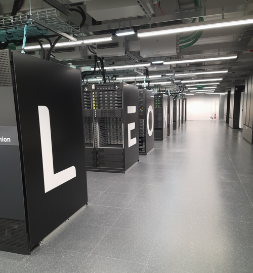

---
jupytext:
  text_representation:
    extension: .md
    format_name: myst
    format_version: '0.13'
kernelspec:
  display_name: Python 3
  language: python
  name: python3
---

# Leonardo setup: A100 single-GPU route



Leonardo supercomputer. Photo: National Institute of Geophysics and
Volcanology (INGV); [source and license details](https://commons.wikimedia.org/wiki/File:Leonardo_supercomputer.png)
([CC BY 4.0](https://creativecommons.org/licenses/by/4.0/)).
This copy was resized; the photo does not imply institutional endorsement.

:::{note} Leonardo hardware
The [Leonardo Booster](https://docs.hpc.cineca.it/hpc/leonardo.html) uses
x86_64 CPU nodes with four NVIDIA A100 GPUs, each with 64 GiB of memory.
:::

Do not reuse an Arrhenius GH200/aarch64 executable or SIF. The bounded Leonardo
qualification ran the same lesson silicon examples on **one A100**: one and
eight native ALCHEMI trajectories, and one LAMMPS ML-IAP/Kokkos trajectory.
Each was a five-step NVE smoke, not a speed comparison or scientific-equivalence
result. The existing LAMMPS build has MPI disabled, so the lesson's coupled
multi-GPU LAMMPS scaling commands are **not** qualified on Leonardo.

These jobs used the `boost_usr_prod` partition and `boost_qos_dbg` for short
qualification. Check current account, queue limits, modules and GPU policy.
The tested module family is:

```bash
module load profile/base
module load gcc/12.2.0 cuda/12.2 openmpi/4.1.6--gcc--12.2.0-cuda-12.2
```

Place the lesson checkout, native Python environment, model checkpoint,
LAMMPS build, and private results directory under your project allocation,
not in one shared Git repository. The pinned original checkpoint has SHA-256
`2ddb079cee0e131eaaf6912ba581b394551ead283e95c99cfe78c605d10b5736`.
Set paths in the submitting shell; the scripts refuse missing inputs:

```bash
export MLIP_LESSON_ROOT=/leonardo_scratch/fast/<PROJECT>/<USER>/mlip-hands-on
export MLIP_LEONARDO_PYTHON=/path/to/private/python/bin/python3
export MLIP_MODEL=/path/to/private/mace-mp-0a-small.model
export MLIP_RESULTS_DIR=/path/to/private/results
export MLIP_REPLICAS=1
sbatch --account=<PROJECT> \
  --export=ALL,MLIP_LESSON_ROOT,MLIP_LEONARDO_PYTHON,MLIP_MODEL,MLIP_RESULTS_DIR,MLIP_REPLICAS \
  scripts/test-leonardo-alchemi.sbatch
```

After a definite result, set `MLIP_REPLICAS=8` for a **distinct** batched
smoke. Do not replay an uncertain submission. The scripts use the one-GPU
`srun` step rather than assuming the batch shell's GPU visibility.

## LAMMPS ML-IAP/Kokkos

Use a native CUDA-Kokkos LAMMPS build with the `ML-IAP`, `KOKKOS`, and
`PYTHON` packages enabled, a matching Python wrapper from the same pinned
source tree, and a CuPy overlay compatible with its ML-IAP bridge. A
successful `import lammps` alone is not enough. The tested build used LAMMPS
`stable_22Jul2025_update6`, Python 3.12.14, CUDA 12.2 toolchain, MACE 0.3.15,
PyTorch 2.13.0+cu126, and CuPy 14.2.0. Its ML-IAP export has SHA-256
`db578c556298ad3bb1f4a93faa50d540eb2b9792215e81ef7548dd7e20a746e8`.
The existing build is **not** a Leonardo MPI solution.

If the pinned LAMMPS source archive is available, its Python wrapper is the
`python/lammps/` package. Preserve that whole directory, including
`lammps/mliap/__init__.py`; `mliap` is a package, not `mliap.py`. The tested
native runtime also needs CuPy from the build overlay on `PYTHONPATH`.
Keep the wrapper and overlay outside Git and verify their archive identities
before extraction. Set the resulting paths:

```bash
export MLIP_LEONARDO_LAMMPS_PREFIX=/path/to/native/lammps-prefix
export MLIP_LEONARDO_WRAPPER_ROOT=/path/to/pinned/source/python
export MLIP_LEONARDO_OVERLAY_ROOT=/path/to/pinned/cupy-overlay
export MLIP_MLIAP_MODEL=/path/to/private/mace-mliap-db578c55.pt
sbatch --account=<PROJECT> \
  --export=ALL,MLIP_LESSON_ROOT,MLIP_LEONARDO_PYTHON,MLIP_LEONARDO_LAMMPS_PREFIX,MLIP_LEONARDO_WRAPPER_ROOT,MLIP_LEONARDO_OVERLAY_ROOT,MLIP_MLIAP_MODEL,MLIP_RESULTS_DIR \
  scripts/test-leonardo-lammps.sbatch
```

The successful Leonardo smoke included the matching CuPy overlay; an earlier
distinct smoke without it failed at `run 0` with `NameError: cupy`. Neither
that failure nor the successful one-GPU smoke proves a multi-GPU MPI build.
The lesson's published HTML can be viewed without a GPU allocation. To run
the `.md` pages as notebooks on Leonardo, install the private Jupytext and
MyST renderer environment described in [Arrhenius](arrhenius.md) (see
[Opening the notebook](notebook.md) for the token and TLS handling) and keep the server token, TLS key, and job logs private. A Leonardo notebook
server itself has not yet been site-qualified.
